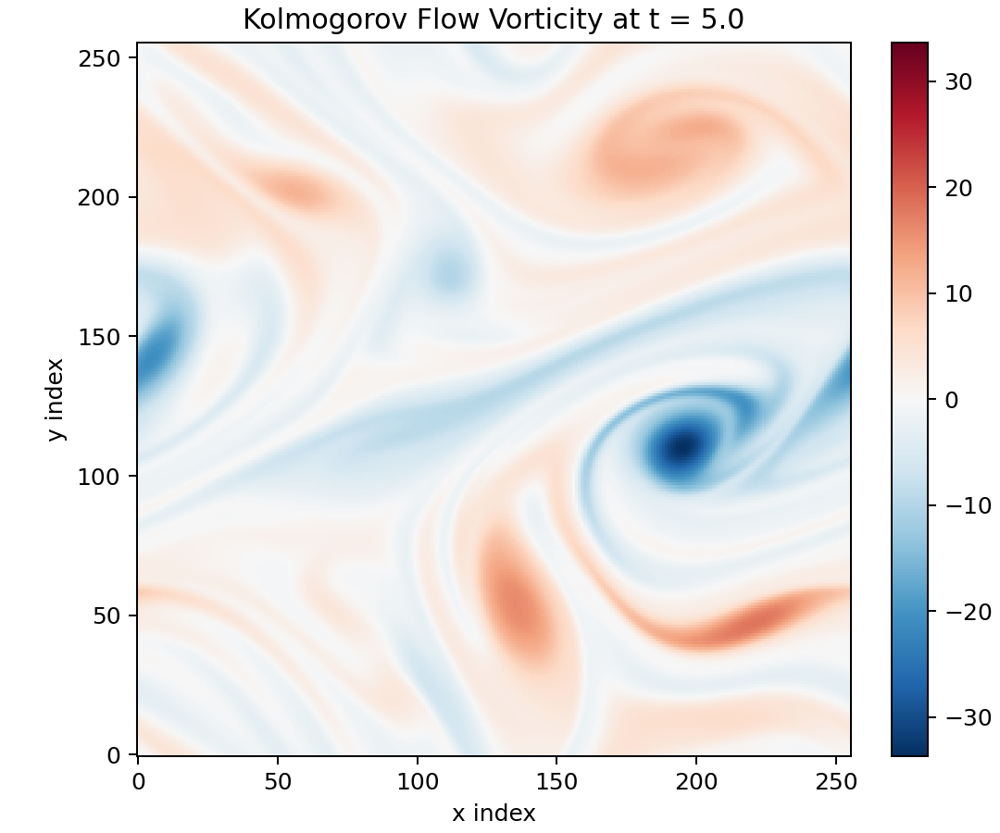

# Pi-LNN

**Sparse-sensor physics-constrained operator learning for turbulent flow reconstruction.**  
100 velocity sensors · Re=10000 · `u, v` only · no full-field supervision

---

> **Live demo page** → [latteine1217.github.io/pi-lnn/lnn_architecture.html](https://latteine1217.github.io/pi-lnn/lnn_architecture.html)  
> **Full experiment history** → [`docs/experiment_log.md`](docs/experiment_log.md)

---

## Current Baselines

### Re=10000 — EXP-064 *(active)*

| Metric | Value |
|---|---|
| **KE rel-err** | **7.80%** |
| div L2 | 0.184 |
| u / v RMSE | 0.0689 / 0.0621 |
| k_f amp ratio | 0.962 |
| k_f phase error | −0.023 rad |

`configs/exp_064_re10000_xlarge_sensor_physics.toml` · 10 000 steps · d=256 · LearnableFourierEmb · GradNorm · sensor continuity

### Re=1000 — EXP-030 *(early validation)*

| Metric | Value |
|---|---|
| **KE rel-err** | **9.61%** |
| u RMSE | 5.68e-2 |
| k_f amp ratio | 1.027 |

`configs/deeponet_cfc_midlong_uvomega_small_soap_sf_5000.toml` · 5 000 steps · d=64

---

## DNS Reference — Re=10000 Vorticity at t = 5



*Target reconstruction: 256² DNS snapshot of 2D Kolmogorov flow forced at k_f=2.*

---

## Architecture

```
sensor_obs [T, K, {u,v}]  +  sensor_pos [K, {x,y}]
    ↓  LearnableFourierEmb + residual MLP
    →  sensor tokens [K, d]
    ↓  token self-attention  (2 layers)
    →  temporal CfC encoder  →  branch states h [T, K, d]

query (x, y, t, c)
    ↓  LearnableFourierEmb + temporal anchor + dt_to_query
    →  trunk feature [N_q, d]
    ↓  causal cross-attention on h  (relpos bias, isotropic |r|)
    →  branch context [N_q, d]

branch basis ⊙ trunk basis  →  u / v / p  [N_q, 1]
```

- `p` is model-internal; constrained by PDE residual only, no data supervision.  
- `ω`, KE, Enstrophy, E(k) are evaluation diagnostics — never enter training.  
- Training signal: sensor MSE (`u, v`) + NS momentum + continuity (GradNorm-weighted).

---

## Quick Start

```bash
uv sync
```

**Train (Re=10000, EXP-064):**
```bash
uv run python src/lnn_kolmogorov.py \
  --config configs/exp_064_re10000_xlarge_sensor_physics.toml \
  --device mps
```

**Evaluate:**
```bash
uv run python scripts/evaluate_deeponet_cfc.py \
  --config configs/exp_064_re10000_xlarge_sensor_physics.toml \
  --checkpoint artifacts/deeponet-cfc-re10000-exp064-sensor-physics/checkpoints/lnn_kolmogorov_step_10000.pt \
  --output-dir artifacts/deeponet-cfc-re10000-exp064-sensor-physics/deeponet-cfc-eval
```

Evaluation outputs: `field_comparison_t5.png` · `vorticity_comparison_t5.png` · `energy_spectrum.png` · `kinetic_energy_vs_time.png` · `summary.json`

---

## Layout

```
src/
  lnn_kolmogorov.py       # model, training loop, physics residuals
  kolmogorov_dataset.py   # sensor + DNS metadata loader

configs/
  exp_064_re10000_xlarge_sensor_physics.toml   # Re=10000 active baseline
  exp_030_re1000_soap_sf_5k.toml               # Re=1000 early validation
  exp_059 … exp_063 …                          # archived experiments

scripts/
  evaluate_deeponet_cfc.py
  generate_sensors_qrpivot.py

docs/
  lnn_architecture.html   # interactive architecture + result figures
  experiment_log.md       # full experiment state (decisions, metrics, configs)
  assets/
```

---

## Information-Theoretic Limit — Confirmed & Accepted

EXP-064 is the accepted final result for K=100 sensors. The sparse reconstruction study is complete.

**Why mid/high frequencies are unreachable with K=100:**

The velocity field is extremely sparse in the wavelet domain (Gini ≈ 0.98).  
Compressed Sensing exact recovery requires M ≥ O(s log N) ≈ **5 000 sensors** (s ≈ 328 significant coefficients, N = 65 536 grid points).  
K=100 is ~50× below this threshold. Switching to a Fourier basis does not help — sparsity is equivalent across bases.

| Band | Energy | Wavelet DOF needed | Feasible with K=100 | EXP-064 error |
|---|---|---|---|---|
| Low (k ≤ 8) | 94.4% | ~196 | ✓ | **3.62%** |
| Mid (k ~ 8..16) | 4.8% | ~588 | ✗ exceeds capacity | ~100% |
| High (k ~ 16..32) | 0.8% | ~1 452 | ✗ far exceeds | ~100% |

All optimization directions tried (SOAP, GradNorm, sensor-continuity physics, trunk depth EXP-065) leave `band_mid/high` at ≈100%.  
This is a mathematical constraint, not a model or training problem.

**Paths that could break the limit:** K ≥ 5 000 sensors · K=200+ with extended training (EXP-066 reduces band_mid to 32.9%) · 4D-Var data assimilation · DNS-POD basis as high-frequency prior (research-only, engineering non-transferable).

→ See [Section 08 of the architecture page](https://latteine1217.github.io/pi-lnn/lnn_architecture.html) for full analysis.
