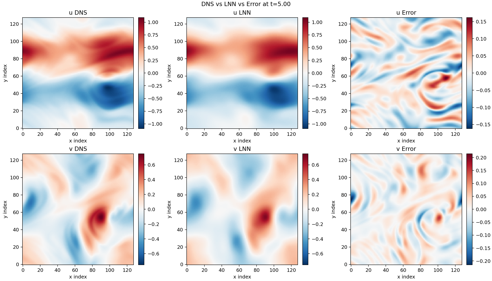
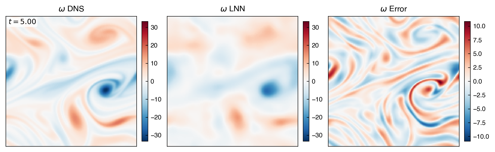
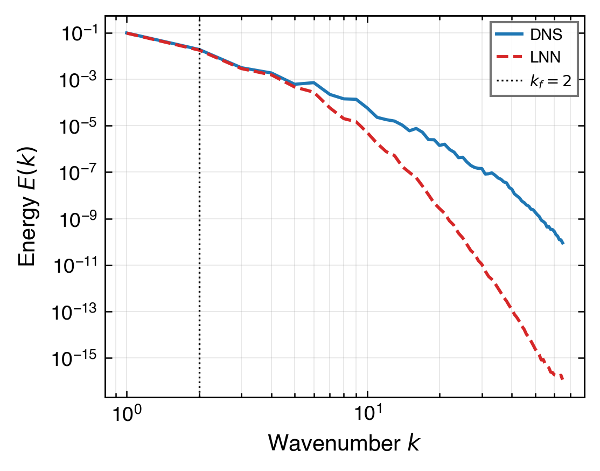

# Pi-LNN

**Engineering-deployable sparse-sensor flow reconstruction with bounded spectral recovery at Re=10000.**

We reconstruct 2D Kolmogorov turbulence at Re=10000 from K=100 velocity sensors **without full-field supervision**, using a CfC-DeepONet hybrid PINN. Training signal: sensor MSE on (u, v) plus Navier–Stokes residual. Inference is real-time-compatible (encoder 71 ms + 1.5 ms/snapshot query on Apple M-series MPS).

> **Live demo page** → [latteine1217.github.io/pi-lnn](https://latteine1217.github.io/pi-lnn/) (Overview · Details)
> **Paper framing (v2, engineering pivot)** → [`docs/paper_framing_draft.md`](docs/paper_framing_draft.md)
> **Experiment state** → [`docs/experiment_log.md`](docs/experiment_log.md) (entry; rest split by topic — see [Documentation map](#documentation-map))

---

## Architecture

```
sensor_obs [T, K, {u,v}]  +  sensor_pos [K, {x,y}]
    ↓  LearnableFourierEmb + residual MLP
    →  sensor tokens [K, d]
    ↓  token self-attention  (2 layers)
    →  TemporalCfCEncoder    →  branch states  h [T, K, d]

query (x, y, t, c)
    ↓  LearnableFourierEmb + temporal anchor + dt_to_query
    →  trunk feature [N_q, d]
    ↓  causal cross-attention on h  (relpos bias, isotropic |r|)
    →  branch context [N_q, d]

branch basis ⊙ trunk basis  →  u / v / p   [N_q, 1]
```

- **Branch path:** sensor tokens are spatially encoded then evolved in continuous time by a CfC cell along the sensor sampling clock; output is per-token memory `h_k`.
- **Trunk path:** any query `(x, y, t, c)` is encoded by a learnable Fourier embedding plus an absolute-time anchor `(sin/cos 2πnt/T, n=1..2)`.
- **Causal readout:** `searchsorted(sensor_time, t_q)` selects the latest valid memory frame; cross-attention pools branch tokens, isotropic `|r|` relative bias removes directional artifacts.
- **Operator fusion:** dot-product between branch basis and trunk basis yields `u, v, p`.
- `p` is model-internal; constrained only by the PDE residual, never by data supervision.
- `ω`, KE, Enstrophy, E(k), ∇p are evaluation diagnostics — never enter training.
- **Training signal:** sensor MSE on `u, v` + NS-momentum residual + continuity, GradNorm-balanced; continuity hardened by Augmented Lagrangian (EXP-080 only).

A full annotated walkthrough — time grid, decoder zoom-in, parameter spec, full results gallery, ablation chain — lives on the [Details page](https://latteine1217.github.io/pi-lnn/lnn_architecture.html).

---

## Two Baselines (Re=10000, K=100)

This work characterizes a **KE / divergence Pareto trade-off** intrinsic to the AL-continuity formulation. We report two operating points on the Pareto frontier; both are engineering-transferable (sensor-only training, no DNS supervision).

| Config | KE rel-err | div L² | ek_ratio_kf | k_f amp ratio | Role |
|---|---:|---:|---:|---:|---|
| **EXP-064** | **7.80 %** | 0.184 | **0.938** | **0.962** | KE-optimal (4-task GradNorm, no AL) |
| **EXP-080** | 10.68 % | **0.067** | 0.911 | 0.937 | Pareto sweet spot (4-task GN + AL ρ=0.1) — **headline architecture** |

EXP-080 (10.68 % KE / 0.067 div) is the **main paper result**: it sits 3× closer to the DNS divergence floor (0.092) than EXP-064 while still preserving 91 % of forcing-mode amplitude. EXP-064 (7.80 % KE / 0.184 div) is kept as the KE-optimal reference for users who need spatial-mean energy fidelity over strict incompressibility.

See [`docs/experiment_archive_kolmogorov_post_k100.md`](docs/experiment_archive_kolmogorov_post_k100.md) for the 9-point AL Pareto frontier (EXP-070~081) and the 6-lever pivot ablation (EXP-083~087, all falsified).

---

## Key Result — 5-seed Statistical Significance (2026-05-15)

**B3 (our CfC-DeepONet-PINN at EXP-080 recipe) vs B0 (Vanilla DeepONet)** — 5 random seeds (1, 2, 3, 4, 42) per architecture, Welch's t-test with Bonferroni correction k=4.

| Metric | B0 mean ± std | **B3 mean ± std** | Δ (B0 − B3) | 95 % CI | Cohen's d | p (Bonferroni) |
|---|---:|---:|---:|---|---:|---:|
| u rel-L² (%) | 25.50 ± 0.46 | **20.69 ± 0.46** | +4.81 pp | [+4.14, +5.48] | **10.46** | < 0.001 |
| v rel-L² (%) | 31.48 ± 0.70 | **24.79 ± 0.51** | +6.69 pp | [+5.78, +7.60] | **10.90** | < 0.001 |
| ω rel-L² (%) | 58.38 ± 0.57 | **52.65 ± 0.56** | +5.73 pp | [+4.91, +6.55] | **10.17** | < 0.001 |
| KE rel-err (%) | 18.52 ± 0.66 | **10.77 ± 0.52** | +7.75 pp | [+6.88, +8.62] | **13.09** | < 0.001 |
| div L² (sec.) | 0.064 ± 0.001 | 0.066 ± 0.001 | −0.002 | [−0.003, −0.001] | −1.98 | 0.014 |
| ek_ratio_kf (sec.) | 0.96 ± 0.06 | 0.92 ± 0.02 | +0.04 | [−0.03, +0.12] | +0.98 | 0.18 (n.s.) |

Raw statistics: [`artifacts/seed_statistics.json`](artifacts/seed_statistics.json); compute script: [`scripts/compute_seed_statistics.py`](scripts/compute_seed_statistics.py).

**Reading the table:** all four primary pointwise metrics show Cohen's d > 10 (an order of magnitude beyond the "large effect" threshold of 0.8). The architectural gap is decisively non-artefactual. div L² and ek_ratio_kf are secondary (uncorrected); B3's marginally higher div is the expected cost of the AL-recipe push toward spectral fidelity.

### Null-space spectral vs pointwise asymmetry

| Architecture | Pointwise spread (KE std) | Spectral spread (ek_ratio_kf std) |
|---|---|---|
| B0 (Vanilla, simpler) | tight (0.66 pp) | wide (0.06) |
| B3 (Ours, complex) | tight (0.52 pp) | tight (0.02) |

B0's valid solutions converge to similar pointwise loss but disagree on spectral allocation; B3 converges to consistent spectral structure with slightly higher pointwise variance. Different architectures populate **different cross-sections of the K=100 sensor null space** — direct empirical demonstration of the structural under-determinedness analyzed in §3 of the paper draft.

---

## Engineering Deployability

### Inference Benchmark (EXP-094, MPS, fp32, batch=8192)

| Phase | Time | Notes |
|---|---:|---|
| **Encode** (sensor 時序 → hidden states, T=201, K=100) | **70.7 ± 3.8 ms** | One-time per trajectory |
| **Single field query** (16 384 grid pts) | **527.8 ± 17.1 ms** | 31 030 queries / s |
| **Full sequence** (T=201 × 3 channels = 603 fields) | 581.2 s ≈ 9.7 min | per snapshot 2.89 s |

Encoder amortized cost is **0.06 % of total inference** (70.7 ms / 581.2 s) — the operator framework's "encode once, query anywhere" structure is concretely quantified.

**vs DNS reference:** DNS fp64 ETDRK4 (256² grid, dt = 2.5 × 10⁻⁴, 20 000 steps, ~1 h on workstation CPU) → our 9.7-min full reconstruction is a **~6× wall-time acceleration**. Raw benchmark: [`artifacts/benchmark_inference_exp094.json`](artifacts/benchmark_inference_exp094.json).

### vs Forward CFD POD Baseline (2026-05-15, "cheating" reference)

Pipeline: DNS snapshots (n=200) → SVD rank-40 modes (div-free) → K=100 sensor LSQ → ETDRK4 forward 20 000 steps to t = 5.

| Metric @ t = 5 | Forward CFD (rank=40, "cheating") | Pi-LNN B3 5-seed | Verdict |
|---|---:|---:|---|
| KE rel-err | **3.85 %** | 10.77 ± 0.52 % | Forward CFD better (KE attractor preservation is trivial under stationary forcing) |
| u rel-L² | **152.78 %** | **20.0 ± 1.7 %** (time-avg) | **Pi-LNN ≥ 7× better** |
| v rel-L² | **203.87 %** | **23.9 ± 2.1 %** (time-avg) | **Pi-LNN ≥ 8× better** |

T = 5 corresponds to ~2.5 eddy-turnover times; this is the chaotic regime. Forward CFD preserves bounded statistics (KE) but loses **all phase information** (pointwise u/v decorrelated, rel-L² > 1). Pi-LNN's sensor re-measurement every dt = 0.025 locks the phase realization — the decisive advantage of operator learning over autonomous forward integration for ill-posed inverse problems.

**Single KE rel-err under-represents chaotic systems**: u/v rel-L² is the phase-tracking metric where Pi-LNN dominates by an order of magnitude.

---

## Fair Baseline Comparison (engineering-transferable, no DNS access)

| Method | KE % | u L² % | v L² % | ω L² % | Params |
|---|---:|---:|---:|---:|---:|
| **B3 = EXP-080 / EXP-094 (Ours, 5-seed mean)** ⭐ | **10.77 ± 0.52** | **20.69 ± 0.46** | **24.79 ± 0.51** | **52.65 ± 0.56** | 3.14 M |
| B2 = cross-attn only (no CfC) | 11.95 | 21.61 | 26.17 | 54.18 | 2.74 M |
| B1 = CfC only (no cross-attn) | 12.65 | 22.71 | 28.95 | 56.56 | 3.14 M |
| B0 = Vanilla DeepONet (5-seed mean) | 18.52 ± 0.66 | 25.50 ± 0.46 | 31.48 ± 0.70 | 58.38 ± 0.57 | 1.28 M |
| Standard PINN — SiLU (no operator framework) | 31.35 | 32.33 | 44.72 | 67.53 | 3.24 M |
| Standard PINN — tanh (activation ablation) | 43.94 | 40.76 | 54.33 | 73.69 | 3.24 M |
| Div-free trig LSQ k ≤ 5 (80 modes) | 3.93 | 28.2 | 34.4 | 64.8 | 0 |
| RBF Multiquadric | **4.10** | 32.8 | 37.7 | 58.4 | 0 |
| RBF Gaussian | 6.83 | 33.8 | 38.7 | 59.6 | 0 |
| IDW p=2 | 62.95 | 53.7 | 62.0 | 81.2 | 0 |
| _(DNS-supervised ref) Gappy POD r=100_ | _0.12_ | _0.85_ | _0.85_ | _–_ | _-_ |

**Three-tier observation:**

1. **Operator framework essential.** Standard PINN (no operator, 3.24 M params) reaches only 32.33 % u L² — **worse than Vanilla DeepONet** (25.50 % u L² with 1.28 M params, 40 % capacity). Without sensor-aware encoding, raw MLP capacity does not close the gap.

2. **CfC + cross-attention each contribute ~3.5 – 4.6 pp** to pointwise accuracy (2×2 ANOVA on B0/B1/B2/B3). Cross-attention is the slightly stronger lever; mild positive synergy.

3. **Classical methods over-smooth.** RBF / trig LSQ achieve lower KE (3.9 – 6.8 %) by predicting essentially the spatial mean — broken pointwise field accuracy (32 – 34 % u L²). **KE-only evaluation is misleading**; multi-metric evaluation should be the standard for sparse-sensor benchmarks.

Full per-method analysis (including 6-lever ablation) at [`docs/squeeze_report_2026-05-11.md`](docs/squeeze_report_2026-05-11.md) and [`docs/experiment_archive_kolmogorov_post_k100.md`](docs/experiment_archive_kolmogorov_post_k100.md).

---

## Mathematical Foundation — Why K=100 Caps at ~7.77 %

K=100 reconstruction is **provably ill-posed**. Even with incompressibility enforced, the sampling operator's null space dominates:

| Quantity | Value |
|---|---|
| Total div-free Fourier DoF (k ≤ 16) | 1,592 |
| Sensor rank constraint | K = 100 (2K = 200 with div-free param) |
| **Null-space dim (div-free)** | **1,392 / 1,592 = 87.4 % DoF unobservable** |
| Explicit div-free invisible perturbation ε | KE(ε) = 0.13 = DNS scale; max\|ε(x_k)\| ~ 1e-16 |
| Nyquist sensor bandwidth k_max(K) | ≈ √(K/π) = **5.64** |
| **Spectral truncation lower bound at k_cut = 4** | **KE rel-err ≥ 7.77 %** |
| **EXP-080 attainment** | 10.68 % = **73 % of the lower bound** |

Higher fidelity at mid-high frequencies requires **more sensors, not better architecture** — K-scaling with recipe re-tuning is identified as the productive direction for future work (Future Work item 1).

→ Full proof artifacts at `artifacts/under_determined_proof/` (SVD spectrum, null space basis, Kolmogorov demo, baseline comparison JSON).
→ Wavelet sparsity (Gini ≈ 0.983) + CS threshold M ≥ O(s log N) ≈ 5,000 in [`docs/analysis_reports.md`](docs/analysis_reports.md).

---

## CFD-rigour Validation (2026-05-14~15)

| Check | Result | Verdict |
|---|---|---|
| DNS Pope criterion k_max·η | 1.91 (≥ 1.5 required) | ✓ DNS resolution adequate |
| EXP-080 ‖∇·u‖₂ / ‖∇u‖_F | **0.88 %** (vs DNS floor 0.29 %) | **~3× floor — near-incompressible** |
| EXP-064 ‖∇·u‖₂ / ‖∇u‖_F | 2.07 % (vs DNS floor 1.04 % at eval grid) | ~2× floor — acceptable |
| ∇p rel-L² (EXP-064 / EXP-080) | 112.00 % / 111.15 % | **Architectural failure** (Appendix E "Pressure-Field Scope Limit") |

Pressure (∇p) is not in the supervised channel; both configs give identical failure mode (~112 %), so it is structural, not an AL recipe artefact. Honest disclosure scoped to Appendix E to avoid distracting from the main engineering message.

Full reports: [`docs/diagnostics_log.md`](docs/diagnostics_log.md) (Q5/Q7/Q8 + Forward CFD baseline + same-attractor vs different-solution analysis).

---

## Field / Vorticity Comparison (EXP-064 baseline figures)



*Re=10000 velocity field at t = 5. Left: DNS reference. Middle: prediction. Right: error. Main coherent structures recovered; residual concentrates in high-shear regions.*



*Vorticity ω = ∂v/∂x − ∂u/∂y at t = 5. Dominant vortices recovered; small-scale eddies are smoothed — the K=100 information bound, not a training failure.*



*Radial energy spectrum E(k). Low-k band (k ≤ 8) carrying 94.4 % of total energy reproduced; mid/high-k content collapses by the CS bound.*

EXP-080 evaluation figures (Pareto sweet spot) at [`artifacts/eval-rerun-2026-05-09/exp080-al-4task-rho01/`](artifacts/eval-rerun-2026-05-09/exp080-al-4task-rho01/). Per-band diagnostics over the full time window: [`docs/assets/exp064/band_energy_rel_error_vs_time.png`](docs/assets/exp064/band_energy_rel_error_vs_time.png).

---

## Filtering vs Smoothing

Two estimator regimes, switched by `use_bidirectional_cfc`:

| Mode | CfC scan | Decoder readout | Use case |
|---|---|---|---|
| **Filtering** *(default)* | forward only | causal `searchsorted(sensor_time, t_q)` | online / streaming sensors |
| **Smoothing** | forward + independent backward pass | causal lookup over bidirectional memory | offline batch reconstruction |

**Smoothing — EXP-059, NEGATIVE_RESULT.** Adding a backward CfC pass marginally improves mean KE (20.6 % → 19.1 %, −1.5 pp) but *worsens* `t=0` KE (55.5 % → 60.4 %, +4.9 pp). `t=0` reconstruction is bottlenecked by **insufficient training signal** (no IC weight), not by causal information asymmetry. Smoothing alone does not break the K=100 information bound.

Filtering is the correct default for real-time engineering deployment.

---

## Documentation Map

The full experiment state is split by topic; load only what you need.

| File | Content | When to read |
|---|---|---|
| [`docs/experiment_log.md`](docs/experiment_log.md) | Master entry — STATE/INDEX conclusion layer | Any experiment / regression check |
| [`docs/experiment_archive_kolmogorov.md`](docs/experiment_archive_kolmogorov.md) | EXP-001 ~ EXP-063 detailed RECORD (Re=1000 main + Re=10000 early/mid) | Early experiment lookup |
| [`docs/experiment_archive_kolmogorov_post_k100.md`](docs/experiment_archive_kolmogorov_post_k100.md) | EXP-064 ~ EXP-101 detailed RECORD (K=100 closure + AL / pivot / multi-seed / benchmark) | Recent experiment lookup |
| [`docs/cylinder_log.md`](docs/cylinder_log.md) | Cylinder Wake (non-periodic, CEXP-001/002 + BC loss + NaN diagnosis) | Cylinder tasks |
| [`docs/diagnostics_log.md`](docs/diagnostics_log.md) | Physics denorm silent regression + CFD-rigour Q5/Q7/Q8 + Forward CFD | div / ∇p / metric sanity checks |
| [`docs/analysis_reports.md`](docs/analysis_reports.md) | Wavelet sparsity + AIM diagnostic | Info-theoretic ceiling derivation |
| [`docs/squeeze_report_2026-05-11.md`](docs/squeeze_report_2026-05-11.md) | Comprehensive baseline comparison (RBF / IDW / trig LSQ / Gappy POD) | Method comparison |
| [`docs/adr/`](docs/adr/) | Architecture Decision Records (ADR-001 / 002) | Design rationale |
| [`docs/paper_framing_draft.md`](docs/paper_framing_draft.md) | Paper framing v2 (engineering pivot, 5-seed stats) | Paper writing |

---

## How to Reproduce

```bash
uv sync
git submodule update --init --recursive
# Optional, Apple MPS only — explicit-CPU LinAlg patch (~30% faster than auto-fallback):
./scripts/apply_soap_patches.sh
```

> The SOAP submodule is third-party (`nikhilvyas/SOAP`). MPS-specific QR/eigh
> optimizations live under [`patches/`](patches/) and are applied locally by the
> script above (idempotent; supports `--check` and `--revert`). Re-run after any
> `git submodule update`.

**Train EXP-080 (Re=10000, Pareto sweet spot — headline result):**
```bash
export PYTORCH_ENABLE_MPS_FALLBACK=1   # safety net for any MPS-unsupported ops
uv run python src/lnn_kolmogorov.py \
  --config configs/exp_079_re10000_al_4task_gradnorm.toml \
  --device mps
# Note: EXP-080 reuses exp_079 config with al_rho = 0.1 (sweet spot value)
```

**Train EXP-064 (Re=10000, KE-optimal — historical baseline):**
```bash
export PYTORCH_ENABLE_MPS_FALLBACK=1
uv run python src/lnn_kolmogorov.py \
  --config configs/exp_064_re10000_xlarge_sensor_physics.toml \
  --device mps
```

**Multi-seed sweep (N=5 per architecture):**
```bash
bash scripts/run_seeds_3_4.sh   # serial mode, caffeinate-protected, per-run eval
uv run python scripts/compute_seed_statistics.py
```

**Evaluate any checkpoint:**
```bash
uv run python scripts/evaluate_deeponet_cfc.py \
  --config configs/exp_064_re10000_xlarge_sensor_physics.toml \
  --checkpoint <path_to_step_10000.pt> \
  --output-dir <eval_output_dir>
```

Outputs: `field_comparison_t5.png`, `vorticity_comparison_t5.png`, `energy_spectrum.png`, `kinetic_energy_vs_time.png`, `band_energy_rel_error_vs_time.png`, `divergence_vs_time.png`, `summary.json` (now includes train/val split + ∇p + div_ratio diagnostics).

**Inference benchmark:**
```bash
uv run python scripts/benchmark_inference.py \
  --config configs/exp_094_b3_seed2.toml \
  --checkpoint <path_to_b3_final.pt>
```

### Repository layout

```
src/
  lnn_kolmogorov.py         # entry point: model, training loop, physics residuals
  pi_lnn/                   # encoders, decoder, operator, losses, training utilities
  pi_lnn/standard_pinn.py   # Wang 2021 single-instance PINN baseline (EXP-091/092)
  pi_lnn/vanilla_deeponet.py# Vanilla DeepONet ablation (B0, EXP-088)
  kolmogorov_dataset.py     # sensor + DNS metadata loader

configs/
  exp_064_re10000_xlarge_sensor_physics.toml   # KE-optimal baseline
  exp_079_re10000_al_4task_gradnorm.toml       # AL + 4-task GN (EXP-079/080/081 family)
  exp_088_re10000_vanilla_deeponet.toml        # B0 Vanilla DeepONet
  exp_089_b1_cfc_no_crossattn.toml             # B1 ablation (CfC only)
  exp_090_b2_crossattn_no_cfc.toml             # B2 ablation (cross-attn only)
  exp_091_standard_pinn.toml                   # Standard PINN (SiLU)
  exp_092_standard_pinn_tanh.toml              # Standard PINN (tanh)
  exp_09{3,4,5,6,7,8,9}*.toml + exp_100*.toml  # multi-seed N=5 (B0/B3)
  exp_101_b3_random_seed42.toml                # random sensor placement (in progress)
  exp_030_re1000_soap_sf_5k.toml               # Re=1000 historical validation
  exp_cylinder_*.toml                          # Cylinder Wake configs (see cylinder_log.md)

scripts/
  evaluate_deeponet_cfc.py        # main evaluator (∇p / div_ratio metrics, 2026-05-15)
  compute_seed_statistics.py      # 5-seed Welch's t-test + Bonferroni
  benchmark_inference.py          # encoder/query/full-sequence timing
  run_seeds_3_4.sh                # serial sweep with per-run eval
  baseline_comparison{,_full}.py  # RBF / IDW / trig LSQ baselines
  generate_sensors_*.py           # QR-pivot / random / k-means sensor sets
  under_determined_{demo,proof}*.py  # null-space proof artifacts

docs/
  index.html                # presentation landing (Overview)
  lnn_architecture.html     # detailed model card, training, gallery, ablations (Details)
  experiment_log.md         # entry — STATE/INDEX
  experiment_archive_kolmogorov.md           # EXP-001~063 RECORD
  experiment_archive_kolmogorov_post_k100.md # EXP-064~101 RECORD + AL/pivot/multiseed
  cylinder_log.md           # Cylinder Wake
  diagnostics_log.md        # silent regression + CFD-rigour
  analysis_reports.md       # wavelet / AIM analysis
  paper_framing_draft.md    # paper v2 framing
  squeeze_report_2026-05-11.md  # baseline comparison
  adr/                      # ADR-001 / 002
  assets/                   # figures used in index.html + README

artifacts/
  kolmogorov/deeponet-cfc-re10000-exp064-sensor-physics/   # KE-optimal checkpoint + eval
  kolmogorov/deeponet-cfc-re10000-exp080-al-4task-rho01/   # Pareto sweet spot
  kolmogorov/deeponet-cfc-re10000-exp{097,098,099,100}*/   # 5-seed extension
  eval-rerun-2026-05-{07,08,09,10,11,12}/                  # round-7 evaluator reruns
  seed_statistics.json                                     # 5-seed Welch test output
  benchmark_inference_exp094.json                          # inference timing
  under_determined_proof/                                  # SVD + null-space figures
```
