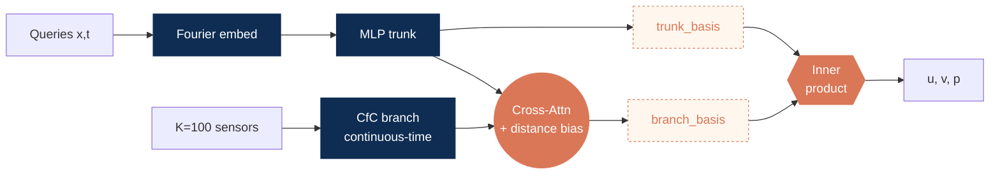

<!-- ====================================================================
     SLIDE 01 · COVER  (pptx Cover layout: 無 chevron NavBar，只有 logos)
     ==================================================================== -->

  <SectionTag>Thesis Defense · Junyi Li</SectionTag>

<h1 style="font-size: 2.4rem; line-height: 1.15; font-weight: 700; color: #7F1084; letter-spacing: -0.01em;">
Physics-Constrained Continuous-Time Reconstruction of Turbulent Flows from  Sparse Sensors
</h1>

  2-D Kolmogorov flow at <b style="color:#7F1084;">Re = 10⁴</b>,
  reconstructed from <b style="color:#7F1084;">100 velocity sensors</b>,
  with Navier–Stokes (NS) residual as the only physics signal —
  no Direct Numerical Simulation (DNS) supervision in training.

<FooterLogos />

<!--
[Cover · 30s] PI-CON 論文 defense。重點 anchor 在標題那行：K=100 sensors only · NS residual as the only physics signal · no DNS supervision in training。大綱 → 問題 / 架構 / 訓練 / 結果（能力→數量→位置→噪音三軸）/ 限制 / 下一步。
-->

---

<NavBar active="background" />

<SectionTag>§ Background · the sparse-reconstruction problem</SectionTag>

# The sparse-sensor reconstruction problem

<LabelTiny>Problem</LabelTiny>

Continuous velocity field <b>u(x, t)</b> from <b>K = 100</b> point sensors + Navier–Stokes

<LabelTiny>Under-determined inverse problem</LabelTiny>

K = 100 probes → N = 256² field. Exact recovery needs <b>2 500–5 000</b> [Donoho 2006 · Candès 2006] — we are <b style="color:#7F1084;">25–50× short</b>. Target: the <b>energy-dominant band</b>.

<LabelTiny>Physics as the prior</LabelTiny>

NS residual as structural regulariser → physically admissible field

<LabelTiny>Engineering constraint</LabelTiny>

No offline DNS reference&nbsp;·&nbsp;sensors + PDE only

Full vorticity field ω(x) constrained by only K = 100 point sensors (markers).

<FooterLogos />

<!--
[Background A1 · 2min] 工程動機開場：sparse sensors + PDE only。三個 bullet（setting / challenge / classical fix）+ 4 obstacles card 保持簡單，不展開 inverse problem 的數學細節（line equation 已移除，避免被問 sensor sampling / sensor noise / rank 等問題）。Take-away 收斂為一句「四 pillar 都壞 → NN 是唯一剩下的工程方案」。下一張 (slide 3) NN vs classical 對照表，再下一張 (slide 4) PINN vs PINO 比較。
-->

---

<NavBar active="background" />

<SectionTag>§ Background · what classical methods require</SectionTag>

# What classical inverse methods require

Classical inverse methods — Proper Orthogonal Decomposition (POD) Reduced-Order Model (ROM) · four-dimensional variational assimilation (4D-Var) · ensemble Kalman filter (EnKF) — each needs one ingredient the field cannot supply:

<Card>

① A pre-computed reference field

POD basis or data-assimilation background field · both <b>offline from a full-field DNS</b>

<b>✗ no offline DNS reference</b> in the field

</Card>

<Card>

② The forward solver in the loop

4D-Var / EnKF <b>re-run the NS solver</b> every assimilation window

<b>✗ minutes–hours per window</b> · not real-time at Re = 10⁴

</Card>

<b style="color:#7F1084;">Implication</b> · learn the prior from sparse sensors + PDE · no reference field, no online solver → neural operator with a physics residual

<FooterLogos />

<!--
[Background A2 · 2min] 對照表 5 + 1 個 deployment requirement：DNS basis 依賴 / forward solver 成本 / 非線性 / function-valued input / inference latency / PDE consistency。Take-away：NN 解掉 classical 的 blocker 並保留 PDE consistency；下一張比較 PINN vs PINO 決定要用哪種 NN。
-->

---

<NavBar active="background" />

<SectionTag>§ Background · operator vs. plain PINN</SectionTag>

# Operator vs. plain PINN

<Card>
<LabelTiny>PLAIN PHYSICS-INFORMED NEURAL NETWORK (PINN)&nbsp;[Raissi 2019]</LabelTiny>

(x, t)&nbsp; →&nbsp; network&nbsp; →&nbsp; u

<b>One flow at a time</b> · input is a single (x, t) coordinate · <b style="color:#E97132;">never reads the measurement stream as input</b> · retrained per case

</Card>

<Card style="background: rgba(127,16,132,0.05);">
<LabelTiny>NEURAL OPERATOR&nbsp;(DeepONet) [Lu 2021]</LabelTiny>

sensors {y(tk)} →<b>branch</b>
query (x, t) →<b>trunk</b>

}

→&nbsp;<b>u(x, t)</b>

inner product of branch &amp; trunk bases

Learns a <b>mapping</b>, not one solution · <b style="color:#7F1084;">branch reads the whole sensor trajectory</b> · trunk queries any point · one network serves new sensor streams

</Card>

<b style="color:#7F1084;">Why an operator</b> · operator branch lets a <b>sparse sensor history</b> — not just a coordinate — drive the reconstruction · <b>P</b>hysics-<b>I</b>nformed <b>C</b>ontinuous-time <b>O</b>perator <b>N</b>etwork (<b style="color:#7F1084;">PI-CON</b>) = operator + differentiable PDE residual

<FooterLogos />

<!--
[Why neural operator · 2min] 從第三頁延伸：上一張說明為何用 NN 而非 POD/4D-Var/KF，這張說明為何用 operator 而非 vanilla PINN。對照表 5+1 row，PINO column 用 ① ② ③ ④ 標號四個對 sparse-sensor 的關鍵 advantage：
① Sensor input 從點變函數（branch ingests trajectory）
② Query 任意 (x, t)，不綁特定問題
③ Generalisation amortised across instances
④ PDE residual 直接在 operator output 上（highlight row）
下一張 K=100 CS bound 量化結構難度。
-->

---

<NavBar active="background" />

<SectionTag>§ Literature review · four gaps</SectionTag>

# Four gaps across seven research lines

Needs a reference field

POD · Dynamic Mode Decomposition (DMD) · QR-pivot [Sirovich 1987 · Schmid 2010 · Manohar 2018] · Fukami 2019 · Maulik 2021 · Deep Operator Network (DeepONet) · Fourier Neural Operator (FNO) [Lu 2021 · Li 2021] · SHRED · Senseiver · FLRNet [Williams 2024 · Santos 2023 · Nguyen 2024]

Needs a solver in the loop

4D-Var · EnKF [Asch 2016] · B-PINN [Yang 2021] — adjoint cost, HMC scaling at high Re

Never reads the sensors

PINN · PirateNet · SOAP [Raissi 2019 · Wang 2024 · 2025] — sensors enter as a loss term, never as input

Never met a PDE

LTC · Closed-form Continuous-time (CfC) [Hasani 2021 · 2022] · Neural / Latent ODE [Chen 2018 · Rubanova 2019] — control and time-series only

The low-error methods are all in row one

SHRED · Senseiver · FLRNet post few-% error — by <b style="color:#E97132;">reading the reference field</b> the rig will not have. What that buys them, next.

<FooterLogos />

<!--
[Literature review 1/2 · 口述（表下敘事與註記已刪，字太小）：
「這些方法都報 few-percent error，但全都對著 full reference field 訓練；surveyed works 裡只有三篇
不用 reference field —— 下一頁就是那三篇。」
「七篇 surveyed works 沒有一篇報 parameter count；上表四篇裡有三篇未報 Reynolds number。」
  —— 委員問「為何不比參數量 / Re」時照此答。
[Literature review 1/2 · 1.5min] 對應 thesis Table 1.1 (tab:lit_summary, chapter01.tex:23-83)，
但不逐條列七行——論文自己說那七條線是要被 consolidate 成四個 Gap 的（chapter01:21），
重點是「卡在哪」不是「有幾條」。故按卡點分四組：需要參考場 / 需要 solver / 不讀 sensor /
沒碰過 PDE。底部條為唯三同 regime 的最接近工作。完整七行表在 thesis Table 1.1，
被問細節時翻論文。次頁給四個 Gap 與 PI-CON 佔的 cell。
注意：他人方法參數量 thesis 未載，不可臆造。
-->

---

<NavBar active="background" />

<SectionTag>§ Literature review · training supervision in prior work</SectionTag>

# What prior methods are trained against

<table class="dns">
<thead>
<tr>
<th style="width: 20%;">Work</th>
<th style="width: 27%;">Architecture</th>
<th style="width: 18%;">Case</th>
<th style="width: 35%;" class="key">What the loss is fitted to</th>
</tr>
</thead>
<tbody>
<tr>
<td class="who">SHRED Williams 2024</td>
<td>Stacked LSTM + shallow FC decoder</td>
<td>Isotropic turbulence (JHTDB)</td>
<td class="key">The full state · ‖x − H(y)‖₂</td>
</tr>
<tr>
<td class="who">Senseiver Santos 2023</td>
<td>Perceiver IO · cross-attention to latent</td>
<td>—</td>
<td class="key">“A dense set of observations is needed to train”</td>
</tr>
<tr>
<td class="who">FLRNet Nguyen 2024</td>
<td>Convolutional neural network (CNN) VAE + Fourier features + multilayer perceptron (MLP)</td>
<td>Cylinder, Re 300–10³</td>
<td class="key">The full field · VAE + perceptual loss</td>
</tr>
<tr>
<td class="who">FLRONet Vo Dang 2024</td>
<td>FNO branch + MLP trunk</td>
<td>Cylinder (CFDBench)</td>
<td class="key">Paired CFD fields</td>
</tr>
<tr class="ours">
<td class="who">PI-CON ours</td>
<td>DeepONet + CfC + cross-attention</td>
<td>Kolmogorov, Re 10⁴</td>
<td class="key">Sensor MSE + NS residual only</td>
</tr>
</tbody>
</table>

<FooterLogos />

<!--
[Literature review 2/3 · 1.5min] 這頁只有一個論點：它們全都對著 reference field 擬合。
故只有一個欄位帶色（橘＝loss 對著什麼擬合），其餘中性。前一版 7 種文字顏色、橘色同時
用在 supervision / Re / readout 三種意思上 —— 每格都是重點就等於沒有重點。

已移除 Readout 與 Sensors 欄：readout 是 slide 7 的軸（Parfenyev 的 query-anywhere 在那裡
才有意義）；sensor 數在此頁不承擔論點。Re 併入 Case 欄，未報者留白（—），不特別標色 ——
那是缺席，不是警訊。

逐格出處（2026-07-15 查證）：
- SHRED (arXiv 2301.12011): stacked LSTM + shallow FC decoder；loss 原文
  「minimize reconstruction loss ∑ᵢ‖xᵢ − H̃({yⱼ})‖₂」→ 對全場 state 監督；JHTDB isotropic
  turbulence；Re 未報。
- Senseiver (Nature MI 2023): Perceiver IO 系 cross-attention 編碼進 latent；OSTI 摘要原文
  「a dense set of observations is needed to train」；Re / sensor 數未報；正文付費牆。
- FLRNet (arXiv 2411.13815): conv VAE + Gaussian Fourier (m=4, σ=5) + MLP 5×128；
  loss = VAE reconstruction + perceptual；cylinder Re 300–1000。
- FLRONet (arXiv 2412.08009): FNO branch (d=64) + 3-layer MLP trunk；cylinder CFDBench；
  Re 未報。⚠️ 其 loss 定義原文未明述，「Paired CFD fields」依 chapter01:101 論述填入，
  非原文直引。

底部交棒：exactly three 的揭曉在此頁，slide 5 不再提前宣告、slide 7 不再重述。
-->

---

<NavBar active="background" />

<SectionTag>§ Literature review · the same-regime works, head to head</SectionTag>

# Same-regime works — head to head

<table class="hh">
<thead>
<tr>
<th style="width: 17%;">Work</th>
<th style="width: 22%;">Architecture</th>
<th style="width: 8%;">Re</th>
<th style="width: 15%;">Probes (fixed)</th>
<th style="width: 13%;">Sensors as input</th>
<th style="width: 13%;">Readout</th>
<th style="width: 14%;">NS residual</th>
</tr>
</thead>
<tbody>
<tr>
<td class="who">Mo &amp; Magri 2025</td>
<td>PC-DualConvNet · U-Net + Fourier branch</td>
<td class="no">34</td>
<td class="no">230</td>
<td class="yes">✓</td>
<td class="no">128² fixed</td>
<td class="no">finite difference</td>
</tr>
<tr>
<td class="who">Kelshaw et al. 2022</td>
<td>VDSR (VGG-style CNN) + bicubic upsample</td>
<td class="no">34</td>
<td>100 (10×10)</td>
<td class="yes">✓</td>
<td class="no">150² fixed</td>
<td class="no">pseudospectral</td>
</tr>
<tr>
<td class="who">Parfenyev et al. 2024</td>
<td>PINN · coordinate MLP 7 × 250</td>
<td class="no">1.3×10³</td>
<td class="no">none — 3×10⁴ scattered (r, t) samples</td>
<td class="no">✗ loss term only</td>
<td class="yes">query-anywhere</td>
<td class="yes">autodiff</td>
</tr>
<tr class="ours">
<td class="who"><b style="color:#7F1084;">PI-CON (ours)</b></td>
<td><b>DeepONet + CfC + cross-attention</b></td>
<td class="yes">10⁴</td>
<td class="yes">100</td>
<td class="yes">✓</td>
<td class="yes">query-anywhere</td>
<td class="yes">autodiff</td>
</tr>
</tbody>
</table>

<Card style="padding-top: 0.45rem; padding-bottom: 0.45rem;">
<LabelTiny>Reynolds number</LabelTiny>

Nearest <b style="color:#E97132;">7.7×</b> lower · CNN pair <b style="color:#E97132;">300×</b> lower

</Card>
<Card style="padding-top: 0.45rem; padding-bottom: 0.45rem;">
<LabelTiny>Measurement model</LabelTiny>

Mo &amp; Magri <b style="color:#E97132;">2.3×</b> our probes · Parfenyev: none, random <b>(r, t)</b>

</Card>
<Card style="padding-top: 0.45rem; padding-bottom: 0.45rem;">
<LabelTiny>No surveyed work combines all three</LabelTiny>

Query-anywhere · sensors-as-input · Re = 10⁴

</Card>

<FooterLogos />

<!--
[Literature review 2/2 · 2min] 口述開場（原標題下小字已移除，字太小）：
「同 regime（sensor + PDE、無 full reference field）survey 只找到這三篇，PI-CON 與它們並列。」
—— "the survey finds no others" 是回應委員「怎麼知道這是全部」的關鍵，務必口頭講出。
逐篇 head-to-head，每一格皆有原文出處（2026-07-15 查證）：
- Mo & Magri 2025 (arXiv 2409.00260): Re=34、80 input + 150 general sensors (≈0.9%)、
  128² grid、PC-DualConvNet (U-Net + Fourier branch)、residual 用 2nd/4th-order FD。
  原文報 relative ℓ₂ 5.51 ± 0.34 %（非 KE MAPE）。
- Kelshaw 2022 (arXiv 2210.17319): ν=1/34、10×10=100 觀測、150² grid、VDSR + bicubic、
  可微 pseudospectral residual。
- Parfenyev 2024 (arXiv 2404.01193): Re≈1.3×10³、Ndata=3×10⁴ (≈0.2%)、coordinate MLP
  7×250、autodiff residual、scattered 量測。
窮盡性：chapter01:99 界定同 regime 者恰為三篇，此表即全集。

⚠️ 兩個已知問題（尚未修 thesis）：
1. 舊版本頁曾寫「Mo & Magri KE MAPE ~23% → ours 5.71%」——該 23% 全 repo 無來源，
   原文亦無近似值（唯一「over 20%」是其 loss 變體間的相對比較）。已移除。
   chapter04:39 本就聲明不採用未經本協定重跑的他人數字為證據。
2. chapter01:99 稱三篇「each returns a fixed mesh」且「rather than continuous
   automatic differentiation」——對 Parfenyev 為誤述（它是 coordinate MLP + autodiff）。
   需修論文。
不要在口試宣稱與 Mo & Magri 的 head-to-head 數值優勢：指標不同、Re 差 300 倍。
-->

---

<NavBar active="background" />

<SectionTag>§ Background · the sensor resolution limit</SectionTag>

# K = 100 — the sensor resolution limit

<Card>
<LabelTiny>Sensor Nyquist</LabelTiny>

Fourier modes inside |k| ≤ kmax ≈ <b>πkmax²</b> · set equal to the <b>K</b> measurements:

kmax ≈ √(K/π)

At <b>K = 100</b> → kmax ≈ <b style="color:#7F1084; font-size:1.5em;">5.64</b> · beyond it: more modes than measurements → <b>unobserved</b>

</Card>

<Card>
<LabelTiny>Energy inside the band</LabelTiny>

DNS kinetic energy within |k| ≤ kmax (t = 5) · K = 100 → <b style="color:#7F1084;">98.9 %</b> · 200 → 99.7 % · 400 → 99.9 %

</Card>

DNS energy spectrum (a) · cumulative fraction (b) · dashed line = kmax = √(K/π)

<FooterLogos />

<!--
[Sensor budget · 2min] 口述收尾（底部 banner 已刪）：「解法是加 sensor，不是加大網路 —— 限制來自資訊，不是架構。」
[Sensor budget · 2min] 兩個視角量化 K=100 觀測能力：①linear system — y = Cu rank-deficient, 650× underdetermined ②CS bound — M ≥ O(s log(N/s)), s≈328 (db4 wavelet), full recovery 需 ~5000 sensors, K=100 差 50×。Implication 精準化：full-field recovery 結構上不可能；productive scope 是 low-band sub-recovery (Nyquist k_max ≈ 5.64) + physics prior 在 null-space 上 regularise。後續 Results 用 sensor Nyquist 與 K-scaling 量化此 scope。
-->

---

<NavBar active="objective" />

<SectionTag>§ Objective</SectionTag>

# Research objective

Reconstruct 2-D turbulent flow from sparse (u, v) sensors + Navier–Stokes residual, <b style="color:#7F1084;">no DNS field</b> in training · then map how <b style="color:#7F1084;">count, placement, noise</b> govern quality.

<Card>
<LabelTiny style="color:#7F1084;">(O1)&nbsp; ACCURATE &amp; FAST RECONSTRUCTOR</LabelTiny>

Engineering-grade from <b>sensor + PDE</b> only · query any (x, t) in one pass.

Criterion · KE rel-err <b>&lt; 10 %</b> (n = 5) — the engineering usability threshold

</Card>

<Card>
<LabelTiny style="color:#7F1084;">(O2)&nbsp; COUNT SETS THE RESOLUTION</LabelTiny>

Recoverable band set by <b>sensor count</b>, not architecture.

Criterion · effective cutoff tracks <b>√(K/π)</b> as K scales

</Card>

<Card>
<LabelTiny style="color:#7F1084;">(O3)&nbsp; PLACEMENT &amp; NOISE SET RELIABILITY</LabelTiny>

Placement and noise change reliability, <b>not feasibility</b>.

Criterion · every placement &amp; noise to <b>10 %</b> stay <b>within target</b>

</Card>

Contribution

<b>PI-CON</b> · CfC branch + distance-biased cross-attention + augmented-Lagrangian continuity · among surveyed methods the only <b>query-anywhere</b> + <b>sensor-only-with-physics</b> at Re = 10⁴.

<FooterLogos />

<!--
[Objective · 1.5min] 對齊論文三軸 arc：工具(PI-CON) + sensing-configuration 系統研究（數量/位置/噪音）。
上方一句話：用 PI-CON 從稀疏 sensor + NS residual 重建流場（無 DNS 全場），並系統研究 sensing config 如何決定品質。
三個 Objective（先 qualitative goal、後 falsifiable criterion）：
  O1 重建器（準＋快）：sensor+PDE only 達 engineering grade，任意點單次前傳。criterion KE<10% n=5 / dominant lever ≥2pp @p<0.01 / 單次前傳 ≥5× 快於 forward-solving。
  O2 數量軸：可重建波數由 sensor 數量決定，非架構。criterion k_max^sensor=√(K/π)≈5.64 @K=100；K=100/200/400 cutoff 隨 √(K/π) 移動。
  O3 位置&噪音軸：placement/noise 影響 reliability 不影響 feasibility。criterion 三 placement 皆 engineering-grade、σ_placement≥3×σ_training；noise 到 10% 仍 engineering-grade。
底部 Contribution：PI-CON = CfC branch + distance-biased cross-attn + AL-continuity，surveyed operator 中首個結合 query-anywhere continuous-time 與 sensor-only-with-physics @Re=10⁴。具體數值留 §Results / §Conclusion。
-->

---

<NavBar active="method" />

<SectionTag>§ Application case · the Kolmogorov flow</SectionTag>

# Kolmogorov flow at Re = 10⁴

  

<Card>
<LabelTiny>Governing equations · incompressible Navier–Stokes</LabelTiny>

∂<b>u</b>/∂t + (<b>u</b>·∇)<b>u</b> = −∇p + ν∇²<b>u</b> + <b>f</b> 
∇·<b>u</b> = 0

<BulletRow><b>Forcing</b> · <b>f</b> = (A sin(2πkf y), 0) · A = 0.1 m/s², kf = 2 m⁻¹</BulletRow>
<BulletRow><b>Domain</b> · Ω = [0, 1]² m², doubly-periodic</BulletRow>

</Card>

<Card>
<LabelTiny>Reynolds number · two, reported separately</LabelTiny>

<BulletRow><b>Control</b> · Re ≡ UL/ν = <b style="color:#7F1084;">10⁴</b> — prescribed</BulletRow>
<BulletRow><b>Injection-scale</b> · Ref ≡ Urmsλf/ν ≈ <b>2.5×10³</b> — measured</BulletRow>

</Card>

<FooterLogos />

<!--
[The case · 1.5min] 新增頁（2026-07-16）。教授九點要求「case 要交代 governing equation / forcing / Re 定義」。
數字逐條對應 thesis chapter03.tex:11-31（\paragraph{Governing equations and characteristic scales.}）
與 tab:dns_params（chapter03.tex:47-54）：
- NS 方程 = eq:ns_dim (ch03:13-19)；forcing f = (A sin(2π k_f y), 0)ᵀ (ch03:20)
- A = 0.1 m/s²、k_f = 2 m⁻¹ (tab:dns_params ch03:53-54)
- λ_f = 1/k_f = 0.5 m、U_rms = √(2·KE̅) = 0.503 m/s = eq:char_scales (ch03:23-24)
- 控制 Re ≡ UL/ν = 10⁴，L = box edge = 1 m、U = 1 m/s、ν = 10⁻⁴ m²/s；原文明講
  「prescribed through ν rather than derived from the realised flow」(ch03:20)
- 診斷 Re_f ≡ U_rms λ_f/ν ≈ 2.5×10³ = eq:re_inj (ch03:29)

== 口述（頁面刻意不印）==
指圖：「二維 Kolmogorov flow，t=5 渦度場，256² stored grid（軸是格點 index）。
forcing 尺度的渦捲夾著薄剪切層 —— 那些細結構就是 K=100 看不到的部分。」
「最接近的同 regime 工作 Mo & Magri 2025 做同一個 case，但在 Re=34。」(chapter01.tex:99)
Re 兩個為何不同（被問才展開，本頁真正的火力）：
「控制 Re 透過 ν 指定，不是量出來的；量出來的注入尺度 Re_f ≈ 2.5×10³。
差約 4 倍是因為 U_rms(0.503) < U(1)：受迫紊流飽和在參考速度以下。ch03:31 明載兩者分開報。」

== 版面 ==
沿用 slides-r3.md:249-316 骨架：對半、圖佔一半置中、圖下不放 caption、兩卡共 4 條 BulletRow。
方程用純文字（非 LaTeX $$）壓低密度。本 deck 無 Caption 元件（r3 有），底部不放 micro caption。
★ 記號已全數移除：論文用 ★ 區分有/無因次，本頁不做無因次化推導，★ 無作用且渲染成搶眼黑星，
並會與上方無星號的方程形成同頁兩套記號。

⚠️ 不可宣稱 statistically steady / sustained：本 DNS 無阻尼、只積分到 t=5，KE 實際 0.161 → 0.122
衰減，T/t_eddy = 2.51 已誠實揭露為短窗 (ch03:113)。頁面只寫 forcing 的形式，不碰穩態。
⚠️ 「為何選 Kolmogorov」thesis 無明文 rationale，不編理由；只陳述 Mo & Magri 同 case 之事實。
⚠️ 不講「forcing 只作用在 u 所以 v 較難重建」—— 該歸因全 thesis 查無，且 cross-attention 的
isotropic kernel 是未排除的競爭解釋（見已停用的 velocity-error backup 頁）。

⚠️⚠️ 版面沿用舊 Corning 面試稿 slides-r3.md，但**數據一律不採用**，五處與本論文矛盾：
  1. r3「Domain [0, 2π]²」→ 論文 Ω = [0,1]²（ch03:12, 20）
  2. r3「Re = U·L/ν, L = 2π/k_f」→ 論文 L = box edge = 1 m（ch03:20）。不同 convention，
     混用會讓 λ_f = 0.5 m 與 k_f = 2 對不上
  3. r3「F = sin(k_f y) x̂」→ 漏振幅 A = 0.1 與 sin 內的 2π（ch03:20, tab:dns_params）
  4. r3「forced, statistically stationary」→ 本 DNS 是衰減短瞬態，見上
  5. r3「clear inertial subrange」→ ch03:113 原文「the [0,1]² box admits **no extended
     inertial range** at this Re」，尾段斜率 −4.61 比 Kraichnan k⁻³ 更陡。直接相反
另：r3 通篇「sub-DNS divergence」為 thesis/CLAUDE.md 明列禁項，不可回收。
r3 的 vorticity GIF 不在本 repo，改用既有靜態圖 kolmogorov_dns_vorticity_re10000_t5.png。
-->

---

<NavBar active="method" />

<SectionTag>§ Application case · numerical setup · Re = 10⁴ · K = 100 sensors</SectionTag>

# 2-D Kolmogorov benchmark — setup at a glance

<Card>
<LabelTiny>DNS REFERENCE SOLVER</LabelTiny>

<b>Solver</b>&nbsp; pseudo-spectral · 2/3 dealiasing · ETDRK4 fp64

<b>Grid</b>&nbsp; run <b style="color:#7F1084;">1024²</b> · stored <b>256²</b>

<b>Sampling</b>&nbsp; Δts = 0.025 s · Nt = 201

</Card>

<Card>
<LabelTiny>DNS VERIFICATION</LabelTiny>

<b style="color:#0F2D52;">Resolution &amp; turbulence statistics</b> ✓ (backup)

<b>Statistical window</b>&nbsp; T = 5 s ≈ <b style="color:#7F1084;">2.5 eddy-turnovers</b>

</Card>

<Card style="padding-top: 0.6rem; padding-bottom: 0.6rem;">

</Card>

<Card>
<LabelTiny>SPARSE-SENSOR PROBLEM</LabelTiny>

<b style="color:#7F1084;">K = 100</b> (u, v) QR-pivot probes → query (u, v, p) at any (x, t)

</Card>

<FooterLogos />

<!--
[Setup · 1.5min] 教授要求補 CFD 必要參數。本頁只講「數值設定」。
⚠️ Governing equations / forcing / Re 定義那張卡已於 2026-07-16 移除 —— 改由前一頁
（"Kolmogorov flow at Re = 10⁴"）專責，兩頁曾重複。不要再把方程加回本頁。
- DNS algorithm：pseudo-spectral with 2/3 dealiasing [Orszag 1971; Boyd 2001] + ETDRK4 fp64 [Cox–Matthews 2002; Kassam–Trefethen 2005]
- Grid 256²、Δt = 2.5e-4、snapshot Δt_s = 0.025、N_t = 201、T = 5
- DNS verification 3 條件：k_max·η = 1.91 ≥ 1.5 (Pope 2000) ✓、KE plateau + CFL ≈ 0.18 < 0.5 ✓、T/t_eddy = 2.51 turnovers ⚠（誠實揭露 statistical window 有限，靠 multi-seed 彌補）
- Sparse-sensor card：K = 100, QR-pivot POD [Manohar 2018], operator target G_θ, loss 只用 sensor + NS（不偷 DNS / ω / E(k)）
右 col 維持 sensor placement 圖。把 engineering target（KE/div/k_f amp 數字）移到 §Results，§Setup 不背具體閾值。
-->

---

<NavBar active="method" />

<SectionTag>§ Architecture · how (O1)–(O3) get answered</SectionTag>

# Three additions to DeepONet

<Card>
<LabelTiny>CfC branch</LabelTiny>

Reads the irregularly-clocked sensor time signal, not a fixed-grid snapshot · keeps (O1) sensor-only training feasible.

</Card>
<Card>
<LabelTiny>Relpos cross-attention</LabelTiny>

Query (x, t) → nearby sensors · sparse-to-dense field readout at any query.

</Card>
<Card>
<LabelTiny>Augmented Lagrangian</LabelTiny>

Adaptive penalty on ∇·u · incompressibility as an active constraint, not a soft residual.

</Card>

Fourier trunk + GradNorm balancing · total ≈ 3.14 M parameters.

<FooterLogos />

<!--
[Architecture · 2min] 教授九點 (7) (9) 落實：把 Architecture 寫成「接 Objective、補 vanilla DeepONet 缺口」三件套 narrative，不在這頁堆 AI mathematical 細節。
Gap → Addition → Why-it-hits-(Ox) 三欄表：
  Gap (a) DeepONet branch 吃固定 grid snapshot → CfC continuous-time branch → 對齊 (O1) sensor-only feasibility
  Gap (b) inner product 沒 spatial prior → cross-attention with ‖r‖ bias → 對齊 (O2) streaming inference
  Gap (c) PDE residual soft penalty → Augmented Lagrangian on continuity → 對齊 (O3) physical consistency
底部一行交代 trunk Fourier embed [Tancik 2020] + GradNorm [Chen 2018] + 3.14M params。
CfC 內部公式、cross-attn 內部公式留 backup slides，這張只講 narrative。
-->

---

<NavBar active="method" />

<SectionTag>§ Method · CfC branch (closing the time-signal gap)</SectionTag>

# CfC — closing the "time-signal" gap in vanilla DeepONet

<Card>
<LabelTiny>① LIQUID NEURAL NETWORK (LNN) [Hasani 2021]</LabelTiny>

h relaxes toward a target A · the <b>decay rate depends on the input</b> — a "liquid" time constant:

$$\frac{d h}{dt} = -\underbrace{\Bigl[\tfrac{1}{\tau} + f(\cdot)\Bigr]}_{\text{input-dependent rate}} \odot\, h \;+\; f(\cdot) \odot A$$

τ, A learnable · f(·) a small MLP · <b style="color:#E97132;">✗ ODE solver in autograd is expensive</b>

</Card>

<Card>
<LabelTiny>② CfC — closed-form solution [Hasani 2022]</LabelTiny>

Same dynamics solved analytically — <b>a gate σ that blends two candidate states</b>:

$$h(t + \Delta t) = \sigma \odot f_1 + (1 - \sigma) \odot f_2$$

$$\sigma = \mathrm{sigmoid}(-\tau_a \Delta t + t_b)$$

<ChartCanvas type="line" :data="gateData" :options="gateOpts" height="54px" />

short gap → <b style="color:#7F1084;">σ → 1</b> → f1 (fast) 
long gap → <b style="color:#7F1084;">σ → 0</b> → f2 (relaxed)

f1 fast-response · f2 slow-relaxation · <b style="color:#0F2D52;">✓ no ODE solver</b> · O(1)/step · autograd-safe

</Card>

<FooterLogos />

<!--
[CfC introduction · backup 1min] 口述開場（標題下小字已刪）：「vanilla DeepONet 的 branch 吃固定 grid snapshot，
我們的 sensor 是不等間隔取樣的 time series，所以把 branch 換成 closed-form continuous-time RNN。」 教授九點 (9) — CFD lab 不重 AI 細節：把 CfC 介紹改成「補 vanilla DeepONet 的 time-signal 缺口」narrative。
頂部一句話：vanilla DeepONet branch 吃固定 grid snapshot，我們的 sensor 是 irregular time series，所以換成 closed-form continuous-time RNN。
卡 1：LNN ODE 形式 + 為何 vanilla ODE solver 在 autograd 內貴。
卡 2：CfC analytical closed-form + O(1) per step + autograd 安全。
底部「為何要 CfC」三條 chip 移除（已在頂部 narrative + 卡 2 末尾標明）。
-->

---

<NavBar active="method" />

<SectionTag>§ Method · cross-attention readout (closing the sparse-to-dense gap)</SectionTag>

# Cross-attention — closing the "sparse-to-dense" gap

<Card>
<LabelTiny>① ATTENTION READOUT [Vaswani 2017]</LabelTiny>

<b style="color:#7F1084;">① Score</b> · <b style="color:#7F1084;">② Retrieve</b>

$$A_{qk} = \mathrm{softmax}_k\!\left(\mathbf{Q}_q^{\top} \mathbf{K}_k \big/ \sqrt{d_{\text{hidden}}} \;+\; b_{qk}\right)$$

$$\textstyle\sum_{k=1}^{K} A_{qk}\,\mathbf{V}_k \;\longrightarrow\; \mathbf{c}_{\text{branch}}(q)$$

<b style="color:#0F2D52;">Qq</b>from the <b style="color:#0F2D52;">trunk</b> · Fourier (x, t)
<b style="color:#7F1084;">bqk</b>MLPrelpos(rqk) · rqk = smoothed torus distance
<b style="color:#D97757;">Kk</b><b style="color:#D97757;">sensor token</b> · WK · scored
<b style="color:#7F1084;">dhidden</b>key/query dim · softmax scaling
<b style="color:#D97757;">Vk</b><b style="color:#D97757;">same token</b> · WV · retrieved
<b style="color:#7F1084;">cbranch</b>branch context · residual MLP

</Card>

<Card>
<LabelTiny>② TWO FLUID-SPECIFIC MODIFICATIONS</LabelTiny>

<b>Causal lookup</b> → <b style="color:#0F2D52;">streaming-deployable</b>

<svg viewBox="0 0 300 60" class="w-full mt-1">
  <rect x="6" y="16" width="181" height="21" fill="#7F1084" opacity="0.08" rx="2"/>
  <line x1="6" y1="37" x2="286" y2="37" stroke="#D1D5DB" stroke-width="1"/>
  <polygon points="286,33 295,37 286,41" fill="#D1D5DB"/>
  <text x="284" y="28" style="font-size:12px;font-style:italic" fill="#9CA3AF">t</text>
  <g fill="#7F1084">
    <circle cx="24" cy="37" r="3.4"/><circle cx="51" cy="37" r="3.4"/><circle cx="78" cy="37" r="3.4"/>
    <circle cx="105" cy="37" r="3.4"/><circle cx="132" cy="37" r="3.4"/><circle cx="159" cy="37" r="3.4"/>
  </g>
  <g fill="#fff" stroke="#D1D5DB" stroke-width="1.5">
    <circle cx="214" cy="37" r="3.4"/><circle cx="241" cy="37" r="3.4"/><circle cx="268" cy="37" r="3.4"/>
  </g>
  <line x1="187" y1="12" x2="187" y2="45" stroke="#D97757" stroke-width="2"/>
  <text x="191" y="21" style="font-size:12px;font-weight:700" fill="#D97757">query t<tspan style="font-size:9px" dy="2">q</tspan></text>
  <text x="6" y="55" style="font-size:12px;font-weight:700" fill="#7F1084">reads these</text>
  <text x="208" y="55" style="font-size:12px" fill="#9CA3AF">future — hidden</text>
</svg>

<b>Isotropic bias</b> — distance decides, direction does not

<svg viewBox="0 0 300 104" class="w-full mt-1">
  <g fill="none" stroke="#E5E7EB" stroke-width="1" stroke-dasharray="3 2">
    <circle cx="70" cy="46" r="18"/><circle cx="70" cy="46" r="34"/>
  </g>
  <g stroke="#C9B3D6" stroke-width="1">
    <line x1="70" y1="46" x2="98" y2="27"/><line x1="70" y1="46" x2="38" y2="58"/>
  </g>
  <text x="84" y="41" style="font-size:12px;font-style:italic" fill="#9CA3AF">r</text>
  <text x="50" y="61" style="font-size:12px;font-style:italic" fill="#9CA3AF">r</text>
  <circle cx="98" cy="27" r="5.5" fill="#7F1084"/>
  <circle cx="38" cy="58" r="5.5" fill="#7F1084"/>
  <circle cx="70" cy="46" r="3.5" fill="#D97757"/>
  <text x="70" y="99" style="font-size:12px;font-weight:700" fill="#0F2D52" text-anchor="middle">same r, same bias</text>
  <g transform="translate(230,46) rotate(-34)">
    <ellipse rx="40" ry="13" fill="#9CA3AF" opacity="0.12"/>
    <ellipse rx="40" ry="13" fill="none" stroke="#D1D5DB" stroke-width="1.2" stroke-dasharray="3 2"/>
  </g>
  <circle cx="258" cy="27" r="7.5" fill="#9CA3AF" opacity="0.9"/>
  <circle cx="198" cy="58" r="2.4" fill="#9CA3AF" opacity="0.55"/>
  <circle cx="230" cy="46" r="3.5" fill="#D97757"/>
  <text x="230" y="99" style="font-size:12px" fill="#9CA3AF" text-anchor="middle">direction decides</text>
</svg>

</Card>

<FooterLogos />

<!--
[Cross-attention introduction · backup 1min] 口述開場（標題下小字已刪）：「inner product 是 global、沒有 spatial prior；
Q 來自 trunk，K 與 V 來自 sensor token —— 所以是 cross 不是 self。」（chapter02:290-292） 少談 Transformer 內部細節，照 thesis §2.3 的骨架講：
「Two modifications adapt it to fluid reconstruction: an isotropic relative-position bias and a causal lookup over sensor time.」(chapter02:257)
頂部一句話：vanilla DeepONet inner product 是 global、沒 spatial prior，所以換成 cross-attention 做 sparse-to-dense readout（chapter02:135 原話）。
卡 1：機制 — 先 Score（A_qk = softmax(QK/√d + b_qk)）再 Retrieve（Σ A_qk V_k → c_branch）。
      為何叫 cross 不叫 self：self-attention 的 Q/K/V 同源，這裡 Q 來自 trunk（查詢點）、
      K 與 V 來自同一個 sensor token H_q[k] 走 W_K / W_V 兩個投影（chapter02:290-292）。
      卡上用顏色編碼：Q 深藍（trunk）、K 與 V 橘（sensor token，同源）。
      √d_hidden 是 softmax 溫度縮放，不是 V；用 \big/ 寫成一行避免根號被 \frac 分母縮小而誤讀成 V。
      b_qk = MLP_relpos(LayerNorm(r_qk))；
      r_qk 先 fold 回環面再取 smooth norm，ε=10⁻⁸ 是為了避免 query 落在 sensor 上時 second-order autograd 出 NaN（chapter02:279）。
卡 2：兩項 fluid-specific 修改，改用圖不用公式（searchsorted/clamp 是實作細節，同心圓是幾何，兩者用文字講都不直觀）。
      被問實作時再答 chapter02:263 的 n*(q) = clamp(searchsorted({t_n}, t_q, right=True) − 1, 0, N_t − 1)。
      (a) causal lookup：binary search 只讀 t ≤ t_q → streaming-deployable；
      (b) 為何 isotropic 而非 directional：forcing 讓流場統計非等向，但 directional bias 會把 QR-pivot sensor 的
      非均勻 x 分布學成假的方向性注意力（chapter02:268）。這是被問「為何不用 (r_x, r_y)」時的標準答案。
移除原本「Self-attention vs cross-attention」對比（純 AI 細節，CFD lab 不感興趣）。
移除原本「卡 2：CFD analogue — learnable RBF interpolant」：該類比全論文不存在（chapter02 提 RBF 0 次），
且 RBF 在論文裡只是被打敗的 baseline（chapter04:219，pointwise u rel-L₂ 低 47–74%）— 講它等於自找交叉詰問。
-->

---

<NavBar active="method" />

<SectionTag>§ Method · Large-Eddy Simulation (LES) proxy</SectionTag>

# LES proxy — DNS-free sensor placement

<Card>
<LabelTiny>FILTERED NAVIER–STOKES</LabelTiny>

$$\partial_t \bar{u}_i + \bar{u}_j\,\partial_j \bar{u}_i = -\partial_i \bar{p} + \nu\,\nabla^2 \bar{u}_i \;-\; \partial_j \tau_{ij}^{\mathrm{SGS}} + f_i$$

<b>Domain</b>&nbsp; same Ω, BC, forcing as DNS

<b>Closure</b>&nbsp; Bardina scale-similarity + spectral hyperviscosity

<b>Solver</b>&nbsp; pseudo-spectral + 2/3 dealiasing, RK2 (Heun) fp64

<b>Setup</b>&nbsp;·&nbsp; N = 256, Tend = 50, cost ≈ <b style="color:#7F1084;">1/16 DNS</b>

</Card>

<Card>
<LabelTiny>LES VERIFICATION</LabelTiny>

<b style="color:#0F2D52;">Resolution, stability &amp; statistical convergence</b> ✓ (backup)

<b>Statistical window</b>&nbsp; Tend/τint = <b style="color:#7F1084;">11.7</b> ≥ 10 · Neff = 5.8

<b>Role</b>&nbsp; <b style="color:#0F2D52;">placement only</b>, not training truth

</Card>

Fig. 2 · LES vorticity with K = 100 QR-pivot sensors

<FooterLogos />

<!--
[LES generation · 2min] 教授九點 (4) (5) 落實：LES 也要把 CFD 重要參數寫清楚 + 解析度/穩定度判斷標準。
左卡 1 — filtered NS + Domain/BC（雙週期，與 DNS 一致）+ SGS closure（Bardina scale-similarity [Bardina 1980; Sagaut 2006] + spectral hyperviscosity）+ Solver（pseudo-spectral + 2/3 dealiasing, RK2 Heun fp64；DNS 才用 ETDRK4）+ N=256, T_end=50, cost ≈ 1/16 DNS
左卡 2 — LES 品質三條 gate（CLAUDE.md LES_Quality_Requirements）。2026-07-16 用
scripts/check_les_quality.py 對 data/les/kolmogorov_les_Re10000_N256_T50_standalone.npy 實測，全過：
  [1] incompressibility  max‖∇·u‖ = 2.29e-13 < 1e-10（solver fp64 診斷值，非從 float32 場重算）
  [2] no aliasing pile-up  譜末端衰減比 5.14e32 > 1e6
  [3] statistical window  τ_int = 4.28 → T_end/τ_int = 11.68 ≥ 10、N_eff = 5.84
⚠ 以下三個舊 gate 已被證偽，禁止再講（CLAUDE.md LES_Quality_Anti_Patterns）：
  ✗「T/t_eddy ≥ 5、EXP-221 達 26.5」—— LES 帶 linear friction −r·u，KE 由 forcing–friction 平衡主導，
     時間尺度是 1/(2r) = 17.5，比 eddy time (~2–3.5) 長一個數量級。用錯時間尺度。
  ✗「KE plateau / rel_change(KE) < 5%」—— 回看窗由 save_interval 決定，結構上不可能失敗。
  ✗「spectral overlap within 2× DNS on k ∈ [2, N/3]」—— LES 有 friction、DNS 沒有，能量平衡不同；
     實測 k ∈ [2,85] 全帶 0/84 個波數落在 [0.5,2] 內，物理上不可能通過。
被問「統計窗夠不夠」答 τ_int，不要答 eddy-turnover。
「placement 只需 leading POD modes align」仍可講，說明為何不要求與 DNS pointwise match。
底部 Pill 用 final fair-comparison 口徑：LES placement 是 EXP-245 main pipeline，KE 5.71 ± 0.11%；不要再用舊 placement-ablation 的 12.36% / 9.40% 作主張。
-->

---

<NavBar active="method" />

<SectionTag>§ Training · closing the physics-consistency gap</SectionTag>

# Augmented Lagrangian on ∇·u

<Card>
<LabelTiny>AUGMENTED LAGRANGIAN (AL) ON CONTINUITY</LabelTiny>

$$\mathcal{L}_{\text{AL}} \;=\; \mathcal{L} + \lambda\,C \;+\; \tfrac{\rho}{2}\,C^2,$$

$$C \,=\, \mathbb{E}_{\text{collocation}}\big[(\partial_x u + \partial_y v)^2\big],$$

$$\lambda \,\leftarrow\, \lambda + \rho\,C \quad\text{(dual ascent).}$$

ρ = 0.1 (penalty), λ_clip = 10 (max dual variable). λ grows when continuity is violated, decays once C is small.

</Card>

<Card>
<LabelTiny>CFD ANALOGUE &amp; OBSERVED EFFECT</LabelTiny>

<b style="color:#7F1084;">SIMPLE / PISO</b>pressure-correction Poisson · <b>exact, pointwise</b>
<b style="color:#7F1084;">Our AL (λ)</b>ascent on the mean residual · <b>in expectation</b>

an analog, not an algorithmic equivalent

<LabelTiny>Is the constraint doing anything?</LabelTiny>

DNS, full cascade1.04 %
DNS, band-limited to k ≤ 160.38 %
PI-CON, same bandwidth0.39 %

At the FD floor of its resolved bandwidth — <b>not</b> below DNS.

</Card>

<FooterLogos />

<!--
[Continuity AL · 1.5min] 左卡 AL formulation 完整：penalty C 是 continuity 平方期望、dual ascent λ ← λ + ρC、ρ=0.1 λ_clip=10。

口述（頁面已移除，被問 ρ 才講）：「把 ρ 拉到 1 可以把 divergence 再壓到 0.28%，
但要付出場精度的代價 —— 這個旋鈕是活的，我們選 0.1 是取平衡。」
右下三行數字就是「constraint 有沒有在作用」的答案，不需要再用文字複述一次。右卡 CFD analogue — SIMPLE/PISO 的 pressure correction p' 是 Lagrange multiplier，我們的 λ 用 gradient ascent 取代 Poisson 解；enforce in expectation 而非 exactly on grid。觀測 effect 用 final protocol 說法：EXP-245 divergence ratio 0.39 ± 0.006%，接近 resolved-bandwidth finite-difference floor。
-->

---

<NavBar active="method" />

<SectionTag>§ Training · optimisation &amp; multi-task balancing</SectionTag>

# SOAP + Schedule-Free + GradNorm — why second-order matters

<Card>
<LabelTiny>SOAP + SCHEDULE-FREE &nbsp;[Wang 2025, Defazio 2024]</LabelTiny>

<b style="color:#7F1084;">SOAP</b>Shampoo-style <b>2nd-order preconditioner</b> · Adam in the preconditioner eigenbasis
<b style="color:#7F1084;">Schedule-Free</b>Polyak–Ruppert averaging · no lr decay
<b style="color:#7F1084;">Why both</b>anisotropic valleys at Re = 10⁴ · Adam zigzags, SOAP overshoots, SF averaging stabilises

<b style="color:#7F1084;">Better stability than vanilla Adam</b> in the multi-task PINN setting.

</Card>

<Card>
<LabelTiny>GRADNORM &nbsp;— auto-weighting 4 loss tasks &nbsp;[Chen 2018]</LabelTiny>

$$\|w_i\,\nabla\!_{\theta_r}\,\mathcal{L}_i\| \;\propto\; (\mathcal{L}_i / \mathcal{L}_i^{(0)})^{\alpha},$$

<b style="color:#7F1084;">Every 1 000 steps</b>equalise <b>gradient-norm magnitude</b> across {data, NS-u, NS-v, cont}
<b style="color:#7F1084;">Why</b>hand-tuned weights are brittle — too small ⇒ data overfit, too large ⇒ near-zero collapse

</Card>

<FooterLogos />

<!--
[Optimisation · 2min] 左卡 SOAP+SF — Shampoo 2nd-order + Polyak averaging。chaotic NS valleys 需要 2nd-order；SOAP+SF 比 vanilla Adam 在 multi-task PINN 更穩定（thesis §Optimization）。（-20% KE 屬 EXP-030 log、thesis 未收，故 slide 只寫質性。）右卡 GradNorm — 4-task gradient-norm equalisation，每 1000 步調權重，避免 hand-tuned brittle。Init 物理 0.01 (1% of data weight)，會自己 ramp up。下一張講 AL 怎麼補 continuity。
-->

---

<NavBar active="method" />

<SectionTag>§ Hyperparameters · physical setup &amp; model</SectionTag>

# Configuration — what the setup rests on

<Card>
<LabelTiny>Flow &amp; DNS reference</LabelTiny>

Domain &amp; BC

Ω = [0, 1]² dimensionless, doubly-periodic

Reynolds number

<b>Re = 10⁴</b> ⇒ ν = 10⁻⁴

Forcing &amp; window

A = 0.1, kf = 2 · T = 5

DNS

<b>Run 1024²</b> ↓×4 → <b>stored 256²</b> · ETDRK4 fp64

</Card>

<Card>
<LabelTiny>Sensors</LabelTiny>

Number &amp; channels

<b>K = 100</b>, (u, v) only

Placement

<b style="color:#7F1084;">LES-derived</b> QR-pivot POD basis [Manohar 2018] — no DNS field

</Card>

<Card>
<LabelTiny>Model</LabelTiny>

Architecture

DeepONet + CfC branch + cross-attention readout

Size

dmodel = 256 · <b>3.14 M</b> parameters

Query grid

128² (DNS 256²/4, avoids Nyquist)

</Card>

<Card>
<LabelTiny>Training</LabelTiny>

Supervision

<b>sensor MSE + NS residual only</b>

Optimiser

SOAP + Schedule-Free · lr = 10⁻³ · AL ρ = 0.1

Budget

20 000 iterations × <b>n = 5 seeds</b>

Hardware

<b style="color:#7F1084;">Single</b> RTX 3090 (24 GB) · ~2 h 45 m per seed

</Card>

Full hyperparameter tables in backup.

<FooterLogos />

<!--
[Hyperparams 1/2 · 1min] §Method 最後的 reproducibility summary (1/2)。物理 + sensors + network 全部集中一頁。Flow: domain, Re, forcing, DNS solver。Sensors: K=100 QR-pivot (u,v only)。Network: d_model=256, d_emb=128, branch CfC, trunk 1-MLP, cross-attn 1 head, 3.14M params。下一張 (12) 講 optimisation + GradNorm + AL + reproducibility (seeds, hardware)。
-->

---
disabled: true
---

<NavBar active="method" />

<SectionTag>§ Backup · full hyperparameter tables</SectionTag>

# Configuration parameters — full reference

<Card>
<LabelTiny>Flow &amp; DNS (full)</LabelTiny>

Characteristic scales

L* = U* = 1 (nondim.); measured Urms = 0.503

DNS time-stepping

Δt = 2.5×10⁻⁴ · Δts = 0.025 (Nt = 201) · T = 5 ≈ 2.51 teddy

</Card>

<Card>
<LabelTiny>Network architecture (full)</LabelTiny>

dmodel · dtime

256 · 16

demb (Fourier)

128, harmonics = 16, σ = 2.0 learnable

Branch (sensor encoder)

spatial CfC × 1 + temporal CfC × 1 [Hasani 2022]

Token self-attn

2 layers × 1 head, dim = 256

Trunk (query MLP)

1 layer × 256 hidden, operator rank = 256

Readout (decoder)

cross-attn, 1 head, |r| bias [Vaswani 2017]

</Card>

<Card>
<LabelTiny>SOAP optimiser [Wang 2025]</LabelTiny>

Learning rate · warm-up

10⁻³ · 2 000 steps

β₁, β₂ · precond. freq.

0.9, 0.999 · every 2 steps

Schedule-Free

Polyak averaging, no lr decay [Defazio 2024]

</Card>

<Card>
<LabelTiny>GradNorm balancing [Chen 2018]</LabelTiny>

Update freq. · EMA

1 000 steps · momentum 0.9

Init weights

(wd, wNS,u, wNS,v, wc) = (1, 0.01, 0.01, 0.01)

</Card>

<Card>
<LabelTiny>Augmented Lagrangian (continuity only)</LabelTiny>

Penalty ρ · λ clip

<b>0.1</b> · 10

Constraint

C = 𝔼[(∂xu + ∂yv)²]

</Card>

<Card>
<LabelTiny>Training &amp; reproducibility</LabelTiny>

Iterations · seeds

20 000 · <b>n = 5</b> (42, 1, 2, 3, 4)

Hardware · wall-time

<b style="color:#7F1084;">Single</b> NVIDIA RTX 3090 (24 GB) · <b>~2 h 45 m</b> per seed (20 k steps, 1024 collocation)

</Card>

<FooterLogos />

<!--
[Hyperparams 2/2 · 1min] §Method 最後的 reproducibility summary (2/2)。Training 設定全部集中。SOAP+SF: lr=1e-3, β=(0.9,0.999), precond_freq=2, warmup=2000, Polyak averaging。GradNorm: 1000 步更新, EMA 0.9, init [1, 0.01, 0.01, 0.01] (物理項從 1% 數據權重 ramp up)。AL: ρ=0.1, λ_clip=10, C continuity constraint。Training: 10k steps × 5 seeds, RTX 3090 ~1h20m/seed。教授要 reproducibility 細節時都翻這兩頁。
-->

---

<NavBar active="method" />

<SectionTag>§ Evaluation metrics &amp; training loss</SectionTag>

# Error metrics & training loss

<Card>
<LabelTiny>FIELD ERROR METRICS &nbsp;(offline DNS benchmark only)</LabelTiny>

$$\mathrm{rel}\,L_2(\phi) = \frac{\|\phi_{\text{pred}} - \phi_{\text{DNS}}\|_2}{\|\phi_{\text{DNS}}\|_2}, \quad \phi \in \{u, v, \omega\}$$

$$\overline{\mathrm{KE\_MAPE}} = \frac{1}{|T|}\sum_{t}\frac{\bigl|\mathrm{KE}_{\text{pred}}(t) - \mathrm{KE}_{\text{DNS}}(t)\bigr|}{\mathrm{KE}_{\text{DNS}}(t)}$$

KE MAPE

<b>headline</b> · t ∈ [0, 5] s · also called <i>KE rel-err</i>

KE(t)

½ ∫Ω (u² + v²) dx

rel-L∞

pointwise max error / DNS max

t* = 5 rel-L₂

final-snapshot error

div ratio

‖∇·u‖₂ / ‖∇u‖FDNS

4th-order central differences on 128² grid.

</Card>

<Card>
<LabelTiny>TRAINING LOSS &nbsp;(GradNorm-balanced [Chen 2018])</LabelTiny>

$$\mathcal{L}(\theta) = w_d\,\mathcal{L}_{\text{data}} + w_{\text{NS},u}\,\mathcal{L}_{\text{NS},u} + w_{\text{NS},v}\,\mathcal{L}_{\text{NS},v} + w_c\,\mathcal{L}_{\text{cont}}$$

ℒdata

MSE on the K = 100 sensor channels

ℒNS,u , ℒNS,v

NS momentum residual at collocation points

ℒcont

∇·u, promoted by AL update

wd , wNS , wc

GradNorm-balanced weights

<b style="color:#7F1084;">Invariant</b>&nbsp;·&nbsp; DNS field never enters ℒ.

</Card>

<FooterLogos />

<!--
[Evaluation metrics · 1.5min] 教授要求「交代清楚誤差怎麼算」+「maximum error 或指定時間點 error 比較好」：
左卡 4 個誤差層級：
  (1) 全域時間平均 rel-L₂
  (2) 最壞點 rel-L_∞（pointwise max / DNS pointwise max）— 教授指定
  (3) 指定時間點 t* = 5 的 snapshot rel-L₂（rollout 結尾最難）— 教授指定
  (4) bulk: KE(t)、div_L₂(t)
最後標明：4 階中央差分、128² eval grid、div 對照 DNS FD floor。
右卡 Loss formulation 精簡保留：4-task weighted sum + 個別公式（data MSE / R_u momentum / L_NS,u / L_cont）。底部紅線：「DNS field 從不入 L」標明工程不可遷移性。
注意：avoid 「approximately / matches」這類 hardness/marketing 語。
-->

---

<NavBar active="results" />

<SectionTag>§ Results · main result · architectural value</SectionTag>

# Main result — 2×2 ablation at n = 5

Re = 10⁴ · K = 100 · LES-derived QR-pivot placement (DNS-free) · 1024 collocation · 20 k iterations · all cells n = 5 seeds

<Card>
<LabelTiny>2×2 ablation · KE MAPE (%, n = 5, lower is better)</LabelTiny>

no cross-attn

+ cross-attn

Δ from cross-attn

no CfC

B08.23

B27.03

−1.20

+ CfC

B19.23

B3 &nbsp;PI-CON5.71

−3.52

Δ from CfC

+1.00

−1.32

Bottom row flips sign: CfC costs <b style="color:#E97132;">+1.00</b> alone, buys <b style="color:#7F1084;">−1.32</b> with cross-attention.

</Card>

<Card>
<LabelTiny>KE decomposition &nbsp;(pp)</LabelTiny>

cross-attention

−1.20

CfC

+1.00

CfC × cross-attention

−2.32

total &nbsp;B3 − B0

−2.52

Additive about the B0 reference cell (8.23 %); interaction outweighs either main effect.

</Card>

<Card>
<LabelTiny>Welch t-test &nbsp;(n = 5 seeds)</LabelTiny>

B3 &nbsp;PI-CON

5.71 ± 0.11 %

B0 &nbsp;vanilla DeepONet

8.23 ± 0.22 %

gap

−30.6 % rel

</Card>

<FooterLogos />

<!--
[Architectural ablation · 2min] 長條圖：4 個架構變體 B0/B1/B2/B3 的 KE MAPE 比較（按 KE 排序）。右上 KE decomposition (about B0=8.23)：cross-attn −1.20pp（dominant lever）、CfC +1.00pp（worse alone）、interaction −2.32pp、sum −2.52pp。右下 multi-seed n=5 t-test：B3 vs B0 −2.52pp（−30.6% relative）、t=22.9、p=3.0×10⁻⁷、Cohen's d=14.5（統計顯著性從投影片移來，字太小委員看不清，改口述）。v-clicks：①兩個 component 都 essential、cross-attn 強 lever ②operator framework > raw capacity (PINN 3.24M < DeepONet 1.28M)。
-->

---

<NavBar active="results" />

<SectionTag>§ Results · field reconstruction at t = 5</SectionTag>

# Field reconstruction ω · u · v at t = 5

<Card>
<LabelTiny>KEY OBSERVATIONS</LabelTiny>

· Main vortex structure recovered

· Small scales (k &gt; 5) smoothed — sensor Nyquist bound

· Error sits on <b>high-shear edges</b>, not random

· |u, v error| ≪ |ω error| (ω amplifies derivatives)

</Card>

Source · EXP-245 baseline (B3 + LES_T50 + 1024 collo) · seed 42 field viz, metrics n = 5.

<Card style="padding-top: 0.5rem; padding-bottom: 0.5rem;">

</Card>

<FooterLogos />

<!--
[Field reconstruction · 口述（caption 已刪，只留 source）：colourbar 上 DNS 與 PI-CON 共用 ±max，
error panel 獨立縮放 —— 委員問「顏色能不能直接比」時照此答。
[Field reconstruction · 2.5min] 合併版：左 title + key observations bullet (k_f mode recovered, mid/high k smoothed, error on high-shear edges, u/v < ω error)，右上 velocity 6-panel (u/v × DNS/PI-CON/Error) + 右下 vorticity 3-col。Speaker：「展示主結果視覺面 — 先看 velocity 場（u/v）DNS 與 PI-CON 視覺幾乎一致，error magnitude 小；再看 vorticity 場是 derivative quantity，amplifies error 但仍 capture 主結構。Error 集中 high-shear edges 是 sensor Nyquist 上限造成。Velocity 圖高度 = vorticity 兩倍（2 row vs 1 row），讓單 panel 視覺等大。」
-->

---

<NavBar active="results" />

<SectionTag>§ Results · vorticity error interpretation</SectionTag>

# Error structure — the K = 100 bound

<Card style="padding-top: 0.6rem; padding-bottom: 0.6rem;">
<LabelTiny>Band-resolved relative error vs time &nbsp;(EXP-245, n = 5)</LabelTiny>

</Card>

<Card style="padding-top: 0.6rem; padding-bottom: 0.6rem;">
<LabelTiny>Key metrics &nbsp;(EXP-245, n = 5)</LabelTiny>

KE MAPE

<b style="color:#7F1084;">5.71 ± 0.11 %</b>

u rel-L₂

13.65 ± 0.06 %

v rel-L₂

17.52 ± 0.10 %

ω rel-L₂

41.79 ± 0.12 %

div ratio

<b style="color:#7F1084;">0.39 ± 0.006 %</b>

</Card>

<Card style="padding-top: 0.6rem; padding-bottom: 0.6rem;">
<LabelTiny>Why KE 5.7 % but ω 41.8 %</LabelTiny>

Low band k ≤ 5

≈ 99 % of energy · error ≈ 4 %

Mid / high k

saturate at 100 %

KE weights energy; ω rel-L₂ is broadband pointwise.

</Card>

<FooterLogos />

<!--
[Vorticity error interpretation · 2min] 口述接回第 8 頁：「k ≤ 5 這條線就是第 8 頁的 sensor Nyquist
k_max ≈ 5.64；越過它 modes 比 measurements 多，架構補不回來。」原本這裡有張 Ceiling 卡寫同樣的
5.64 與同樣的結論，與第 8 頁逐字重複、且右欄已擠爆，故移除改為口述。
左 metrics 用 EXP-245 main (LES_T50, 20k, n=5)：KE 5.71 ± 0.11%, ω rel-L₂ 41.79%, div ratio 0.39%。右三個 Card 解讀：①DNS reference 有什麼 (k_f forcing + cascade) ②PI-CON 抓到什麼 (主 vortex + k_f mode 對的振幅相位，小尺度 smoothed) ③Error 結構性 (集中在 high-shear edges, 不是 random noise)。後面 spectral analysis 量化這個 information bound。
-->

---
disabled: true
---

<!--
Backup. 停用理由（2026-07-15）：
- ① / ③ 與 slide 19（field figure）及 slide 20（ceiling card）重複。
- ② 的 u/v anisotropy 歸因（forcing 只在 u → v 為導出量 → 較難重建）全 thesis
  搜不到，屬投影片手打推理；且 chapter02.tex:265 自承 cross-attention 用
  isotropic 距離核是 deliberate modelling simplification，構成一個未被排除的
  競爭解釋。兩假設未經實驗分離，不宜在口試斷言。
- 唯一該留的 u/v rel-L₂ 數值已併入 slide 20 Key metrics（同屬 Table 4.1 主列）。
若要復用：先讓 anisotropy 歸因進 thesis，或補實驗分離 (a) forcing 與 (b) isotropic kernel。
-->

<NavBar active="results" />

<SectionTag>§ Backup · velocity error analysis</SectionTag>

# Channel-wise interpretation — u, v anisotropy and structural error

<Card>
<LabelTiny>① u CHANNEL — streamwise</LabelTiny>

DNS range ±1.0 · error band ±0.10 ⇒ <b style="color:#7F1084;">~10 % peak local error</b>

Large-scale shear sheets fully recovered · error localised at sheet edges (large |∂u/∂y|)

u rel-L₂ — B3 5-seed mean&nbsp;<b>13.65 ± 0.06 %</b>

</Card>

<Card>
<LabelTiny>② v CHANNEL — cross-stream</LabelTiny>

· DNS range ±0.7 (smaller than u) · error band ±0.15 (higher relative error)

· Forcing acts only on u (sin(kf y))

· v = derived response via ∇p + nonlinear coupling

· No direct forcing template → harder to recover from sparse v samples

v rel-L₂ — B3 5-seed mean&nbsp;<b>17.52 ± 0.10 %</b>

</Card>

<Card>
<LabelTiny>③ ERROR STRUCTURE</LabelTiny>

· <b>Not random noise</b> — error concentrates on <b>high-shear edges</b>

· Same pattern as ω error field → coherent representational deficit

· Low-gradient bulk regions reconstruct accurately

· Mid/high-k structural error, sensor-bound at Nyquist kmax ≈ 5.64

</Card>

<FooterLogos />

<!--
[Velocity error analysis · 2min] 3 Card 拆 u / v / Error structure。u (range ±1, error ±0.15, ~15% peak) — 主 shear sheets recovered. v (range ±0.7, error ±0.20, 相對 error 略高) — forcing 在 v 方向。Error structure — 集中 high-shear edges 跟 ω error 同 pattern，coherent representational deficit 非 noise。底部 explainer：velocity error < vorticity error 因為 energy 在低 k (k≤8 占 94%) ω = curl 放大高 k。
-->

---

<NavBar active="results" />

<SectionTag>§ Results · EXP-245 baseline (B3 + LES_T50, 1024 collo)</SectionTag>

# Temporal diagnostics

<Card>

KE MAPE <b style="color:#7F1084;">5.71 ± 0.11 %</b> (n = 5) · follows DNS decay 0.161 → 0.122 · IC warm-up t &lt; 2 s.

</Card>

<Card>

Time-avg u <b>13.65 %</b>, v <b>17.52 %</b> (n = 5) · ~30 % at IC → single-digit · ±1σ band.

</Card>

<FooterLogos />

<!--
[Temporal diagnostics · 1.5min] 兩張圖：KE(t)（MAPE 5.71 ± 0.11%, n=5, 追 DNS chaotic decay
0.161→0.122 m²/s²）、velocity rel-L₂ u/v(t)（~30%→single-digit, ±1σ band n=5）。
div ratio 0.39% 接近 resolved-bandwidth FD floor。

⚠️ 2026-07-16 改動：原本三張圖並排（KE / uv / E(k)），每張只有 1/3 寬，但 PNG 內的
label 與 legend 字級是照全寬設計的，縮到 1/3 後委員看不清。改為兩張並排（max-height
180 → 270px），每張面積約 2 倍。

移除的 E(k) at t=5 並未損失論證：K-scaling 頁（下一張）的三連能譜已含 K=100 的
E(k) 與 Nyquist 截止線，且那張是專門為投影片畫的（字級較大），本來就比這張清楚。
band-resolved 的 k≤5 / mid-high 飽和數字則在「Error structure」頁的 key metrics。
若要恢復三圖，正解是重畫 PNG 加大字級，不是把圖再縮小。

⚠️ 已移除「v > u: forcing acts on u」—— 該歸因全 thesis 查無，且 cross-attention 的
isotropic kernel 是未排除的競爭解釋（見已停用的 velocity-error backup 頁）。
-->

---

<NavBar active="results" />

<SectionTag>§ Results · sensor placement axis (O3)</SectionTag>

# DNS-free placement — competitive, not equivalent

Same B3 backbone, 1024 collocation, 20 k iterations, n = 5 · sensor values always come from the K = 100 positions only.

<table class="pl">
<thead>
<tr>
<th>Placement strategy</th>
<th>DNS full field to place?</th>
<th>KE MAPE (%)</th>
<th>u / v rel-L₂ (%)</th>
</tr>
</thead>
<tbody>
<tr class="main">
<td>LES T = 50 &nbsp;main pipeline</td>
<td class="no">No</td>
<td>5.71 ± 0.11</td>
<td>13.65 / 17.52</td>
</tr>
<tr>
<td>DNS QR-pivot &nbsp;oracle</td>
<td class="yes">Yes</td>
<td><b>4.68 ± 0.06</b></td>
<td>15.34 / 18.10</td>
</tr>
<tr>
<td>Random uniform &nbsp;no-effort fallback</td>
<td class="no">No</td>
<td>7.95 ± 0.68</td>
<td>17.20 / 21.62</td>
</tr>
</tbody>
</table>

<Card style="padding-top: 0.6rem; padding-bottom: 0.6rem;">
<LabelTiny>KE and pointwise L₂ trade off</LabelTiny>

The oracle takes <b>KE</b>. LES takes <b>pointwise L₂</b> — and needs no DNS field to place.

</Card>

<Card style="padding-top: 0.6rem; padding-bottom: 0.6rem;">
<LabelTiny>Placement is worth 2.24 pp</LabelTiny>

LES over random: <b style="color:#7F1084;">−2.24 pp</b> of KE for one cheap LES run.

</Card>

<Card style="padding-top: 0.6rem; padding-bottom: 0.6rem;">
<LabelTiny>Reliability, not feasibility</LabelTiny>

Spread from <b>placement</b> (± 0.68) is <b style="color:#E97132;">6×</b> the spread from training seeds (± 0.11). All three clear 10 %.

</Card>

<FooterLogos />

<!--
[Placement · 2min] O3 位置軸。表格即證據 —— 論文 §placement (sec:placement_analysis)
本身也是純表格、無圖。

欄位語意取自 chapter04.tex:347 的「DNS full field for placement?」（Yes/No），一欄即可，
不需要 pre-deployment cost + engineering deployable 兩欄互相重複。
數字：chapter04.tex:351 / :386（random u 17.20±1.42, v 21.62±2.07）、tab:main_metrics。

三張卡：
1. trade-off —— oracle 贏 KE、LES 贏 pointwise L₂（chapter04:357），不可寫成 LES 全面勝。
2. −2.24 pp —— LES 相對 random 的 KE 增益（chapter04:45 原文；實算 7.95 − 5.71 = 2.24）。
3. variance —— ± 0.68（跨 5 種佈點）vs ± 0.11（跨 training seed）＝ 6.2×，對應
   chapter04:45「reduces placement-induced variance roughly sixfold」。這是 O3
   「placement 影響 reliability 不影響 feasibility」的量化依據，三者皆 < 10 % 門檻。

⚠️ 已移除原本右欄的 les_T50_vs_dns_spectrum.png：
   (a) 它回答「這個 LES 好不好」，屬 slide 12 的範圍；本頁講 placement 結果，該圖不支撐本頁主張。
   (b) 其 caption「Leading POD modes overlap within 2× on k ∈ [2, N/3]」正是
       thesis/CLAUDE.md 明列的 LES 禁項 ——「不可拿 LES 能譜與 DNS 比對當 gate；
       friction 使兩者能量平衡不同，物理上不可能通過，吻合也不構成 LES 品質證據」。
   同一條 gate 亦仍掛在 thesis chapter03.tex:208 的 tab:les_params，待處理。
-->

---

<NavBar active="results" />

<SectionTag>§ Results · vs an open-loop forward-CFD forecast</SectionTag>

# Forward-CFD — same spectrum, unrelated field

<Card style="padding-top: 0.6rem; padding-bottom: 0.6rem;">
<LabelTiny>Radial energy spectrum at t = 5</LabelTiny>

</Card>

<Card style="padding-top: 0.6rem; padding-bottom: 0.6rem;">
<LabelTiny>Near t = 5 &nbsp;(Re = 10⁴, K = 100)</LabelTiny>

Forward-CFD

PI-CON

KE rel-err t ≳ 3.3

3.85 %

1.62 ± 0.09 %

u rel-L₂ t = 5

152.8 %

7.28 ± 0.14 %

v rel-L₂ t = 5

203.9 %

16.38 ± 0.34 %

ω rel-L₂ t = 5

144.0 %

38.36 ± 0.45 %

σu/σv t = 5

0.90

2.30

<b>Not the headline numbers</b> · KE is the t ≳ 3.3 mean, matched to the forecast at t = 5.

</Card>

<Card style="padding-top: 0.6rem; padding-bottom: 0.6rem;">
<LabelTiny>KE alone mis-ranks</LabelTiny>

KE puts them <b>2.4×</b> apart. Pointwise: <b style="color:#E97132;">21×</b>.

</Card>

Open-loop, not matched assimilation · POD-40 from <b>200 offline DNS snapshots</b>.

<FooterLogos />

<!--
[Forward-CFD · 2min] 底部 note 精簡後的完整口徑：forward-CFD 從 K=100 sensor 在 t=0 建 divergence-free 場，
之後自由積分、不再 assimilate 任何資料（open-loop）；且它用了 200 個 DNS snapshots offline 建 POD-rank-40 basis
—— 比 PI-CON（只看 sensor stream）多得多的資訊。所以這不是公平的 matched-assimilation baseline，是誠實揭露 forward-CFD 的優勢。
[Forward-CFD · 2min] 圖下小字精簡後的完整口徑（原註記字太小已縮）：
  DNS anisotropy σ_u/σ_v = 2.32。此頁 KE 是 late-window (t ≳ 3.3) mean、u/v/ω 是 t=5 snapshot，
  為何 KE 用窗平均而非 t=5 單點：evaluator 不存單張 snapshot 的 KE（appendix07:100 caption 原文
  「the evaluator stores no single-snapshot KE」）。t ≳ 3.3 這個窗是為了對齊 forward-CFD 的 t=5
  forecast，不是挑對我們有利的區間 —— 委員問「為何兩欄時間窗不同」照此答。
  兩者都對齊 forward-CFD forecast 的比較窗；main-result 的 KE MAPE 5.71%、u rel-L₂ 13.65%
  則是整個 t ∈ [0,5] 窗的均值。委員若追問「這數字跟主結果為何不同」照此回答。
[Forward-CFD · 2min] 委員第一反射問題「為何不直接 forward CFD」的正面回答。
主視覺＝能譜重疊圖（thesis/figures/results/forward_cfd_spectrum_t5.png；論文未引用此圖，
appendix07 只有 tab:forward_cfd 表）。

講法：先指圖 ——「DNS 與 forward-CFD 的能譜在兩個多 decade 上幾乎完全重疊，每個尺度的
能量都一樣」；再指右表 ——「但 u rel-L₂ 是 152.8%」。統計上分不出、逐點上毫無關係，
這正是 KE 誤導排序的原因：KE 只差 2.4×，pointwise 差 21×。呼應 §Conclusion ④
KE-as-misleading。

σ_u/σ_v = 0.90 是額外一擊：forward-CFD 連 Kolmogorov 流的各向異性都弄丟了
（DNS 2.32、PI-CON 2.30），所以它不只是「統計對、相位錯」，連 second-order statistic
都偏了。

數字全部出自 appendix07 tab:forward_cfd（appendix07.tex:106-113）。
算術：3.85/1.62 = 2.38 → 2.4×；152.8/7.28 = 21.0 → 21×。

⚠️ 必講的 caveat（appendix07:85, 100 明載）：這是 open-loop forecast reference，
不是 matched assimilation baseline；且 forward-CFD 另外用了 200 張 DNS snapshot
離線建 POD 基底 —— 它拿的資訊比 PI-CON 多，pointwise 仍崩掉。不可宣稱這是公平對打。
-->

---

<NavBar active="results" />

<SectionTag>§ Results · vs classical sensor-only interpolation</SectionTag>

# Classical interpolation — lower KE, worse field

<table class="fb">
  <thead>
    <tr>
      <th class="m">Method &nbsp;(same K = 100 sensors, no DNS access)</th>
      <th>KE % lower ≠ better</th><th>u L₂ %</th><th>v L₂ %</th><th>ω L₂ %</th>
    </tr>
  </thead>
  <tbody>
    <tr>
      <td class="m">Radial basis function (RBF) multiquadric, ε = 10</td>
      <td class="trap">5.08</td><td>30.02</td><td>34.43</td><td>58.33</td>
    </tr>
    <tr>
      <td class="m">Inverse distance weighting (IDW) p = 2</td>
      <td>66.66</td><td>52.88</td><td>62.02</td><td>81.89</td>
    </tr>
    <tr>
      <td class="m">Divergence-free trigonometric least squares kmax = 5</td>
      <td class="trap">4.42</td><td>25.87</td><td>31.96</td><td>63.41</td>
    </tr>
    <tr class="ours">
      <td class="m">PI-CON (ours, n = 5)</td>
      <td>5.71</td><td class="win">13.65</td><td class="win">17.52</td><td class="win">41.79</td>
    </tr>
  </tbody>
</table>

Source · appendix tab:fair_baselines · same LES-derived K = 100 sensors as the main baseline.

<Card>
<LabelTiny>Cause</LabelTiny>

Contraction toward the <b>inter-sensor mean</b>

</Card>

<Card>
<LabelTiny>u rel-L₂ reduction</LabelTiny>

<b style="color:#7F1084;">47.2 %</b> vs trig. LSQ 
<b style="color:#7F1084;">74.2 %</b> vs IDW

</Card>

<FooterLogos />

<!--
[Classical interpolation · 1.5min] 數字全部出自 thesis/back/appendix07.tex tab:fair_baselines，未改動。
這是全論文唯一「同 sensor、同指標、同 Re」的數字並排比較 —— 與文獻三篇（Mo & Magri / Kelshaw /
Parfenyev）的比較是規格對照，不是數值比較（Re 差 7.7× 以上，並排會誤導）。

本頁論點與 Forward-CFD 頁同一條：KE 單獨看會排錯名次。
- RBF 5.08 / trig-LSQ 4.42 的 KE 都比我們的 5.71 低，但 u rel-L₂ 是我們的 ~2 倍。
- 原因（appendix07 原文）：classical interpolation 把速度往 inter-sensor mean 收縮，
  壓低總動能，KE ratio 因為錯的理由靠近 DNS。pointwise u/v L₂ 才揭穿。
- 三個 baseline 都是 sensor-only（訓練與推論皆不碰 DNS），與 PI-CON 同約束，所以公平。
- RBF 的 ε=10、trig-LSQ 的 k_max=5 都由 a-priori 尺度定（sensor 間距、K=100 Nyquist），
  非為了壓低 DNS error 而調 —— 這點被問「你是不是挑弱的對手」時要講。

⚠️ appendix07 另有紀錄：trig-LSQ 在 k_max=8/12、RBF 在壞長度尺度下，誤差會大好幾個數量級。
   那些不穩定變體「excluded from the main comparison table」—— 我們選的是它們的強項組態，不是弱項。
   委員若問「為何只列這三列」，照此答。

⚠️ 這三個是通用經典方法，不是某篇論文的方法，appendix07 也沒有 \cite。不要說成「我們贏了某某論文」。
-->

---

<NavBar active="results" />

<SectionTag>§ Results · sensor count axis (O2)</SectionTag>

# K-scaling — cutoff vs. sensor count

Where PI-CON departs from DNS follows the sensor Nyquist kmax = √(K/π) — higher fidelity comes from <b style="color:#7F1084;">bandwidth expansion</b>, not architecture search.

<Card style="padding: 0.45rem 0.6rem;" class="mt-2">

</Card>

Single-seed at the final protocol · read as a trend, not a fit.

<FooterLogos />

<!--
[K-scaling · 1.5min] 圖下小字精簡後的完整口徑（原註記字太小已縮）：
  K=100 是 seed-42 單 run（n=5 mean 為 5.71%）；K=400 run 用 512 collocation points（非 1024）。
  所以這條 K-scaling 是 single-seed trend，不是 fit。
O2 數量軸。主視覺＝三連能譜（scripts/plot_spectrum_k_scaling_triptych.py，
投影片專用；論文用 fig:k_scaling_spectra 的三張 subfigure）。講法：指綠線 —— 5.64 → 7.98 →
11.28 一路右移，而藍色 PI-CON 正好在綠線處脫離黑色 DNS，三格都是。這就是 chapter04:169
「the reconstruction bandwidth tracks the Nyquist-predicted wavenumber ceiling」。
KE 5.90 / 2.47 / 1.76 % 已標進 panel 標題（出處 tab:k_scaling_nyquist, chapter04.tex:285）。

也是 spectral-bias 反駁：若 ceiling 來自模型的 spectral bias，加 sensor 不會讓 cutoff 右移；
它右移了，所以 ceiling 是 sensor 資訊量而非架構。

⚠️ 舊版用 KE 長條圖是錯的證據形式：主張是頻寬/冪律，長條圖畫不出斜率。實測 log-log
局部斜率 −1.26 (K=100→200) 與 −0.49 (K=200→400)、整體擬合 −0.87，三點不在一直線上；
若改畫 log-log 會當場暴露。頻譜圖才是論文真正的主張。

⚠️ 舊版寫「ratios (0.42, 0.30) follow the 1/K prediction within 20%」比論文更硬且丟了
caveat。chapter04:318 原文是「within 20% of this scaling estimate」，並明載「Because the
K=400 run uses fewer collocation points, the three-point curve should not be read as a
strict fit」。1/K 係由 k_max ∝ √K 推得（cutoff 以上未解析能量 ∝ k_max⁻² ∝ 1/K），屬
scaling estimate 非 prediction。兩個 caveat 已放回頁面（右卡）。被追問再給 ratio。

資料：EXP-269 (K=200)、EXP-270 (K=400, collo=512) 見 experiment_log_v2:493-494。
-->

---

<NavBar active="results" />

<SectionTag>§ Results · sensor noise axis (O3)</SectionTag>

# Sensor noise — reliability, not feasibility

Additive Gaussian noise, per-channel, as a fraction of each sensor's standard deviation · <b>n = 5 seeds per level</b> · final protocol.

<table class="nz">
<thead>
<tr>
<th>Metric (%)</th>
<th>0 %</th>
<th>1 %</th>
<th>3 %</th>
<th>5 %</th>
<th class="worst">10 %</th>
<th class="delta">Δ 0 → 10 %</th>
</tr>
</thead>
<tbody>
<tr class="head">
<td class="m">KE MAPE &nbsp;target &lt; 10</td>
<td>5.71</td><td>5.75</td><td>5.81</td><td>5.92</td>
<td class="worst">6.08</td>
<td class="delta">+6.5 %</td>
</tr>
<tr>
<td class="m">u rel-L₂</td>
<td>13.65</td><td>13.66</td><td>13.74</td><td>13.90</td>
<td class="worst">14.49</td>
<td class="delta">+6.2 %</td>
</tr>
<tr>
<td class="m">v rel-L₂</td>
<td>17.52</td><td>17.57</td><td>17.70</td><td>17.92</td>
<td class="worst">18.77</td>
<td class="delta">+7.1 %</td>
</tr>
<tr>
<td class="m">ω rel-L₂</td>
<td>41.79</td><td>41.78</td><td>42.00</td><td>42.32</td>
<td class="worst">43.47</td>
<td class="delta">+4.0 %</td>
</tr>
<tr>
<td class="m">div ratio</td>
<td>0.39</td><td>0.40</td><td>0.40</td><td>0.42</td>
<td class="worst">0.46</td>
<td class="delta">+17.7 %</td>
</tr>
</tbody>
</table>

All metrics degrade monotonically in the aggregate; none exceeds the 10 % target. At the worst case tested, KE sits <b style="color:#7F1084;">3.9 percentage points</b> under target. <b>Reliability, not feasibility.</b>

KE seed spread ± 0.03–0.21 across levels; the 0 % → 1 % step is smaller than that spread.

<FooterLogos />

<!--
[Noise robustness · 1.5min] O3 噪音軸。純數字頁 —— 五個點跨度僅 0.37 pp、全部通過門檻，
沒有可畫的形狀；折線圖只會是一條平線加一條碰不到的門檻線。

表格轉置：列＝指標、欄＝噪音強度。每一列由左往右讀就是一條變化軌跡；原本（列＝噪音、
欄＝指標）要直著讀才看得出變化。Δ 欄放最右並以分隔線切開，五個 + 號一眼看完。
門檻寫進 KE 的列標（target < 10），不另立卡片。

數據：EXP-290 final protocol n=5（experiment_log_v2:1507-1514）+ EXP-245 clean（:558）；
對應 thesis chapter04.tex:438 表與 :443。

講法：先掃 Δ 欄 —— 每一列都是正的，noise 不是免費的，div ratio 動最多 (+17.7 %)；
再看 KE 列的 10 % 格 6.08 —— 離門檻還有 3.9 pp。先承認再劃線，比宣稱「highly robust」強。

⚠️ 只有 KE 有 seed 標準差（log 僅記 KE mean/std，u/v/ω/div 只有 mean），故 ± 不入表格，
改以底注給範圍。0 % → 1 % 的 +0.035 pp 小於該散布，不可宣稱可分辨；唯 0 → 10 % 的
+0.37 pp 大於散布。
⚠️ ω rel-L₂ 非嚴格單調（1 % 時 41.790 → 41.781 微降 0.009，遠在 baseline std ±0.12 內）
—— 表上看得到，講的時候用論文原詞「monotone in the aggregate」(chapter04:443)，
不可說 strictly monotone。
⚠️ 不要用舊的 single-seed 10k noise 表（§6, EXP-258~261, KE 6.92→7.14）；log:1516 明載
已被 EXP-290 取代，chapter04:443 稱其為 older single-seed regularisation artefact。
-->

---

<NavBar active="results" />

<SectionTag>§ Results · engineering applicability (within the validated scope)</SectionTag>

# Engineering applicability — scope and limits

Scope: 2-D periodic Ω = [0,1]², stationary Kolmogorov forcing, DNS-extracted sparse sensors; additive Gaussian noise tested separately up to 10 % sensor std.

  
RESOLVED · k ≤ 5.64 · 98.9 % of energy

  
UNOBSERVED · k &gt; 5.64

k = 1<b>kmax = √(K/π) = 5.64</b> → sensor Nyquist, not architecture

<Card>
<LabelTiny style="color:#16A34A;">✓ SUPPORTED · K = 100</LabelTiny>

KE &amp; mean-flow monitoring → 5.71 ± 0.11 %

Phase-locked control @ kf → amp 0.99 · phase ≲ 0.09 rad

Incompressibility check → div 0.39 % = FD floor

Streaming deployment → causal · any query rate

</Card>

<Card>
<LabelTiny style="color:#DC2626;">✗ OUT OF SCOPE · K = 100</LabelTiny>

Small-scale statistics → high-order moments &gt; kmax

Fine vorticity filaments → ω = diagnostic, not observable

Acoustic / shock localisation → needs denser / multi-modal

fix = more sensors, <b>not</b> a bigger network

</Card>

<Pill>70.7 ms encoder · 31k queries/s · full-field not real-time (CPU/MPS)</Pill>

<FooterLogos />

<!--
[Engineering applicability · 2min] 左卡：K=100 可支援的 use case — KE & mean-flow monitoring (5.71 ± 0.11%)、phase-locked control (forcing mode amplitude/phase recovered)、incompressibility check (resolved-bandwidth FD floor)、streaming deployment (filtering mode)。右卡：不適用 case — small-scale turbulence stats、fine vorticity filaments、acoustic/shock localisation 需多模態。底部 inference cost 必須精準：encoder 70.7ms 一次/trajectory；sparse query throughput 31k grid-pt/s；full 128² query 527.8ms，不宣稱 full-field 100ms。
-->

---
disabled: true
---

<NavBar active="results" />

<SectionTag>§ Backup · multi-constraint AL diagnostic · EXP-292</SectionTag>

# NS-momentum AL is mixed, not a promoted main recipe

<table class="w-full" style="border-collapse: collapse;">
  <thead>
    <tr style="border-bottom: 2px solid #7F1084;">
      <th class="text-left py-1 px-2" style="color:#7F1084;">Config</th>
      <th class="text-left py-1 px-2" style="color:#7F1084;">GradNorm tasks</th>
      <th class="text-left py-1 px-2" style="color:#7F1084;">AL terms</th>
      <th class="text-left py-1 px-2" style="color:#7F1084;">KE MAPE (%)</th>
      <th class="text-left py-1 px-2" style="color:#7F1084;">u L₂ (%)</th>
      <th class="text-left py-1 px-2" style="color:#7F1084;">div ratio (%)</th>
      <th class="text-left py-1 px-2" style="color:#7F1084;">Verdict</th>
    </tr>
  </thead>
  <tbody>
    <tr style="border-bottom: 1px solid #E5E0EC; background: rgba(127, 16, 132, 0.10);">
      <td class="py-1 px-2"><b>EXP-292 cont-only AL</b></td>
      <td class="py-1 px-2">[data, ns_u, ns_v]</td>
      <td class="py-1 px-2">[cont]</td>
      <td class="py-1 px-2"><b style="color:#7F1084;">5.75</b></td>
      <td class="py-1 px-2">13.38</td>
      <td class="py-1 px-2">0.57</td>
      <td class="py-1 px-2">stable diagnostic</td>
    </tr>
    <tr style="border-bottom: 1px solid #E5E0EC;">
      <td class="py-1 px-2">EXP-292 full physics AL, no GN</td>
      <td class="py-1 px-2">[data]</td>
      <td class="py-1 px-2">[ns_u, ns_v, cont]</td>
      <td class="py-1 px-2">5.54</td>
      <td class="py-1 px-2"><b>13.31</b></td>
      <td class="py-1 px-2">0.56</td>
      <td class="py-1 px-2">no collapse</td>
    </tr>
    <tr style="border-bottom: 1px solid #E5E0EC;">
      <td class="py-1 px-2">EXP-292 NS-AL + cont double</td>
      <td class="py-1 px-2">[data, cont]</td>
      <td class="py-1 px-2">[ns_u, ns_v, cont]</td>
      <td class="py-1 px-2"><b>5.47</b></td>
      <td class="py-1 px-2">13.47</td>
      <td class="py-1 px-2"><b>0.39</b></td>
      <td class="py-1 px-2">best KE, single seed</td>
    </tr>
    <tr>
      <td class="py-1 px-2">EXP-292 full double</td>
      <td class="py-1 px-2">[data, ns_u, ns_v, cont]</td>
      <td class="py-1 px-2">[ns_u, ns_v, cont]</td>
      <td class="py-1 px-2">6.31</td>
      <td class="py-1 px-2">13.85</td>
      <td class="py-1 px-2">0.39</td>
      <td class="py-1 px-2">accuracy cost</td>
    </tr>
  </tbody>
</table>

<Card>
<LabelTiny>① FINAL-PROTOCOL RERUN CHANGES THE STORY</LabelTiny>

The older blanket rejection of NS-AL does not transfer cleanly to the final 20 k / 1024 / LES protocol.&nbsp;
Several variants are stable and KE-competitive.

</Card>

<Card>
<LabelTiny>② WHY CONTINUITY-ONLY STAYS MAIN</LabelTiny>

EXP-292 is single-seed and diagnostic. The thesis keeps continuity-only AL because the main EXP-245 recipe is validated at n = 5, while multi-constraint variants have not been multi-seed confirmed.

</Card>

<FooterLogos />

<!--
[Multi-constraint AL · 2min] 這張是 EXP-292 final-protocol rerun。不要再沿用舊的 multi-AL 負面結論。新的重點：NS-momentum AL 在 final protocol 下並未 collapse，甚至有 single-seed KE 較好的 row；但這不是 main claim，因為沒有 multi-seed。正式 thesis conclusion：continuity-only AL 保留為 conservative main recipe，因為 EXP-245 n=5 已驗證；multi-constraint AL 留在 appendix/backup 作 diagnostic。
-->

---
disabled: true
---

<NavBar active="results" />

<SectionTag>§ Results · filtering vs smoothing mode</SectionTag>

# Filtering stays default for deployment, not because smoothing fails

<Card>
<LabelTiny>FILTERING vs SMOOTHING</LabelTiny>

<table class="w-full mt-2 text-xs" style="border-collapse: collapse;">
  <thead>
    <tr style="border-bottom: 1.5px solid #7F1084;">
      <th class="text-left py-1 px-1" style="color:#7F1084;">Mode</th>
      <th class="text-left py-1 px-1" style="color:#7F1084;">KE mean</th>
      <th class="text-left py-1 px-1" style="color:#7F1084;">Role</th>
    </tr>
  </thead>
  <tbody>
    <tr style="border-bottom: 1px solid #E5E0EC; background: rgba(127,16,132,0.10);">
      <td class="py-1 px-1"><b>Filtering</b> (EXP-245)</td>
      <td><b style="color:#7F1084;">5.71 ± 0.11 %</b></td>
      <td>main n = 5 baseline</td>
    </tr>
    <tr>
      <td class="py-1 px-1">Smoothing (EXP-294)</td>
      <td>5.74 %</td>
      <td>single-seed diagnostic</td>
    </tr>
  </tbody>
</table>

Filtering = forward CfC scan only, query reads sensor up to tq. 
Smoothing = forward + backward CfC, query sees full sensor sequence.

</Card>

<Card>
<LabelTiny>FINAL-PROTOCOL RESULT</LabelTiny>

· Smoothing is <b>comparable</b> to filtering under the final protocol

· It is not promoted because the evidence is single-seed

· The main filtering recipe has n = 5 support

</Card>

<Card>
<LabelTiny>ENGINEERING IMPLICATIONS OF FILTERING</LabelTiny>

① <b>Streaming-deployable</b> — never reads future sensor data

② <b>½ compute</b> — no backward scan

③ <b>Validated recipe</b> — filtering is the n = 5 default mode

</Card>

<FooterLogos />

<!--
[Filtering vs smoothing · 1min] 兩個 CfC mode 對照：filtering forward-only (engineering deployable) vs smoothing forward+backward (offline batch)。EXP-294 final-protocol smoothing 不再支持舊的 failure story；它與 filtering 接近。但 filtering 仍是預設，因為 streaming-deployable、半 compute，而且 EXP-245 n=5 是主 baseline。
-->

---

<NavBar active="summary" />

<SectionTag>§ Conclusion · contributions</SectionTag>

# Contributions

①

PI-CON — a sparse-sensor inverse operator

K = 100, Re = 10⁴, sensor + PDE only → KE <b>5.71 ± 0.11 %</b>

②

Sensing study — count, placement, noise

Count sets resolution; placement and noise set reliability

③

Cross-Reynolds feasibility

Re = 10⁶ → KE <b>6.10 %</b> (single seed)

④

KE alone mis-ranks (secondary)

Interpolation posts lower KE with a worse field

Eight sensing configurations, KE <b>1.76 – 7.95 %</b> · all within the 10 % target

<FooterLogos />

<!--
[Contributions · 1.5min] 對應 thesis §5.2 的四條（chapter05.tex:18-21）。
2026-07-16 精簡：頁面只留「一句標題 + 一行結果」，細節數字改口述。

口述（頁面已移除，被問才給）：
① cross-attention 是 dominant standalone lever，CfC 透過 interaction 生效（2×2 分解：
   cross-attn −1.20、CfC +1.00、interaction −2.32、total −2.52 pp；p = 3.0×10⁻⁷）
② 數量：K 100 → 400 使 KE 5.90 → 1.76 %；位置：placement σ ≈ 6× training σ；
   噪音：10 % → KE 6.08 %。三軸皆在 10 % 門檻內。
③ Re = 10⁶ 用 K = 200，KE 6.10 % ≈ Re = 10⁴ baseline。chapter05:20 明載
   「single-seed and should be treated as an extension, not a multi-seed benchmark」——
   務必主動說是 extension 不是 benchmark。
④ PI-CON 把 pointwise u rel-L₂ 相對 classical interpolation 降低 47–74 %
   （chapter04:219, Appendix app:fair_baselines）。這條是次要貢獻，不與前三條等重。

舊版每張卡都是「一句敘述 + 一句數字」雙層結構，敘述那層是講的時候要說的話，不是要印的。
壓成單行標題 + 單行數字（147 → 約 70 字）。

數字出處：① tab:main_metrics；② tab:k_scaling_nyquist + chapter04:45 的 σ 比 6.2×；
③ tab:re1e6（chapter05:20 明載「single-seed and should be treated as an extension,
not a multi-seed benchmark」，故 ③ 保留該但書）；④ chapter04:219 的 47–74 %
（Appendix app:fair_baselines）。

④ 刻意灰階：thesis/CLAUDE.md 定調它是次要貢獻，不與前三條等重。
-->

---

<NavBar active="summary" />

<SectionTag>§ Conclusion · limitations and future work</SectionTag>

# Limitations and future work

<table class="lx">
<thead><tr><th style="color:#E97132;">Limitation</th><th></th><th style="color:#7F1084;">Future work</th></tr></thead>
<tbody>
<tr>
<td class="lim">Uniform sensor clock</td>
<td class="arw">→</td>
<td class="fix">Irregular-clock test on the existing frames</td>
</tr>
<tr>
<td class="lim">Gaussian noise only</td>
<td class="arw">→</td>
<td class="fix">Bias, drift, dropout, calibration</td>
</tr>
<tr>
<td class="lim">Periodic domain, single forcing</td>
<td class="arw">→</td>
<td class="fix">Wall-bounded geometries</td>
</tr>
<tr>
<td class="lim">Cross-Re single seed</td>
<td class="arw">→</td>
<td class="fix">Multi-seed at Re = 10⁶</td>
</tr>
<tr>
<td class="lim">CFD-rigour gaps</td>
<td class="arw">→</td>
<td class="fix">Reynolds stresses, TKE budget, 4D-Var baseline</td>
</tr>
</tbody>
</table>

Validated scope · K = 100 · Re = 10⁴ · 2-D periodic Kolmogorov

<FooterLogos />

<!--
[Limitations & future work · 1.5min] 對應 thesis §5.3 + §5.4。原本拆兩頁（限制、未來工作），
2026-07-16 合併：每條限制的答案就是對應的未來工作，拆開才需要 FW①↔LIM② 互指標籤。

頁面只印 5 條最重要的；thesis §5.3 實際有 7 條，以下**兩條刻意不印，被問要答得出來**：
- K-scaling 是三點趨勢，非嚴格擬合：K=400 用 512 collocation 而非 1024
  （chapter04.tex:276 caption；chapter04:318 原文「should not be read as a strict fit」）。
  實測 log-log 局部斜率 −1.26 (K=100→200) 與 −0.49 (K=200→400)，三點不在一直線上。
  補法：matched-budget sweep K = 50/100/200/400。
- Per-case fitting，無 cross-case generality（chapter05:45）。補法：一個 operator 跨多場景 +
  training–simulation crossover（重訓比直接解流場貴時，operator 就沒有工程理由）。
另 thesis 尚有 Acceptance metrics / Diagnostic boundaries 兩條，屬細節。

口述（頁面已精簡掉的補述）：
- 「Uniform sensor clock」：CfC 的存在理由就是讀不規則時鐘，但 benchmark 均勻取樣 →
  這個能力從未被實驗觸及。補法最便宜：既有 201 frames 加時間軸 mask，對照 GRU + Δt，
  不需新 DNS。這也直接檢驗論文標題的「Continuous-Time」。
- 它同時解釋主結果頁 CfC 單獨 +1.00 pp：均勻時鐘下 Δt 為定值，chapter02.tex:212 的
  Δt 閘門吃不到變異，CfC 退化為多帶參數的 gated RNN，變差是預期而非意外。
- 「Periodic domain」：cylinder wake 已有初步驗證（Appendix），非全新領域。

⚠️ 「Uniform sensor clock」這條 thesis §5.3 原本沒有，2026-07-16 查證時發現 chapter05.tex:43
已有對應的 \textbf{Temporal sampling} 條目（先前 note 說「論文沒有」是過時資訊）。
-->

---
disabled: true
---

<NavBar active="results" />

<SectionTag>§ Backup · historical physics-sampling diagnostic</SectionTag>

# Historical sampling-budget sweep motivated the final protocol

<table class="w-full" style="border-collapse: collapse;">
  <thead>
    <tr style="border-bottom: 2px solid #7F1084;">
      <th class="text-left py-1 px-2" style="color:#7F1084;">Config</th>
      <th class="text-left py-1 px-2" style="color:#7F1084;">num_physics_pts</th>
      <th class="text-left py-1 px-2" style="color:#7F1084;">KE MAPE (%)</th>
      <th class="text-left py-1 px-2" style="color:#7F1084;">u rel-L₂ (%)</th>
      <th class="text-left py-1 px-2" style="color:#7F1084;">ω rel-L₂ (%)</th>
      <th class="text-left py-1 px-2" style="color:#7F1084;">div L₂</th>
      <th class="text-left py-1 px-2" style="color:#7F1084;">ek-ratiokf</th>
      <th class="text-left py-1 px-2" style="color:#7F1084;">GPU util (%)</th>
      <th class="text-left py-1 px-2" style="color:#7F1084;">Train wall</th>
    </tr>
  </thead>
  <tbody>
    <tr style="border-bottom: 1px solid #E5E0EC;">
      <td class="py-1 px-2">EXP-200 baseline (n=5 mean)</td>
      <td class="py-1 px-2">64</td>
      <td class="py-1 px-2">10.77 ± 0.52</td>
      <td class="py-1 px-2">20.69</td>
      <td class="py-1 px-2">52.65</td>
      <td class="py-1 px-2">6.6e-2</td>
      <td class="py-1 px-2">0.920</td>
      <td class="py-1 px-2">13–34 (latency-bound)</td>
      <td class="py-1 px-2">~2 h 24 m (M3)</td>
    </tr>
    <tr style="border-bottom: 1px solid #E5E0EC;">
      <td class="py-1 px-2">EXP-241_a</td>
      <td class="py-1 px-2">256 (4×)</td>
      <td class="py-1 px-2">6.88</td>
      <td class="py-1 px-2">17.13</td>
      <td class="py-1 px-2">46.71</td>
      <td class="py-1 px-2">0.0551</td>
      <td class="py-1 px-2">0.953</td>
      <td class="py-1 px-2">40</td>
      <td class="py-1 px-2">1 h 04 m</td>
    </tr>
    <tr style="border-bottom: 1px solid #E5E0EC; background: rgba(127, 16, 132, 0.10);">
      <td class="py-1 px-2"><b>EXP-241_b · DNS oracle best</b></td>
      <td class="py-1 px-2"><b>1024 (16×)</b></td>
      <td class="py-1 px-2"><b style="color:#7F1084;">5.97</b></td>
      <td class="py-1 px-2"><b style="color:#7F1084;">16.38</b></td>
      <td class="py-1 px-2"><b style="color:#7F1084;">45.14</b></td>
      <td class="py-1 px-2"><b style="color:#7F1084;">0.0460</b></td>
      <td class="py-1 px-2"><b style="color:#7F1084;">0.957</b></td>
      <td class="py-1 px-2"><b>75 (throughput-bound)</b></td>
      <td class="py-1 px-2">1 h 19 m</td>
    </tr>
  </tbody>
</table>

All rows use <b>DNS QR-pivot sensor</b> (omniscient oracle), so this slide is kept as historical protocol evidence only. The deployable main baseline is EXP-245 with LES_T50 sensors, 20 k iterations, and n = 5 seeds: KE <b>5.71 ± 0.11 %</b>.

<Card>
<LabelTiny>① BAND DECOMPOSITION — where the gain lives</LabelTiny>

Low band (k ≤ 8, 94.4 % of E):&nbsp; rel-err 3.62 % → <b style="color:#7F1084;">2.41 %</b> (−34 %).&nbsp;
Mid/high band (k &gt; 8):&nbsp; 99.97 % → <b>99.99 %</b> (no change — Nyquist kmaxsensor ≈ 5.64 still binds).

</Card>

<Card>
<LabelTiny>② TWO INDEPENDENT CONSTRAINTS</LabelTiny>

Low band — physics-sampling budget affects PDE-residual estimator coverage.&nbsp;
Mid/high band — sensor count binds (information-theoretic).&nbsp;
Total KE = 94.4 % · low + 5.6 % · mid/high → collocation dominates total KE improvement.

</Card>

<FooterLogos />

<!--
[Historical sampling budget · 2.5min] 這張現在只放 backup，說明為什麼 final protocol 升到 1024 physics points。三點 sweep：64 / 256 / 1024，KE 10.77 → 6.88 → 5.97。注意：這些是 DNS-oracle sensor、single seed 的 historical protocol evidence，不再作 Chapter 4 主線。正式主線是 EXP-245 final protocol n=5 + sensor Nyquist / K-scaling / placement variance。
-->

---
disabled: true
---

<NavBar active="results" />

<SectionTag>§ Backup · historical Architecture × Placement 2D ablation · EXP-240</SectionTag>

# Historical 2D ablation is not the current placement comparison

This disabled slide is retained only to explain the development history. The current placement claim is EXP-245 vs EXP-271: DNS oracle wins KE, LES placement wins pointwise L₂.

<table class="w-full" style="border-collapse: collapse;">
  <thead>
    <tr style="border-bottom: 2px solid #7F1084;">
      <th class="text-left py-1 px-2" style="color:#7F1084;">Historical KE MAPE (%)</th>
      <th class="text-left py-1 px-2" style="color:#7F1084;">DNS oracle</th>
      <th class="text-left py-1 px-2" style="color:#7F1084;">LES_T=50</th>
      <th class="text-left py-1 px-2" style="color:#7F1084;">Random</th>
      <th class="text-left py-1 px-2" style="color:#7F1084;">Best → worst (within row)</th>
    </tr>
  </thead>
  <tbody>
    <tr style="border-bottom: 1px solid #E5E0EC;">
      <td class="py-1 px-2"><b>B0 · Vanilla DeepONet</b> (n=5 / n=1)</td>
      <td class="py-1 px-2">18.52 ± 0.66</td>
      <td class="py-1 px-2">19.58 (EXP-240_a)</td>
      <td class="py-1 px-2">21.82 (EXP-240_b)</td>
      <td class="py-1 px-2">+18 % rel.&nbsp;(Random worse than DNS)</td>
    </tr>
    <tr style="border-bottom: 1px solid #E5E0EC; background: rgba(127, 16, 132, 0.10);">
      <td class="py-1 px-2"><b>B3 · PI-CON historical</b> (pre-final protocol)</td>
      <td class="py-1 px-2"><b style="color:#7F1084;">9.40 / 10.77 ± 0.52</b></td>
      <td class="py-1 px-2"><b style="color:#7F1084;">12.36</b></td>
      <td class="py-1 px-2"><b style="color:#7F1084;">13.25</b></td>
      <td class="py-1 px-2">+41 % rel.&nbsp;(Random worse than DNS)</td>
    </tr>
    <tr style="border-bottom: 2px solid #7F1084;">
      <td class="py-1 px-2"><b>PI-CON reduces KE vs B0</b></td>
      <td class="py-1 px-2"><b style="color:#7F1084;">−49 %</b></td>
      <td class="py-1 px-2"><b style="color:#7F1084;">−37 %</b></td>
      <td class="py-1 px-2"><b style="color:#7F1084;">−39 %</b></td>
      <td class="py-1 px-2">—</td>
    </tr>
  </tbody>
</table>

<Card>
<LabelTiny>① ARCHITECTURE EFFECT DOMINANT</LabelTiny>

Historical takeaway: architecture mattered in this early grid, but the final thesis uses EXP-245/271 for placement and EXP-245/246/247/248/249/250 for architecture.

</Card>

<Card>
<LabelTiny>② B0 LESS SENSITIVE TO PLACEMENT</LabelTiny>

Do not quote these rows as final placement evidence; they used older protocols and mixed seed/statistical status.

</Card>

<Card>
<LabelTiny>③ LES &gt; RANDOM TRANSFERS ACROSS ARCH</LabelTiny>

Final deployment statement: LES-derived placement is competitive and DNS-free, while random placement remains a higher-variance fallback.

</Card>

<FooterLogos />

<!--
[Arch × Placement 2D · 2min] 封閉的 2×3 ablation：B0 vs B3 跨 3 個 placement (DNS / LES_T50 / Random)。主要 finding: architecture gap ~8pp 跨所有 placement 穩定，且比 placement gap (~3pp) 大 2-3×。Sub-finding 1: B0 placement gap (3.30) ≈ B3 (3.85)，B0 capacity saturated，placement marginal benefit 已 cap。Sub-finding 2: 反直覺 — B0 從 LES placement 受益更多 (Random→LES +2.24pp vs B3 +0.89pp)，因為架構不夠時 placement 變 binding constraint。Decision gate: hypothesis 部分支持，LES placement 對 B0 也有改善 (19.58%) 但仍受架構 capacity 限制，未達 16% "transferable" 門檻。
-->

---
disabled: true
---

<NavBar active="summary" />

<SectionTag>§ Backup material</SectionTag>

# Backup slides — Q&A reference

The following slides cover deeper details on methodology, ablations, and CFD-rigour questions. 
Skipped during 30-min defense; available for follow-up questions.

<FooterLogos />

---
disabled: true
---

<NavBar active="background" />

<SectionTag>§ Literature review · landscape of sparse-flow reconstruction</SectionTag>

# Methodology landscape & research gap

Deployable backbone must integrate:&nbsp;
<b style="color:#7F1084;">(a)</b> function-valued sensor input&nbsp;·&nbsp;
<b style="color:#7F1084;">(b)</b> continuous-time recurrence&nbsp;·&nbsp;
<b style="color:#7F1084;">(c)</b> PDE consistency under sensor-only training

<table class="w-full" style="border-collapse: collapse;">
  <thead>
    <tr style="border-bottom: 2px solid #7F1084;">
      <th class="text-left py-1 px-2" style="color:#7F1084;">Method family</th>
      <th class="text-left py-1 px-2" style="color:#7F1084;">Representative work</th>
      <th class="text-left py-1 px-2" style="color:#7F1084;">Training supervision</th>
      <th class="text-left py-1 px-2" style="color:#7F1084;">Missing ingredient(s)</th>
      <th class="text-left py-1 px-2" style="color:#7F1084;">Deployable?</th>
    </tr>
  </thead>
  <tbody style="font-size: 0.83rem;">
    <tr style="border-bottom: 1px solid #E5E0EC;">
      <td class="py-1 px-2">Classical ROM + DA</td>
      <td class="py-1 px-2">POD [Sirovich 1987], QR-pivot [Manohar 2018], 4D-Var [Asch 2016]</td>
      <td class="py-1 px-2">Sensor + low-rank basis / solver</td>
      <td class="py-1 px-2" style="color:#E97132;"><b>(a) (b) (c)</b>&nbsp;— basis explodes at high Re; needs offline DNS</td>
      <td class="py-1 px-2" style="color:#E97132;">Partial</td>
    </tr>
    <tr style="border-bottom: 1px solid #E5E0EC;">
      <td class="py-1 px-2">Operator learning + CT-RNN backbones</td>
      <td class="py-1 px-2">DeepONet [Lu 2021], FNO [Li 2021], CfC [Hasani 2022], Neural ODE</td>
      <td class="py-1 px-2">DNS forward / sequence data</td>
      <td class="py-1 px-2" style="color:#E97132;"><b>(c)</b>&nbsp;— no PDE residual under sensor-only loss</td>
      <td class="py-1 px-2" style="color:#6B7280;">–</td>
    </tr>
    <tr style="border-bottom: 1px solid #E5E0EC;">
      <td class="py-1 px-2">PINN + stabilization</td>
      <td class="py-1 px-2">PINN [Raissi 2019], PirateNets [Wang 2024]</td>
      <td class="py-1 px-2">Coord query + PDE residual</td>
      <td class="py-1 px-2" style="color:#E97132;"><b>(a) (b)</b>&nbsp;— MLP cannot ingest sensor trajectory</td>
      <td class="py-1 px-2" style="color:#E97132;">Partial</td>
    </tr>
    <tr style="border-bottom: 1px solid #E5E0EC;">
      <td class="py-1 px-2">Sparse-sensor + physics (SOTA)</td>
      <td class="py-1 px-2">Mons et al. 2025 — physics-constrained CNN</td>
      <td class="py-1 px-2">Sensor + NS only</td>
      <td class="py-1 px-2" style="color:#E97132;"><b>(a) partial · (b)</b>&nbsp;— sensor as image; discrete time</td>
      <td class="py-1 px-2" style="color:#E97132;">Partial</td>
    </tr>
  </tbody>
</table>

<FooterLogos />

<!--
[Literature review landscape · 2min] 5 row 表格 — 上方 legend 標 (a)(b)(c) 三個 deployable backbone 缺口。每行 Missing ingredient column 標該方法缺哪些：Classical ROM 缺 (a)(b)(c)、Operator learning 缺 (c)、PINN 缺 (a)(b)、Mons SOTA 缺 (a) partial + (b)。Highlight row = PI-CON (ours) 標「provides (a)(b)(c)」直接填上 gap，不用底部再寫 take-away。
-->

---
disabled: true
---

<NavBar active="background" />

<SectionTag>§ Motivation</SectionTag>

# Why combine operator learning, CfC, and physics

<Card>
<LabelTiny>4 GAPS LEFT BY EXISTING WORK</LabelTiny>

<b>(G1) Supervision regime</b>&nbsp;·&nbsp; No PINO validated under <b>sensor + NS-only</b> deployment.

Closest comparator (Mons 2025) is a plain CNN, not an operator.

<b>(G2) Function-valued sensor input</b>&nbsp;·&nbsp; PINN MLP cannot ingest a sensor <b>trajectory</b>.

DeepONet was designed for dense forward, not sparse inverse with continuous-time queries.

<b>(G3) CT-RNN ↔ PDE autograd</b>&nbsp;·&nbsp; Latent-ODE needs per-step integration <b>inside autograd</b>.

Prohibitive when also computing PDE Jacobians; CfC closed-form has the right cost profile but no fluids deployment yet.

<b>(G4) Error attribution</b>&nbsp;·&nbsp; Existing studies report <b>aggregated error</b>, no split.

Info-limit (Nyquist) vs architecture vs collocation never separated by band.

</Card>

<Card>
<LabelTiny>OUR INGREDIENTS — EACH FILLS A GAP</LabelTiny>

<b>DeepONet branch–trunk</b> [Lu 2021]&nbsp;→ G2

Operator-universal-approximation; branch ingests function-valued sensor input.

<b>CfC closed-form RNN</b> [Hasani 2022]&nbsp;→ G3

Continuous-time, O(1) per step, autograd-stable through PDE Jacobians.

<b>Causal cross-attention</b> [Vaswani 2017]&nbsp;→ G1

Sparse-to-dense fusion: query at any (x, t); + AL-continuity → sensor-only + NS regime.

<b>Band decomposition</b> (Nyquist kmax)&nbsp;→ G4

Low (k≤8) vs mid/high (k&gt;8) split → info-limit isolated from architecture choices.

</Card>

<FooterLogos />

<!--
[Motivation · 2min] 左卡 4 gaps 完整版（每條一行 + 補充 context）：
G1 supervision regime — PINO 在 sensor + NS-only regime 未驗證 (Mons 2025 用 plain CNN)
G2 function-valued sensor input — PINN MLP 無法 ingest trajectory; DeepONet 不適 sparse inverse
G3 CT-RNN autograd — Latent-ODE 需 per-step integration; CfC closed-form 適但無 PDE deployment
G4 error attribution — 沒人對 sensor info bound 拆 error
右卡 4 ingredients (each → Gx)：DeepONet→G2 / CfC→G3 / Cross-attn→G1 / Band decomposition→G4，每條補 1 line "what it provides"。底部 Hypothesis chip：四件套合一補 G1-G4，gain 應 statistically significant + 殘餘 error 對齊 sensor info bound (Nyquist k_max ≈ 5.64) 而非 optimisation。
-->

---
disabled: true
---

<NavBar active="results" />

<SectionTag>§ Results · falsifiability tests at fixed collocation budget (O3 support)</SectionTag>

# 8 levers at fixed collocation = 64 — all falsified

<table class="w-full" style="border-collapse: collapse;">
  <thead>
    <tr style="border-bottom: 2px solid #7F1084;">
      <th class="text-left py-0.5 px-2" style="color:#7F1084;">Lever target</th>
      <th class="text-left py-0.5 px-2" style="color:#7F1084;">Experiment</th>
      <th class="text-left py-0.5 px-2" style="color:#7F1084;">Recipe</th>
      <th class="text-left py-0.5 px-2" style="color:#7F1084;">KE MAPE</th>
      <th class="text-left py-0.5 px-2" style="color:#7F1084;">Δ vs EXP-064</th>
      <th class="text-left py-0.5 px-2" style="color:#7F1084;">Outcome</th>
    </tr>
  </thead>
  <tbody>
    <tr style="border-bottom: 1px solid #E5E0EC; background: rgba(127,16,132,0.10);">
      <td class="py-0 px-2"><b>(baseline)</b></td><td><b>EXP-064</b></td><td>4-task GradNorm, no AL</td><td><b style="color:#7F1084;">7.80 %</b></td><td>—</td><td><b style="color:#7F1084;">reference</b></td>
    </tr>
    <tr style="border-bottom: 1px solid #E5E0EC;">
      <td class="py-0 px-2">① Trunk capacity</td><td>EXP-065</td><td>num_query_mlp_layers 1→2</td><td>7.74 %</td><td>−0.06 percentage points</td><td style="color:#E97132;">noise floor</td>
    </tr>
    <tr style="border-bottom: 1px solid #E5E0EC;">
      <td class="py-0 px-2">② Multi-scale time const + freq stratification</td><td>EXP-067</td><td>CfC log τ ∈ (−3, 1), 3-band σ</td><td>11.20 %</td><td>+3.40 percentage points</td><td style="color:#E97132;">regression</td>
    </tr>
    <tr style="border-bottom: 1px solid #E5E0EC;">
      <td class="py-0 px-2">③ PINN causal weighting</td><td>EXP-068</td><td>ε = 1, 16 bins</td><td>9.73 %</td><td>+1.93 percentage points</td><td style="color:#E97132;">regression (div +269 %)</td>
    </tr>
    <tr style="border-bottom: 1px solid #E5E0EC;">
      <td class="py-0 px-2">④ Multi-head cross-attn</td><td>EXP-083</td><td>num_heads 1→2 (same params)</td><td>10.36 %</td><td>+2.56 percentage points</td><td style="color:#E97132;">ek_ratio −4.2 %</td>
    </tr>
    <tr style="border-bottom: 1px solid #E5E0EC;">
      <td class="py-0 px-2">⑤ Fourier bandwidth ↑</td><td>EXP-084</td><td>fourier_harmonics 8→16</td><td>10.81 %</td><td>+3.01 percentage points</td><td style="color:#E97132;">spectral over-fit</td>
    </tr>
    <tr style="border-bottom: 1px solid #E5E0EC;">
      <td class="py-0 px-2">⑥ K-scaling</td><td>EXP-085</td><td>K = 100 → 200, same recipe</td><td>~ 30 %</td><td>+22 percentage points</td><td style="color:#E97132;">recipe mismatch</td>
    </tr>
    <tr style="border-bottom: 1px solid #E5E0EC;">
      <td class="py-0 px-2">⑦ Trunk depth ↑</td><td>EXP-086</td><td>num_query_mlp_layers 1→3</td><td>11.77 %</td><td>+3.97 percentage points</td><td style="color:#E97132;">over-smoothing</td>
    </tr>
    <tr>
      <td class="py-0 px-2">⑧ Modified MLP gating</td><td>EXP-087</td><td>U/V gating (Wang 2024) [Wang 2024]</td><td>10.71 %</td><td>+2.91 percentage points</td><td style="color:#E97132;">noise floor</td>
    </tr>
  </tbody>
</table>

<b>At collocation = 64, no architectural lever closes the gap.</b>&nbsp;
Productive levers identified by stable phase:&nbsp;
<b>physics-sampling budget</b> (historical EXP-241)&nbsp;·&nbsp;
<b>continuity-only AL</b> (main EXP-245 n = 5 recipe).

<FooterLogos />

<!--
[Falsifiability tests · 2min] 8 個 legacy lever 對 EXP-064 baseline 做 ablation，全部在早期固定 physics budget 下；此頁現在是 backup，不作主線。正式結論應回到 final protocol：EXP-245 n=5 main baseline、K-scaling 趨勢、EXP-290 noise、EXP-292 diagnostic。
-->

---
disabled: true
---

<NavBar active="summary" />

<SectionTag>§ Backup · anticipated Q&A</SectionTag>

# Defense preparation — CFD-rigour questions

<Card>
<LabelTiny>Q1.&nbsp; DNS resolution adequacy? &nbsp;<b style="color:#7F1084;">✓ verified</b></LabelTiny>

ε = <b>6.27·10⁻³</b>,&nbsp; η = <b>3.55·10⁻³</b>,&nbsp; kmax = 85.3 mode (2/3 dealiased) ⇒ kmax,phys = 536.&nbsp;
<b style="color:#7F1084;">kmax·η = 1.91 ≥ 1.5 (Pope 2000)</b> ⇒ adequate.

</Card>

<Card>
<LabelTiny>Q2.&nbsp; Energy spectrum slope? &nbsp;<b style="color:#E97132;">dissipation-dominated</b></LabelTiny>

Fitted slope k &gt; kf: <b>−4.61</b> (R² = 0.99) — <b>steeper than theoretical k⁻³</b>.&nbsp; Re = 10⁴ on a [0,1]² box has no clear inertial enstrophy range; dissipation dominates above kf.&nbsp; Inverse cascade absent (only k = 1 below kf).

</Card>

<Card>
<LabelTiny>Q3.&nbsp; T = 5 vs Lyapunov time?</LabelTiny>

Urms = 0.50, teddy = L / Urms = <b>1.99</b>.&nbsp;
T = 5 ≈ <b>2.51 turnovers</b>; λL proxy ≈ 1/teddy = 0.50 ⇒ ~2.5 e-foldings.&nbsp;
<b style="color:#E97132;">Limited statistical window</b>; multi-seed n = 5 partially compensates.

</Card>

<Card>
<LabelTiny>Q4.&nbsp; AL ≡ SIMPLE/PISO?</LabelTiny>

<b>Lagrangian analog, not algorithmically equivalent</b>.&nbsp; SIMPLE: elliptic Poisson, non-local, pointwise on grid.&nbsp; AL: scalar λ, gradient ascent on mean residual, enforced in expectation over sampled collocation. Same constraint, different enforcement mechanism.

</Card>

<Card>
<LabelTiny>Q5.&nbsp; Is divergence really controlled? &nbsp;<b style="color:#7F1084;">✓ matched-bandwidth check</b></LabelTiny>

EXP-245 divergence ratio is <b style="color:#7F1084;">0.39 ± 0.006 %</b>.&nbsp;
The full DNS finite-difference ratio is higher because it contains unresolved high-k content; after band-limiting DNS to the reconstructed bandwidth, the floor is ≈ <b>0.38 %</b>.&nbsp;
Claim: AL-continuity reaches the resolved-bandwidth FD floor, not "more incompressible than DNS."

</Card>

<Card>
<LabelTiny>Q6.&nbsp; Standard PINN baseline straw-man?</LabelTiny>

Acknowledged limitation: PINN has no set-encoder for sensor cloud.&nbsp; <b>Vanilla DeepONet (B0)</b> is the fair architectural baseline (same set-encoded input), and B3 vs B0 KE gap −2.52 percentage points at p = 3.0×10⁻⁷ isolates "operator branch + CfC + cross-attn" gain.&nbsp; PINN row is informational, not the headline claim.

</Card>

<Card>
<LabelTiny>Q7.&nbsp; Pressure rel-L₂ (mod gauge)?</LabelTiny>

DNS reference prms (gauge-removed) = <b>0.231</b> (denominator established).&nbsp;
Numerator ‖ppred − pDNS + C‖₂ needs evaluator extension (1 h work); without it the momentum residuals could be satisfied by an arbitrary p gauge — CFD-rigour gap acknowledged.

</Card>

<Card>
<LabelTiny>Q8.&nbsp; Forward CFD from sensor IC&nbsp; (2026-05-15 actually run)</LabelTiny>

POD-projection IC (rank 40 from K = 100 sensors, div-free by construction) → ETDRK4 forward to t = 5, fp64.&nbsp;
KE MAPE <b>3.85 %</b>, enstrophy 14.65 vs 14.16 (±3.5 %) ⇒ <b>same invariant measure</b>, not a different solution branch.&nbsp;
But pointwise <b>u rel-L₂ 152.8 %&nbsp;·&nbsp;v rel-L₂ 203.9 %</b> (vs PI-CON final baseline 13.65 % / 17.52 %, <b>≥ 11×</b> worse), and forcing-induced anisotropy <b>u_std/v_std</b> drifts from 2.32 (DNS) to 0.90 (forward).&nbsp;
Reading: <i>another typical sample on the same chaotic attractor, with phase totally decorrelated after 2.5 teddy</i> — KE alone mis-ranks; operator framework is what tracks the realization.

</Card>

<FooterLogos />

<!--
[Anticipated Q&A · backup only] 8 個 CFD-rigour 級別問題的預備答案。Q1-Q3 DNS validation 數據 (ε/η/k_max·η, E(k) slope, Lyapunov);  Q4 AL vs SIMPLE 描述軟化;  Q5 div in physical units;  Q6 PINN straw-man defense (用 B0 vanilla DeepONet 作為 fair baseline);  Q7 pressure rel-L₂ pending;  Q8 forward CFD baseline 已實際跑出（2026-05-15, 遠端 home-gpu, ETDRK4 20000 steps, 27.5min）：KE MAPE 3.85% < PI-CON 5.71% **but** u rel-L₂ 152.8% / v rel-L₂ 203.9% vs PI-CON 13.65% / 17.52% — chaos signature 教科書範例，bounded statistics 留下、phase info 丟失。回應策略：當委員攻擊「為何不用 forward CFD」，回擊 "KE MAPE alone mis-ranks chaotic systems; pointwise rel-L₂ ≥ 11× worse confirms operator framework value"。
-->
