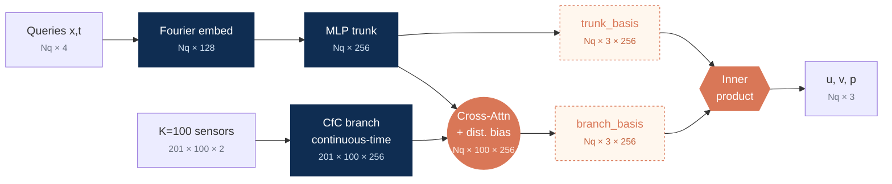

<!-- ====================================================================
     SLIDE 01 · COVER  (pptx Cover layout: 無 chevron NavBar，只有 logos)
     ==================================================================== -->

  <SectionTag>Master Thesis Defense · Engineering and System Science, NTHU · July 2026</SectionTag>

物理約束之稀疏感測器連續時間湍流場重建

<h1 style="font-size: 2.2rem; line-height: 1.15; font-weight: 700; color: #7F1084; letter-spacing: -0.01em;">
Physics-Constrained Continuous-Time Reconstruction of Turbulent Flows from  Sparse Sensors
</h1>

  2-D Kolmogorov flow at <b style="color:#7F1084;">Re = 10⁴</b>,
  reconstructed from <b style="color:#7F1084;">100 velocity sensors</b>,
  with Navier–Stokes (NS) residual as the only physics signal —
  no Direct Numerical Simulation (DNS) supervision in training.

  Presenter<b>李駿毅</b> Jun-Yi Li · 113011527
  Advisor<b>林洸銓</b> Dr. Kuang C. Lin
  LabApplied Computing &amp; Thermofluid Laboratory

<FooterLogos />

<!--
[Cover · 30s] PI-CON 論文 defense。重點 anchor 在標題那行：K=100 sensors only · NS residual as the only physics signal · no DNS supervision in training。大綱 → 問題 / 架構 / 訓練 / 結果（能力→數量→位置→噪音三軸）/ 限制 / 下一步。
-->

---

<NavBar active="background" />

<SectionTag>§ Background · the sparse-reconstruction problem</SectionTag>

# The sparse-sensor reconstruction problem

<LabelTiny>Problem</LabelTiny>

Continuous velocity field <b>u(x, t)</b> from <b>K = 100</b> point sensors + Navier–Stokes

<LabelTiny>Under-determined inverse problem</LabelTiny>

K = 100 probes → N = 256² field. Exact recovery needs <b>2 500–5 000</b> [Donoho 2006 · Candès 2006] — we are <b style="color:#7F1084;">25–50× short</b>. Target: the <b>energy-dominant band</b>.

<LabelTiny>Physics as the prior</LabelTiny>

NS residual as structural regulariser → physically admissible field

<LabelTiny>Engineering constraint</LabelTiny>

No offline DNS reference&nbsp;·&nbsp;sensors + PDE only

Full vorticity field ω(x) constrained by only K = 100 point sensors (markers).

<FooterLogos />

<!--
[Background A1 · 2min] 工程動機開場：sparse sensors + PDE only。三個 bullet（setting / challenge / classical fix）+ 4 obstacles card 保持簡單，不展開 inverse problem 的數學細節（line equation 已移除，避免被問 sensor sampling / sensor noise / rank 等問題）。Take-away 收斂為一句「四 pillar 都壞 → NN 是唯一剩下的工程方案」。下一張 (slide 3) NN vs classical 對照表，再下一張 (slide 4) PINN vs PINO 比較。
-->

---

<NavBar active="background" />

<SectionTag>§ Background · what classical methods require</SectionTag>

# What classical inverse methods require

Classical inverse methods — Proper Orthogonal Decomposition (POD) Reduced-Order Model (ROM) · four-dimensional variational assimilation (4D-Var) · ensemble Kalman filter (EnKF) — each needs one ingredient the field cannot supply:

<Card>

① A pre-computed reference field

POD basis or data-assimilation background field · both <b>offline from a full-field DNS</b>

<b>✗ no offline DNS reference</b> in the field

</Card>

<Card>

② The forward solver in the loop

4D-Var / EnKF <b>re-run the NS solver</b> every assimilation window

<b>✗ minutes–hours per window</b> · not real-time at Re = 10⁴

</Card>

<b style="color:#7F1084;">Implication</b> · learn the prior from sparse sensors + PDE · no reference field, no online solver → neural operator with a physics residual

<FooterLogos />

<!--
[Background A2 · 2min] 對照表 5 + 1 個 deployment requirement：DNS basis 依賴 / forward solver 成本 / 非線性 / function-valued input / inference latency / PDE consistency。Take-away：NN 解掉 classical 的 blocker 並保留 PDE consistency；下一張比較 PINN vs PINO 決定要用哪種 NN。
-->

---

<NavBar active="background" />

<SectionTag>§ Background · operator vs. plain PINN</SectionTag>

# Operator vs. plain PINN

<Card>
<LabelTiny>PLAIN PHYSICS-INFORMED NEURAL NETWORK (PINN)&nbsp;[Raissi 2019]</LabelTiny>

(x, t)&nbsp; →&nbsp; network&nbsp; →&nbsp; u

<b>One flow at a time</b> · input is a single (x, t) coordinate · <b style="color:#E97132;">never reads the measurement stream as input</b> · retrained per case

</Card>

<Card style="background: rgba(127,16,132,0.05);">
<LabelTiny>NEURAL OPERATOR&nbsp;(DeepONet) [Lu 2021]</LabelTiny>

sensors {y(tk)} →<b>branch</b>
query (x, t) →<b>trunk</b>

}

→&nbsp;<b>u(x, t)</b>

inner product of branch &amp; trunk bases

Learns a <b>mapping</b>, not one solution · <b style="color:#7F1084;">branch reads the whole sensor trajectory</b> · trunk queries any point · one network serves new sensor streams

</Card>

<b style="color:#7F1084;">Why an operator</b> · operator branch lets a <b>sparse sensor history</b> — not just a coordinate — drive the reconstruction · <b>P</b>hysics-<b>I</b>nformed <b>C</b>ontinuous-time <b>O</b>perator <b>N</b>etwork (<b style="color:#7F1084;">PI-CON</b>) = operator + differentiable PDE residual

<FooterLogos />

<!--
[Why neural operator · 2min] 從第三頁延伸：上一張說明為何用 NN 而非 POD/4D-Var/KF，這張說明為何用 operator 而非 vanilla PINN。對照表 5+1 row，PINO column 用 ① ② ③ ④ 標號四個對 sparse-sensor 的關鍵 advantage：
① Sensor input 從點變函數（branch ingests trajectory）
② Query 任意 (x, t)，不綁特定問題
③ Generalisation amortised across instances
④ PDE residual 直接在 operator output 上（highlight row）
下一張 K=100 CS bound 量化結構難度。
-->

---

<NavBar active="background" />

<SectionTag>§ Literature review · four gaps</SectionTag>

# Four gaps across seven research lines

<table class="gp">
<thead>
<tr>
<th style="width: 4%;"></th>
<th style="width: 30%;" class="key">What is missing</th>
<th style="width: 46%;">Left open by</th>
<th style="width: 20%;">Answered by</th>
</tr>
</thead>
<tbody>
<tr>
<td class="n">1</td>
<td class="key">Ground-truth field to train against</td>
<td>POD · DMD · QR-pivot [Sirovich 1987 · Manohar 2018] · DeepONet · FNO [Lu 2021 · Li 2021] · SHRED · Senseiver · FLRNet</td>
<td>architecture</td>
</tr>
<tr>
<td class="n">2</td>
<td class="key">Sensors read as input</td>
<td>PINN · PirateNet [Raissi 2019 · Wang 2024] — scored by sensors · operator nets need a dense grid</td>
<td>architecture</td>
</tr>
<tr>
<td class="n">3</td>
<td class="key">Uneven clocks under PDE autodiff</td>
<td>Neural / Latent ODE [Chen 2018 · Rubanova 2019] · CfC [Hasani 2022] — never PDE-constrained</td>
<td>architecture</td>
</tr>
<tr class="sens">
<td class="n">4</td>
<td class="key">Sensing configuration mapped</td>
<td><b>All surveyed works</b> — one error, one fixed setup · sensor positions taken as <b>given</b></td>
<td><b style="color:#E97132;">sensing study</b></td>
</tr>
</tbody>
</table>

Gaps 1–3 are architectural → PI-CON · Gap 4 is not → more sensors, better placement, or a better model?

<FooterLogos />

<!--
[Literature review 1/2 · 口述（表下敘事與註記已刪，字太小）：
「這些方法都報 few-percent error，但全都對著 full reference field 訓練；surveyed works 裡只有三篇
不用 reference field —— 下一頁就是那三篇。」
「七篇 surveyed works 沒有一篇報 parameter count；上表四篇裡有三篇未報 Reynolds number。」
  —— 委員問「為何不比參數量 / Re」時照此答。
[Literature review 1/2 · 1.5min] 對應 thesis Table 1.1 (tab:lit_summary, chapter01.tex:23-83)，
但不逐條列七行——論文自己說那七條線是要被 consolidate 成四個 Gap 的（chapter01:21），
重點是「卡在哪」不是「有幾條」。完整七行表在 thesis Table 1.1，被問細節時翻論文。
注意：他人方法參數量 thesis 未載，不可臆造。

⚠️ 2026-07-17 重大修正：本頁原本列的四個 gap 是**投影片自創**的四個架構 gap
（reference field / solver in the loop / reads sensors / met a PDE），**與論文的四個 Gap 不同**，
而且把論文的 Gap 4 弄丟了。後果：整個 O2/O3（貢獻的一半）在文獻回顧裡沒有對應的缺口，
Objective 那頁的 O2/O3 因此顯得沒有來由。

現改為論文 chapter01:108-118 的原四條：
  Gap 1 (ch01:108) No ground-truth field to train against
  Gap 2 (ch01:111) The model must read the sensor stream, not merely be scored by it
  Gap 3 (ch01:114) Sensors report on uneven clocks, but the model must stay differentiable for the PDE
  Gap 4 (ch01:117) How the sensing configuration (count, placement, noise) governs reconstruction is unmapped
底部條依 chapter01:106 原文：「The first three gaps are architectural; the fourth asks how sensor
count, placement, and noise govern the achievable result. The proposed work addresses Gaps 1--3
with a new architecture and Gap 4 with a systematic sensing study.」

口述 Gap 4（本頁新增，最重要的一條，直接鋪陳 O2/O3 與 LES placement 管線）：
「所有 surveyed works 都只報一個 setup 的單一總誤差，sensor 位置一律當作**給定**的 —— 沒有人
把 count / placement / noise 拆開量。所以無從判斷下一步該加感測器、改佈點、還是換模型。」
（chapter01:118 原文：「Without this map, it is unclear whether the productive next step is more
sensors, better placement, cleaner sensing, or a better model.」）
—— 這個「positions are taken as given」的觀察出自 JY_prelim.pptx (2025-12 預口試稿) slide 8：
該表 Sensor Strategy 一欄七篇全是 Given mask / Given tracks / Given sites / Given coverage /
Given labels / As given。那一欄重複七次本身就是論證，不需修辭。

⚠️ 已移除底部原本的「The low-error methods are all in row one」條：那句在講 slide 6 的論點
（它們對著 reference field 擬合），本頁的落點應是「四個 gap 怎麼分工」。
-->

---

<NavBar active="background" />

<SectionTag>§ Literature review · training supervision in prior work</SectionTag>

# What prior methods are trained against

<table class="dns">
<thead>
<tr>
<th style="width: 20%;">Work</th>
<th style="width: 27%;">Architecture</th>
<th style="width: 18%;">Case</th>
<th style="width: 35%;" class="key">What the loss is fitted to</th>
</tr>
</thead>
<tbody>
<tr>
<td class="who">SHRED Williams 2024</td>
<td><b class="bb">LSTM</b> stack + shallow FC decoder</td>
<td>Isotropic turbulence (JHTDB)</td>
<td class="key">The full state · ‖x − H(y)‖₂</td>
</tr>
<tr>
<td class="who">Senseiver Santos 2023</td>
<td><b class="bb">Perceiver IO</b> · cross-attention to latent</td>
<td>—</td>
<td class="key">“A dense set of observations is needed to train”</td>
</tr>
<tr>
<td class="who">FLRNet Nguyen 2024</td>
<td><b class="bb">CNN</b> VAE + Fourier features + <b class="bb">MLP</b></td>
<td>Cylinder, Re 300–10³</td>
<td class="key">The full field · VAE + perceptual loss</td>
</tr>
<tr>
<td class="who">FLRONet Vo Dang 2024</td>
<td><b class="bb">DeepONet</b> · <b class="bb">FNO</b> branch + <b class="bb">MLP</b> trunk</td>
<td>Cylinder (CFDBench)</td>
<td class="key">Paired CFD fields</td>
</tr>
<tr class="ours">
<td class="who">PI-CON ours</td>
<td><b class="bb">DeepONet</b> · <b class="bb">CfC</b> branch + cross-attention</td>
<td>Kolmogorov, Re 10⁴</td>
<td class="key">Sensor MSE + NS residual only</td>
</tr>
</tbody>
</table>

<FooterLogos />

<!--
[Literature review 2/3 · 1.5min] 這頁只有一個論點：它們全都對著 reference field 擬合。
故只有一個欄位帶色（橘＝loss 對著什麼擬合），其餘中性。前一版 7 種文字顏色、橘色同時
用在 supervision / Re / readout 三種意思上 —— 每格都是重點就等於沒有重點。

已移除 Readout 與 Sensors 欄：readout 是 slide 7 的軸（Parfenyev 的 query-anywhere 在那裡
才有意義）；sensor 數在此頁不承擔論點。Re 併入 Case 欄，未報者留白（—），不特別標色 ——
那是缺席，不是警訊。

逐格出處（2026-07-15 查證）：
- SHRED (arXiv 2301.12011): stacked LSTM + shallow FC decoder；loss 原文
  「minimize reconstruction loss ∑ᵢ‖xᵢ − H̃({yⱼ})‖₂」→ 對全場 state 監督；JHTDB isotropic
  turbulence；Re 未報。
- Senseiver (Nature MI 2023): Perceiver IO 系 cross-attention 編碼進 latent；OSTI 摘要原文
  「a dense set of observations is needed to train」；Re / sensor 數未報；正文付費牆。
- FLRNet (arXiv 2411.13815): conv VAE + Gaussian Fourier (m=4, σ=5) + MLP 5×128；
  loss = VAE reconstruction + perceptual；cylinder Re 300–1000。
- FLRONet (arXiv 2412.08009): FNO branch (d=64) + 3-layer MLP trunk；cylinder CFDBench。
  ⚠️ 其 loss 定義原文未明述，「Paired CFD fields」依 chapter01:101 論述填入，非原文直引。

== 「FLRONet 的 Re 為什麼空著？」（2026-07-17 親自查證 arXiv 2412.08009 全文 15 頁）==
**因為原文從頭到尾沒給 Re 數值。** 實測：全文 54k 字元中「Reynolds」只出現 1 次，且無數字 ——
唯一那句是定性的「…the inherent difficulty of reconstructing flow with a high Reynolds number
driven by the increased velocity of the fluid…」。「viscosity」出現 0 次，所以連反推 Re 都做不到。

它改用**入口速度**索引案例：CFDBench cylinder dataset，domain 0.14 × 0.24 m → 140×240 grid，
50 個 case，inlet velocity 由 0.1 m/s 遞增到 5.0 m/s（45 train / 5 test，test 為 3.5/3.9/4.2…）。
⚠️ 2026-07-17：曾把「no Re stated · indexed by inlet velocity 0.1–5.0 m/s」以小字標進 Case 欄，
已移除（使用者：小字不需要）。**該資訊改為口述** —— 被問「FLRONet 的 Re 是多少」時答：
「原文沒給。全文只出現一次 Reynolds 且無數值，viscosity 一次都沒有，所以連反推都做不到；
它用 inlet velocity 0.1–5.0 m/s 索引 50 個 case。」
同理 SHRED (JHTDB isotropic) 與 Senseiver 亦未報 Re。**四篇裡三篇未報 Re，只有 FLRNet
給了 Re 300–10³** —— 這點若被問「為何不做 Re 的 head-to-head」，就是答案。

⚠️ 先前這裡的註記「Re 未報」是別人 2026-07-15 記的，我 2026-07-17 親自抓 PDF 逐字查證後確認屬實
（第一次 WebFetch 讀 PDF 回傳二進位亂碼、宣稱「無法確定」，不可採信；改用 pypdf 本地解析才得出）。
⚠️ 舊版頁面底部曾有一行小字「the Reynolds number is unstated in three of the four above」，
已被移除 —— 該資訊現在改標在各自的格子裡，比一行看不見的註腳有效。

順帶：FLRONet 論文標題即為「**Deep Operator Learning** for High-Fidelity Fluid Flow Field
Reconstruction from Sparse Sensor Measurements」，自稱 deep operator learning —— 這是本表
必須標出 DeepONet 血緣的第二個依據（第一個是 chapter01:101）。

== 「為什麼沒有 DeepONet 系的對照？」（2026-07-17 補；委員極可能問）==
有 —— 就是 FLRONet。chapter01:101 原文稱它是「the spatio-temporal **deep operator network**
of Vo Dang and Nguyen … **the closest published architecture to the present branch--trunk
readout**」。先前本表把它的 Architecture 寫成「FNO branch + MLP trunk」，沒出現 DeepONet
字樣，等於把這個對照藏起來 —— 委員讀表時會問的正是這題。已改為
「DeepONet · FNO branch + MLP trunk」+ 灰字註「closest published branch–trunk」。

完整答法（三層，被追問時逐層給）：
1. **文獻對照 = FLRONet**：同為 branch–trunk deep operator network，但它訓練對著
   paired CFD fields（chapter01:101「train against complete CFD fields rather than the PDE」）
   —— 差別不在架構家族，在監督訊號。這正是本表的論點。
2. **原版 DeepONet [Lu 2021] 為何不在同 regime 比較**：chapter01:93 明載 DeepONet/FNO
   「are demonstrated as dense-input forward operators: the branch expects its input function
   sampled on a fixed dense grid … rather than ~10² scattered points」——它吃不了稀疏散點，
   屬 Gap 2，不是同 regime 的競爭者。連 physics-informed 的 PINO 也「evaluates its residual
   on a grid」。
3. **真正的 DeepONet 對照在內部**：chapter01:128 的 O1 criterion 就是「reduce KE error by at
   least two percentage points relative to the **vanilla DeepONet baseline** at p<0.01」——
   那是 2×2 ablation 的 B0（主結果頁：B0 8.23% → B3 5.71%，−2.52 pp, p=3.0×10⁻⁷）。
   即 vanilla DeepONet 是以 baseline 而非文獻列的形式對照，因為沒有已發表工作在此 regime
   跑過 vanilla DeepONet，只能自己重跑才是公平比較（chapter04:39 不採他人未經本協定重跑的數字）。

== 顏色規則（三色，各一個意思，不可再增）==
橘 = loss 對著什麼擬合（本頁論點）· 深藍 = 模型主體（結構標示，非好壞）· 紫 = PI-CON 那列。
主體用深藍而非橘，是為了不與「loss 擬合對象」搶同一個語意通道。

底部交棒：exactly three 的揭曉在此頁，slide 5 不再提前宣告、slide 7 不再重述。
-->

---

<NavBar active="background" />

<SectionTag>§ Literature review · same-regime works</SectionTag>

# Same-regime works

<table class="hh">
<thead>
<tr>
<th style="width: 30%;">Work</th>
<th style="width: 14%;">Re</th>
<th style="width: 16%;">Probes</th>
<th style="width: 20%;">Sensors as input</th>
<th style="width: 20%;">Readout</th>
</tr>
</thead>
<tbody>
<tr>
<td class="who">Mo &amp; Magri 2025 PC-DualConvNet</td>
<td>34</td>
<td>230</td>
<td>✓</td>
<td>128² fixed mesh</td>
</tr>
<tr>
<td class="who">Kelshaw et al. 2022 VDSR CNN</td>
<td>34</td>
<td>100</td>
<td>✓</td>
<td>150² fixed mesh</td>
</tr>
<tr>
<td class="who">Parfenyev et al. 2024 coordinate-MLP PINN</td>
<td>1.3×10³</td>
<td>none</td>
<td>✗ loss term only</td>
<td>query-anywhere</td>
</tr>
<tr class="ours">
<td class="who" style="color:#7F1084;">PI-CON (ours) DeepONet + CfC</td>
<td>10⁴</td>
<td>100</td>
<td>✓</td>
<td>query-anywhere</td>
</tr>
</tbody>
</table>

<FooterLogos />

<!--
[Literature review 2/2 · 2min] 口述開場：
「同 regime（sensor + PDE、無 full reference field）survey 只找到這三篇，PI-CON 與它們並列。」
—— "the survey finds no others" 是回應委員「怎麼知道這是全部」的關鍵，務必口頭講出。

== 口述三個 take-away（2026-07-16 從頁面移除的三張卡，改用講的）==
① Reynolds number：最接近的一篇仍低 7.7×（1.3×10³ vs 10⁴），兩篇 CNN 低 300×（34 vs 10⁴）。
② Measurement model：Mo & Magri 用 2.3× 於我們的 probe 數（230 vs 100）；
   Parfenyev 根本沒有固定測站 —— 它抽 3×10⁴ 個隨機 (r, t) 樣本，那是任何 rig 都裝不出來的
   量測模型（chapter01:99 原文「not one a rig can install」）。
③ 本頁的落點：**沒有任何 surveyed work 同時做到 query-anywhere + sensors-as-input + Re=10⁴**
   —— 表格右兩欄加上 Re 欄一起看就是這個結論，指著表講即可，不需要再印一次。

== 表格設計（2026-07-16 重做）==
原本 7 欄且同一組橘/紫被用在四種不同意思上（Re 的橘、probes 的橘、readout 的橘、
residual 的橘都代表「比我們差」）—— 每格都是重點就等於沒有重點。現在：
  - 欄位砍到 5 欄：Work / Re / Probes / Sensors as input / Readout
  - 移除 Architecture 獨立欄（併為 Work 下的灰色小字）與 NS residual 欄
    （NS residual 與 Readout 高度相關：query-anywhere 必然是 autodiff，fixed mesh 必然是
     FD/pseudospectral，多一欄不增資訊；且「都有 PDE residual」正是本頁 same-regime 的前提，
     已寫在標題下那句）
  - 顏色只留一個意思：**紫色 = PI-CON 那一列**。其餘全中性。

逐篇出處（2026-07-15 查證）：
- Mo & Magri 2025 (arXiv 2409.00260): Re=34、80 input + 150 general sensors (≈0.9%)、
  128² grid、PC-DualConvNet (U-Net + Fourier branch)、residual 用 2nd/4th-order FD。
  原文報 relative ℓ₂ 5.51 ± 0.34 %（非 KE MAPE）。
- Kelshaw 2022 (arXiv 2210.17319): ν=1/34、10×10=100 觀測、150² grid、VDSR + bicubic、
  可微 pseudospectral residual。
- Parfenyev 2024 (arXiv 2404.01193): Re≈1.3×10³、Ndata=3×10⁴ (≈0.2%)、coordinate MLP
  7×250、autodiff residual、scattered 量測。
窮盡性：chapter01:99 界定同 regime 者恰為三篇，此表即全集。

⚠️ 兩個已知問題（尚未修 thesis）：
1. 舊版本頁曾寫「Mo & Magri KE MAPE ~23% → ours 5.71%」——該 23% 全 repo 無來源，
   原文亦無近似值（唯一「over 20%」是其 loss 變體間的相對比較）。已移除。
   chapter04:39 本就聲明不採用未經本協定重跑的他人數字為證據。
2. chapter01:99 稱三篇「each returns a fixed mesh」且「rather than continuous
   automatic differentiation」——對 Parfenyev 為誤述（它是 coordinate MLP + autodiff）。
   需修論文。
不要在口試宣稱與 Mo & Magri 的 head-to-head 數值優勢：指標不同、Re 差 300 倍。
-->

---

<NavBar active="background" />

<SectionTag>§ Background · the sensor resolution limit</SectionTag>

# K = 100 — the sensor resolution limit

<Card>
<LabelTiny>Sensor Nyquist</LabelTiny>

Fourier modes inside |k| ≤ kmax ≈ <b>πkmax²</b> · set equal to the <b>K</b> measurements:

kmax ≈ √(K/π)

At <b>K = 100</b> → kmax ≈ <b style="color:#7F1084; font-size:1.5em;">5.64</b> · a scale, not a wall — beyond it κ: 7 → 7×10² <b>(observable to k ≈ 8)</b>

</Card>

<Card>
<LabelTiny>Energy inside the band</LabelTiny>

DNS kinetic energy within |k| ≤ kmax (t = 5) · K = 100 → <b style="color:#7F1084;">98.9 %</b> · 200 → 99.7 % · 400 → 99.9 %

</Card>

DNS energy spectrum (a) · cumulative fraction (b) · dashed line = kmax = √(K/π)

<FooterLogos />

<!--
[Sensor budget · 2min] 口述收尾（底部 banner 已刪）：「解法是加 sensor，不是加大網路 —— 限制來自資訊，不是架構。」
[Sensor budget · 2min] 兩個視角量化 K=100 觀測能力：①linear system — y = Cu rank-deficient, 650× underdetermined ②CS bound — M ≥ O(s log(N/s)), s≈328 (db4 wavelet), full recovery 需 ~5000 sensors, K=100 差 50×。Implication 精準化：full-field recovery 結構上不可能；productive scope 是 low-band sub-recovery (Nyquist k_max ≈ 5.64) + physics prior 在 null-space 上 regularise。後續 Results 用 sensor Nyquist 與 K-scaling 量化此 scope。
-->

---

<NavBar active="objective" />

<SectionTag>§ Objective</SectionTag>

# Research objective

Reconstruct 2-D turbulent flow from sparse (u, v) sensors + Navier–Stokes residual, <b style="color:#7F1084;">no DNS field</b> in training · then map how <b style="color:#7F1084;">count, placement, noise</b> govern quality.

<Card>
<LabelTiny style="color:#7F1084;">(O1)&nbsp; ACCURATE &amp; FAST RECONSTRUCTOR</LabelTiny>

Engineering-grade from <b>sensor + PDE</b> only · query any (x, t) in one pass.

Criterion · KE rel-err <b>&lt; 10 %</b> (n = 5) — the engineering usability threshold

</Card>

<Card>
<LabelTiny style="color:#7F1084;">(O2)&nbsp; COUNT SETS THE RESOLUTION</LabelTiny>

Recoverable band set by <b>sensor count</b>, not architecture.

Criterion · effective cutoff tracks <b>√(K/π)</b> as K scales

</Card>

<Card>
<LabelTiny style="color:#7F1084;">(O3)&nbsp; PLACEMENT &amp; NOISE SET RELIABILITY</LabelTiny>

Placement and noise change reliability, <b>not feasibility</b>.

Criterion · every placement &amp; noise to <b>10 %</b> stay <b>within target</b>

</Card>

<FooterLogos />

<!--
[Objective · 1.5min] 對齊論文三軸 arc：工具(PI-CON) + sensing-configuration 系統研究（數量/位置/噪音）。
上方一句話：用 PI-CON 從稀疏 sensor + NS residual 重建流場（無 DNS 全場），並系統研究 sensing config 如何決定品質。
三個 Objective（先 qualitative goal、後 falsifiable criterion）：
  O1 重建器（準＋快）：sensor+PDE only 達 engineering grade，任意點單次前傳。criterion KE<10% n=5 / dominant lever ≥2pp @p<0.01 / 單次前傳 ≥5× 快於 forward-solving。
  O2 數量軸：可重建波數由 sensor 數量決定，非架構。criterion k_max^sensor=√(K/π)≈5.64 @K=100；K=100/200/400 cutoff 隨 √(K/π) 移動。
  O3 位置&噪音軸：placement/noise 影響 reliability 不影響 feasibility。criterion 三 placement 皆 engineering-grade、σ_placement≥3×σ_training；noise 到 10% 仍 engineering-grade。
⚠️ 2026-07-16 移除底部的 Contribution 區塊 —— 三重重複：
(a) 「surveyed 中唯一結合 query-anywhere + sensor-only-with-physics @ Re=10⁴」已在
    slide 7（Same-regime works）的「No surveyed work combines all three」講過；
(b) 「PI-CON = CfC branch + cross-attn + AL-continuity」是 slide 12（Three additions
    to DeepONet）整頁的內容；
(c) 貢獻條列在 §Conclusion 有專頁。
本頁專責「要達成什麼 + 怎麼判定失敗」，架構與貢獻留給後面。

口述橋接（頁面不印）：「這三個目標分別由架構、數量軸、位置與噪音軸回答 —— 先看架構。」
論文 §Objective 結尾有 \paragraph{Contribution}（thesis/CLAUDE.md 要求），那是論文體例；
投影片有專頁，不需在此重複。
-->

---

<NavBar active="method" />

<SectionTag>§ Application case · the Kolmogorov flow</SectionTag>

# Kolmogorov flow at Re = 10⁴

  

<Card>
<LabelTiny>Governing equations · incompressible Navier–Stokes</LabelTiny>

∂<b>u</b>/∂t + (<b>u</b>·∇)<b>u</b> = −∇p + ν∇²<b>u</b> + <b>f</b> 
∇·<b>u</b> = 0

<BulletRow><b>Forcing</b> · <b>f</b> = (A sin(2πkf y), 0) · A = 0.1 m/s², kf = 2 m⁻¹</BulletRow>
<BulletRow><b>Domain</b> · Ω = [0, 1]² m², doubly-periodic</BulletRow>

</Card>

<Card>
<LabelTiny>Reynolds number · two, reported separately</LabelTiny>

<BulletRow><b>Control</b> · Re ≡ UL/ν = <b style="color:#7F1084;">10⁴</b> — prescribed</BulletRow>
<BulletRow><b>Injection-scale</b> · Ref ≡ Urmsλf/ν ≈ <b>2.5×10³</b> — measured</BulletRow>

</Card>

<FooterLogos />

<!--
[The case · 1.5min] 新增頁（2026-07-16）。教授九點要求「case 要交代 governing equation / forcing / Re 定義」。
數字逐條對應 thesis chapter03.tex:11-31（\paragraph{Governing equations and characteristic scales.}）
與 tab:dns_params（chapter03.tex:47-54）：
- NS 方程 = eq:ns_dim (ch03:13-19)；forcing f = (A sin(2π k_f y), 0)ᵀ (ch03:20)
- A = 0.1 m/s²、k_f = 2 m⁻¹ (tab:dns_params ch03:53-54)
- λ_f = 1/k_f = 0.5 m、U_rms = √(2·KE̅) = 0.503 m/s = eq:char_scales (ch03:23-24)
- 控制 Re ≡ UL/ν = 10⁴，L = box edge = 1 m、U = 1 m/s、ν = 10⁻⁴ m²/s；原文明講
  「prescribed through ν rather than derived from the realised flow」(ch03:20)
- 診斷 Re_f ≡ U_rms λ_f/ν ≈ 2.5×10³ = eq:re_inj (ch03:29)

== 口述（頁面刻意不印）==
指圖（動畫，t = 0 → 5，41 幀循環）：「二維 Kolmogorov flow 的渦度場。
forcing 尺度的渦捲夾著薄剪切層，隨時間翻捲 —— 那些細結構就是 K=100 看不到的部分。」

⚠️ 2026-07-16 改用動畫 GIF（原為 t=5 靜態 PNG）。來源：舊 Corning 面試稿
~/Downloads/slidev-presentation/public/animation_vorticity_re10000.gif，已複製進 public/images/。
使用前逐項驗證過它與本論文 DNS 同源，非隨手取用：
  - 頁腳標註 "N=1024 ETD-RK4 fp64 3/2 dealias T=5" → 對應 chapter03 tab:dns_params 的
    run 1024²、ETDRK4、fp64、T=5（3/2 padding 與 2/3 truncation 是同一件事的兩種說法）
  - 軸為 0.0–1.0 物理座標 → domain [0,1]²，與 chapter03:12/20 一致
    （注意：r3 deck 的**文字**寫 [0,2π]² 是錯的，但這張**圖**本身是對的，兩者不要混淆）
  - 最後一幀 t=5.00 的渦結構與 kolmogorov_dns_vorticity_re10000_t5.png 完全吻合 → 同一次 DNS
順帶修掉舊靜態圖的缺點：那張的軸是 "x index"/"y index"（格點編號），GIF 是物理座標。

⚠️ 已對原始 GIF 做兩處後製（scripts 無產生腳本，故直接改檔）：
  1. 裁掉頂端 19 列 —— **原檔的標題帶「Kolmogorov DNS Re=10000」本身就被切掉一截**
     （實測第 0 列即有 191 px 非白墨），且該標題與投影片 H1 重複。裁掉比留半截字乾淨。
     保留第 25 列起的 "t = ..." 時間戳（顯示動畫進度）與頁腳的 DNS 參數標註。
  2. 128 色調色盤 + optimize → 12.0 MB 壓到 4.1 MB，t=5 幀與原檔比對無可見劣化。
裁切後尺寸 1050 × 956（原 1050 × 975）。

⚠️ .gitignore 未擋此檔 → commit 會進 repo（4.1 MB）。
⚠️ 匯出 PDF 時 GIF 只會定格第一幀（t = 0，初始細碎場）。若 PDF 版需要有意義的畫面，
   改用 kolmogorov_dns_vorticity_re10000_t5.png，或接受定格在 t=0。
「最接近的同 regime 工作 Mo & Magri 2025 做同一個 case，但在 Re=34。」(chapter01.tex:99)
Re 兩個為何不同（被問才展開，本頁真正的火力）：
「控制 Re 透過 ν 指定，不是量出來的；量出來的注入尺度 Re_f ≈ 2.5×10³。
差約 4 倍是因為 U_rms(0.503) < U(1)：受迫紊流飽和在參考速度以下。ch03:31 明載兩者分開報。」

== 版面 ==
沿用 slides-r3.md:249-316 骨架：對半、圖佔一半置中、圖下不放 caption、兩卡共 4 條 BulletRow。
方程用純文字（非 LaTeX $$）壓低密度。本 deck 無 Caption 元件（r3 有），底部不放 micro caption。
★ 記號已全數移除：論文用 ★ 區分有/無因次，本頁不做無因次化推導，★ 無作用且渲染成搶眼黑星，
並會與上方無星號的方程形成同頁兩套記號。

⚠️ 不可宣稱 statistically steady / sustained：本 DNS 無阻尼、只積分到 t=5，KE 實際 0.161 → 0.122
衰減，T/t_eddy = 2.51 已誠實揭露為短窗 (ch03:113)。頁面只寫 forcing 的形式，不碰穩態。
⚠️ 「為何選 Kolmogorov」thesis 無明文 rationale，不編理由；只陳述 Mo & Magri 同 case 之事實。
⚠️ 不講「forcing 只作用在 u 所以 v 較難重建」—— 該歸因全 thesis 查無，且 cross-attention 的
isotropic kernel 是未排除的競爭解釋（見已停用的 velocity-error backup 頁）。

⚠️⚠️ 版面沿用舊 Corning 面試稿 slides-r3.md，但**數據一律不採用**，五處與本論文矛盾：
  1. r3「Domain [0, 2π]²」→ 論文 Ω = [0,1]²（ch03:12, 20）
  2. r3「Re = U·L/ν, L = 2π/k_f」→ 論文 L = box edge = 1 m（ch03:20）。不同 convention，
     混用會讓 λ_f = 0.5 m 與 k_f = 2 對不上
  3. r3「F = sin(k_f y) x̂」→ 漏振幅 A = 0.1 與 sin 內的 2π（ch03:20, tab:dns_params）
  4. r3「forced, statistically stationary」→ 本 DNS 是衰減短瞬態，見上
  5. r3「clear inertial subrange」→ ch03:113 原文「the [0,1]² box admits **no extended
     inertial range** at this Re」，尾段斜率 −4.61 比 Kraichnan k⁻³ 更陡。直接相反
另：r3 通篇「sub-DNS divergence」為 thesis/CLAUDE.md 明列禁項，不可回收。
r3 的 vorticity GIF 不在本 repo，改用既有靜態圖 kolmogorov_dns_vorticity_re10000_t5.png。
-->

---

<NavBar active="method" />

<SectionTag>§ Application case · numerical setup · Re = 10⁴ · K = 100 sensors</SectionTag>

# 2-D Kolmogorov benchmark — setup at a glance

<Card>
<LabelTiny>DNS REFERENCE SOLVER</LabelTiny>

<b>Solver</b>&nbsp; pseudo-spectral · 2/3 dealiasing · ETDRK4 fp64

<b>Grid</b>&nbsp; run <b style="color:#7F1084;">1024²</b> · stored <b>256²</b>

<b>Sampling</b>&nbsp; Δts = 0.025 s · Nt = 201

</Card>

<Card>
<LabelTiny>DNS VERIFICATION</LabelTiny>

<b style="color:#0F2D52;">Resolution &amp; turbulence statistics</b> ✓

<b>Statistical window</b>&nbsp; T = 5 s ≈ <b style="color:#7F1084;">2.5 eddy-turnovers</b>

</Card>

<Card style="padding-top: 0.6rem; padding-bottom: 0.6rem;">

</Card>

<Card>
<LabelTiny>SPARSE-SENSOR PROBLEM</LabelTiny>

<b style="color:#7F1084;">K = 100</b> (u, v) QR-pivot probes → query (u, v, p) at any (x, t)

</Card>

<FooterLogos />

<!--
[Setup · 1.5min] 教授要求補 CFD 必要參數。本頁只講「數值設定」。
⚠️ Governing equations / forcing / Re 定義那張卡已於 2026-07-16 移除 —— 改由前一頁
（"Kolmogorov flow at Re = 10⁴"）專責，兩頁曾重複。不要再把方程加回本頁。
- DNS algorithm：pseudo-spectral with 2/3 dealiasing [Orszag 1971; Boyd 2001] + ETDRK4 fp64 [Cox–Matthews 2002; Kassam–Trefethen 2005]
- Grid 256²、Δt = 2.5e-4、snapshot Δt_s = 0.025、N_t = 201、T = 5
- DNS verification 3 條件：k_max·η = 1.91 ≥ 1.5 (Pope 2000) ✓、KE plateau + CFL ≈ 0.18 < 0.5 ✓、T/t_eddy = 2.51 turnovers ⚠（誠實揭露 statistical window 有限，靠 multi-seed 彌補）
- Sparse-sensor card：K = 100, QR-pivot POD [Manohar 2018], operator target G_θ, loss 只用 sensor + NS（不偷 DNS / ω / E(k)）
右 col 維持 sensor placement 圖。把 engineering target（KE/div/k_f amp 數字）移到 §Results，§Setup 不背具體閾值。
-->

---

<NavBar active="method" />

<SectionTag>§ Architecture · how (O1)–(O3) get answered</SectionTag>

# Three additions to DeepONet

Tensor shapes · sensor path fixed per trajectory (201 time steps × 100 sensors) · query path batched over
<b>Nq</b> = 1 024 collocation points per training step, 128² grid at evaluation.

<Card>
<LabelTiny>CfC branch</LabelTiny>

Reads the irregularly-clocked sensor time signal, not a fixed-grid snapshot · keeps (O1) sensor-only training feasible.

</Card>
<Card>
<LabelTiny>Relpos cross-attention</LabelTiny>

Query (x, t) → nearby sensors · sparse-to-dense field readout at any query.

</Card>
<Card>
<LabelTiny>Augmented Lagrangian</LabelTiny>

Adaptive penalty on ∇·u · incompressibility as an active constraint, not a soft residual.

</Card>

<FooterLogos />

<!--
[Architecture · 2min] 教授九點 (7) (9) 落實：把 Architecture 寫成「接 Objective、補 vanilla DeepONet 缺口」三件套 narrative，不在這頁堆 AI mathematical 細節。
Gap → Addition → Why-it-hits-(Ox) 三欄表：
  Gap (a) DeepONet branch 吃固定 grid snapshot → CfC continuous-time branch → 對齊 (O1) sensor-only feasibility
  Gap (b) inner product 沒 spatial prior → cross-attention with ‖r‖ bias → 對齊 (O2) streaming inference
  Gap (c) PDE residual soft penalty → Augmented Lagrangian on continuity → 對齊 (O3) physical consistency
底部一行交代 trunk Fourier embed [Tancik 2020] + GradNorm [Chen 2018] + 3.14M params。
CfC 內部公式、cross-attn 內部公式留 backup slides，這張只講 narrative。
-->

---

<NavBar active="method" />

<SectionTag>§ Method · CfC branch (closing the time-signal gap)</SectionTag>

# CfC — closing the "time-signal" gap in vanilla DeepONet

<Card>
<LabelTiny>① LIQUID NEURAL NETWORK (LNN) [Hasani 2021]</LabelTiny>

h relaxes toward a target A · the <b>decay rate depends on the input</b> — a "liquid" time constant:

$$\frac{d h}{dt} = -\underbrace{\Bigl[\tfrac{1}{\tau} + f(\cdot)\Bigr]}_{\text{input-dependent rate}} \odot\, h \;+\; f(\cdot) \odot A$$

τ, A learnable · f(·) a small MLP · <b style="color:#E97132;">✗ ODE solver in autograd is expensive</b>

</Card>

<Card>
<LabelTiny>② CfC — closed-form solution [Hasani 2022]</LabelTiny>

Same dynamics solved analytically — <b>a gate σ that blends two candidate states</b>:

$$h(t + \Delta t) = \sigma \odot f_1 + (1 - \sigma) \odot f_2$$

$$\sigma = \mathrm{sigmoid}(-\tau_a \Delta t + t_b)$$

<ChartCanvas type="line" :data="gateData" :options="gateOpts" height="54px" />

short gap → <b style="color:#7F1084;">σ → 1</b> → f1 (fast) 
long gap → <b style="color:#7F1084;">σ → 0</b> → f2 (relaxed)

f1 fast-response · f2 slow-relaxation · <b style="color:#0F2D52;">✓ no ODE solver</b> · O(1)/step · autograd-safe

</Card>

<FooterLogos />

<!--
[CfC introduction · backup 1min] 口述開場（標題下小字已刪）：「vanilla DeepONet 的 branch 吃固定 grid snapshot，
我們的 sensor 是不等間隔取樣的 time series，所以把 branch 換成 closed-form continuous-time RNN。」 教授九點 (9) — CFD lab 不重 AI 細節：把 CfC 介紹改成「補 vanilla DeepONet 的 time-signal 缺口」narrative。
頂部一句話：vanilla DeepONet branch 吃固定 grid snapshot，我們的 sensor 是 irregular time series，所以換成 closed-form continuous-time RNN。
卡 1：LNN ODE 形式 + 為何 vanilla ODE solver 在 autograd 內貴。
卡 2：CfC analytical closed-form + O(1) per step + autograd 安全。
底部「為何要 CfC」三條 chip 移除（已在頂部 narrative + 卡 2 末尾標明）。
-->

---

<NavBar active="method" />

<SectionTag>§ Method · cross-attention readout (closing the sparse-to-dense gap)</SectionTag>

# Cross-attention — closing the "sparse-to-dense" gap

<Card>
<LabelTiny>① ATTENTION READOUT [Vaswani 2017]</LabelTiny>

<b style="color:#7F1084;">① Score</b> · <b style="color:#7F1084;">② Retrieve</b>

$$A_{qk} = \mathrm{softmax}_k\!\left(\mathbf{Q}_q^{\top} \mathbf{K}_k \big/ \sqrt{d_{\text{hidden}}} \;+\; b_{qk}\right)$$

$$\textstyle\sum_{k=1}^{K} A_{qk}\,\mathbf{V}_k \;\longrightarrow\; \mathbf{c}_{\text{branch}}(q)$$

<b style="color:#0F2D52;">Qq</b>from the <b style="color:#0F2D52;">trunk</b> · Fourier (x, t)
<b style="color:#7F1084;">bqk</b>MLPrelpos(rqk) · rqk = smoothed torus distance
<b style="color:#D97757;">Kk</b><b style="color:#D97757;">sensor token</b> · WK · scored
<b style="color:#7F1084;">dhidden</b>key/query dim · softmax scaling
<b style="color:#D97757;">Vk</b><b style="color:#D97757;">same token</b> · WV · retrieved
<b style="color:#7F1084;">cbranch</b>branch context · residual MLP

</Card>

<Card>
<LabelTiny>② TWO FLUID-SPECIFIC MODIFICATIONS</LabelTiny>

<b>Causal lookup</b> → <b style="color:#0F2D52;">streaming-deployable</b>

<svg viewBox="0 0 300 60" class="w-full mt-1">
  <rect x="6" y="16" width="181" height="21" fill="#7F1084" opacity="0.08" rx="2"/>
  <line x1="6" y1="37" x2="286" y2="37" stroke="#D1D5DB" stroke-width="1"/>
  <polygon points="286,33 295,37 286,41" fill="#D1D5DB"/>
  <text x="284" y="28" style="font-size:12px;font-style:italic" fill="#9CA3AF">t</text>
  <g fill="#7F1084">
    <circle cx="24" cy="37" r="3.4"/><circle cx="51" cy="37" r="3.4"/><circle cx="78" cy="37" r="3.4"/>
    <circle cx="105" cy="37" r="3.4"/><circle cx="132" cy="37" r="3.4"/><circle cx="159" cy="37" r="3.4"/>
  </g>
  <g fill="#fff" stroke="#D1D5DB" stroke-width="1.5">
    <circle cx="214" cy="37" r="3.4"/><circle cx="241" cy="37" r="3.4"/><circle cx="268" cy="37" r="3.4"/>
  </g>
  <line x1="187" y1="12" x2="187" y2="45" stroke="#D97757" stroke-width="2"/>
  <text x="191" y="21" style="font-size:12px;font-weight:700" fill="#D97757">query t<tspan style="font-size:9px" dy="2">q</tspan></text>
  <text x="6" y="55" style="font-size:12px;font-weight:700" fill="#7F1084">reads these</text>
  <text x="208" y="55" style="font-size:12px" fill="#9CA3AF">future — hidden</text>
</svg>

<b>Isotropic bias</b> — distance decides, direction does not

<svg viewBox="0 0 300 104" class="w-full mt-1">
  <g fill="none" stroke="#E5E7EB" stroke-width="1" stroke-dasharray="3 2">
    <circle cx="70" cy="46" r="18"/><circle cx="70" cy="46" r="34"/>
  </g>
  <g stroke="#C9B3D6" stroke-width="1">
    <line x1="70" y1="46" x2="98" y2="27"/><line x1="70" y1="46" x2="38" y2="58"/>
  </g>
  <text x="84" y="41" style="font-size:12px;font-style:italic" fill="#9CA3AF">r</text>
  <text x="50" y="61" style="font-size:12px;font-style:italic" fill="#9CA3AF">r</text>
  <circle cx="98" cy="27" r="5.5" fill="#7F1084"/>
  <circle cx="38" cy="58" r="5.5" fill="#7F1084"/>
  <circle cx="70" cy="46" r="3.5" fill="#D97757"/>
  <text x="70" y="99" style="font-size:12px;font-weight:700" fill="#0F2D52" text-anchor="middle">same r, same bias</text>
  <g transform="translate(230,46) rotate(-34)">
    <ellipse rx="40" ry="13" fill="#9CA3AF" opacity="0.12"/>
    <ellipse rx="40" ry="13" fill="none" stroke="#D1D5DB" stroke-width="1.2" stroke-dasharray="3 2"/>
  </g>
  <circle cx="258" cy="27" r="7.5" fill="#9CA3AF" opacity="0.9"/>
  <circle cx="198" cy="58" r="2.4" fill="#9CA3AF" opacity="0.55"/>
  <circle cx="230" cy="46" r="3.5" fill="#D97757"/>
  <text x="230" y="99" style="font-size:12px" fill="#9CA3AF" text-anchor="middle">direction decides</text>
</svg>

</Card>

<FooterLogos />

<!--
[Cross-attention introduction · backup 1min] 口述開場（標題下小字已刪）：「inner product 是 global、沒有 spatial prior；
Q 來自 trunk，K 與 V 來自 sensor token —— 所以是 cross 不是 self。」（chapter02:290-292） 少談 Transformer 內部細節，照 thesis §2.3 的骨架講：
「Two modifications adapt it to fluid reconstruction: an isotropic relative-position bias and a causal lookup over sensor time.」(chapter02:257)
頂部一句話：vanilla DeepONet inner product 是 global、沒 spatial prior，所以換成 cross-attention 做 sparse-to-dense readout（chapter02:135 原話）。
卡 1：機制 — 先 Score（A_qk = softmax(QK/√d + b_qk)）再 Retrieve（Σ A_qk V_k → c_branch）。
      為何叫 cross 不叫 self：self-attention 的 Q/K/V 同源，這裡 Q 來自 trunk（查詢點）、
      K 與 V 來自同一個 sensor token H_q[k] 走 W_K / W_V 兩個投影（chapter02:290-292）。
      卡上用顏色編碼：Q 深藍（trunk）、K 與 V 橘（sensor token，同源）。
      √d_hidden 是 softmax 溫度縮放，不是 V；用 \big/ 寫成一行避免根號被 \frac 分母縮小而誤讀成 V。
      b_qk = MLP_relpos(LayerNorm(r_qk))；
      r_qk 先 fold 回環面再取 smooth norm，ε=10⁻⁸ 是為了避免 query 落在 sensor 上時 second-order autograd 出 NaN（chapter02:279）。
卡 2：兩項 fluid-specific 修改，改用圖不用公式（searchsorted/clamp 是實作細節，同心圓是幾何，兩者用文字講都不直觀）。
      被問實作時再答 chapter02:263 的 n*(q) = clamp(searchsorted({t_n}, t_q, right=True) − 1, 0, N_t − 1)。
      (a) causal lookup：binary search 只讀 t ≤ t_q → streaming-deployable；
      (b) 為何 isotropic 而非 directional：forcing 讓流場統計非等向，但 directional bias 會把 QR-pivot sensor 的
      非均勻 x 分布學成假的方向性注意力（chapter02:268）。這是被問「為何不用 (r_x, r_y)」時的標準答案。
移除原本「Self-attention vs cross-attention」對比（純 AI 細節，CFD lab 不感興趣）。
移除原本「卡 2：CFD analogue — learnable RBF interpolant」：該類比全論文不存在（chapter02 提 RBF 0 次），
且 RBF 在論文裡只是被打敗的 baseline（chapter04:219，pointwise u rel-L₂ 低 47–74%）— 講它等於自找交叉詰問。
-->

---

<NavBar active="method" />

<SectionTag>§ Method · Large-Eddy Simulation (LES) proxy</SectionTag>

# LES proxy — DNS-free sensor placement

<Card>
<LabelTiny>FILTERED NAVIER–STOKES</LabelTiny>

$$\partial_t \bar{u}_i + \bar{u}_j\,\partial_j \bar{u}_i = -\partial_i \bar{p} + \nu\,\nabla^2 \bar{u}_i \;-\; \partial_j \tau_{ij}^{\mathrm{SGS}} \;-\; r\,\bar{u}_i + f_i$$

<b>Domain</b>&nbsp; same Ω, BC, forcing as DNS

<b>Friction</b>&nbsp; <b style="color:#E97132;">r = 2.86×10⁻² s⁻¹</b> — arrests the inverse cascade · <b>absent from the DNS</b>

<b>Closure</b>&nbsp; Bardina scale-similarity + spectral hyperviscosity

<b>Setup</b>&nbsp;·&nbsp; N = 256, Tend = 50 s, cost ≈ <b style="color:#7F1084;">1/16 DNS</b>

</Card>

<Card>
<LabelTiny>LES VERIFICATION</LabelTiny>

<b style="color:#0F2D52;">Resolution and stability</b> ✓

<b style="color:#E97132;">Statistical convergence not established</b> · Tend/τint = <b>4.9</b> &lt; 10

<b>Role</b>&nbsp; <b style="color:#0F2D52;">placement only</b> — needs large-scale structure, not statistics

</Card>

Fig. 2 · LES vorticity with K = 100 QR-pivot sensors

<FooterLogos />

<!--
[LES generation · 2min] 教授九點 (4) (5) 落實：LES 也要把 CFD 重要參數寫清楚 + 解析度/穩定度判斷標準。
左卡 1 — filtered NS + Domain/BC（雙週期，與 DNS 一致）+ SGS closure（Bardina scale-similarity [Bardina 1980; Sagaut 2006] + spectral hyperviscosity）+ Solver（pseudo-spectral + 2/3 dealiasing, RK2 Heun fp64；DNS 才用 ETDRK4）+ N=256, T_end=50, cost ≈ 1/16 DNS
左卡 2 — LES 品質 gate。2026-07-16 用 scripts/check_les_quality.py 對
data/les/kolmogorov_les_Re10000_N256_T50_standalone.npy 實測：
  [1] incompressibility  max‖∇·u‖ = 2.29e-13 < 1e-10（solver fp64 診斷值，非從 float32 場重算）PASS
  [2] no aliasing pile-up  譜末端衰減比 5.14e32 > 1e6  PASS
  [3] statistical window  ⚠️ **腳本報 τ_int = 4.28 → T_end/τ_int = 11.68 PASS，此判定不可採信**

⚠️⚠️ 2026-07-17 更正（頁面已改；先前投影片寫「statistical convergence ✓ · 11.7 ≥ 10」是錯的）：
scripts/check_les_quality.py 的 τ_int 是**從那支 50 s 紀錄自己**估的 → 系統性低估。
若真實 τ_int ≈ 10 s，50 s 只有約 5 個相關時間，自相關會提早過零，積分必然偏小 ——
**太短的紀錄無法自己揭露它太短**，是自我實現的假通過。
論文 chapter03:193 用正確做法：另跑一支 **T_end = 400 s** 診斷（N=128 較便宜，同 closure /
friction / dealiasing）量得 **τ_int = 10.1 s** → 50/10.1 = **4.9 < 10，未達**；N_eff ≈ 2.5，
且該 400 s 診斷到 t=400 仍有微弱能量上飄 → 「no horizon reachable at this cost reaches a
statistically steady state」。tab:les_verification 亦已標為「Statistical window (not met; see text)」。
→ 口試不可宣稱 LES 統計收斂。正確說法：**LES 只需提供大尺度空間結構供佈點，不需統計收斂**
（頁面 Role 那行已改成這個口徑）。
→ TODO: scripts/check_les_quality.py 的 [3] 應改為要求外部提供 τ_int（或拒絕在
   T_end/τ_int < 10 時給 PASS），否則它會繼續對每支短 LES 發假通過。
⚠ 以下三個舊 gate 已被證偽，禁止再講（CLAUDE.md LES_Quality_Anti_Patterns）：
  ✗「T/t_eddy ≥ 5、EXP-221 達 26.5」—— LES 帶 linear friction −r·u，KE 由 forcing–friction 平衡主導，
     時間尺度是 1/(2r) = 17.5，比 eddy time (~2–3.5) 長一個數量級。用錯時間尺度。
  ✗「KE plateau / rel_change(KE) < 5%」—— 回看窗由 save_interval 決定，結構上不可能失敗。
  ✗「spectral overlap within 2× DNS on k ∈ [2, N/3]」—— LES 有 friction、DNS 沒有，能量平衡不同；
     實測 k ∈ [2,85] 全帶 0/84 個波數落在 [0.5,2] 內，物理上不可能通過。
被問「統計窗夠不夠」：**誠實答未達**（T_end/τ_int = 4.9 < 10），並說明為何不影響本研究 ——
LES 的角色是提供佈點所需的大尺度空間結構，不是提供收斂統計量；佈點品質的證據是下游結果
（EXP-245 LES placement KE 5.71 ± 0.11%，與 DNS-oracle 4.68% 同級、皆遠低於 10% 門檻），
不是 LES 自身的統計收斂。不要答 eddy-turnover（用錯時間尺度）。
底部 Pill 用 final fair-comparison 口徑：LES placement 是 EXP-245 main pipeline，KE 5.71 ± 0.11%；不要再用舊 placement-ablation 的 12.36% / 9.40% 作主張。
-->

---

<NavBar active="method" />

<SectionTag>§ Training · closing the physics-consistency gap</SectionTag>

# Augmented Lagrangian on ∇·u

<Card>
<LabelTiny>AUGMENTED LAGRANGIAN (AL) ON CONTINUITY</LabelTiny>

$$\mathcal{L}_{\text{AL}} \;=\; \lambda\,C \;+\; \tfrac{\rho}{2}\,C^2, \qquad C \,\equiv\, \mathcal{L}_{\text{cont}}$$

$$C \,=\, \mathbb{E}_{\text{collocation}}\big[(\partial_x u + \partial_y v)^2\big] \,\ge\, 0$$

$$\lambda \,\leftarrow\, \mathrm{clip}\big(\lambda + \rho\,\bar{C},\; 0,\; \Lambda_{\max}\big)$$

ρ = 0.1 · Λmax = 10 · C̄ = EMA of C (β = 0.5), updated every 100 steps. 
<b style="color:#E97132;">C ≥ 0 ⇒ λ rises monotonically</b> — an accumulated-multiplier schedule, not a textbook equality-constraint Lagrangian (whose λ would change sign).

</Card>

<Card>
<LabelTiny>CFD ANALOGUE &amp; OBSERVED EFFECT</LabelTiny>

<b style="color:#7F1084;">SIMPLE / PISO</b>pressure-correction Poisson · <b>exact, pointwise</b>
<b style="color:#7F1084;">Our AL (λ)</b>ascent on the mean residual · <b>in expectation</b>

an analog, not an algorithmic equivalent

<LabelTiny>Is the constraint doing anything?</LabelTiny>

DNS, full cascade1.04 %
DNS, band-limited to k ≤ 160.38 %
PI-CON, same bandwidth0.39 %

At the FD floor of its resolved bandwidth — <b>not</b> below DNS.

</Card>

<FooterLogos />

<!--
[Continuity AL · 1.5min] 左卡 AL formulation 完整：penalty C 是 continuity 平方期望、dual ascent
λ ← clip(λ + ρC̄, 0, Λ_max)、ρ=0.1 Λ_max=10、C̄ 為 C 的 EMA(β=0.5) 每 100 步更新。

⚠️ 2026-07-17 修正兩處錯誤（實測佐證，見下）：
(1) 原式寫 `L_AL = L + λC + (ρ/2)C²` —— 把總損失塞進 AL 項自己的定義裡，代入 eq:total_loss
    會遞迴。正解 `L_AL = λC + (ρ/2)C²`（論文 eq:al_loss / chapter02:390；程式碼
    src/pi_con/losses.py:111 `return self.lambda_ * C + 0.5 * self.rho * C ** 2`）。
(2) 原本寫「λ grows when continuity is violated, decays once C is small」—— **錯**。
    C 是平方的平均恆 ≥ 0，losses.py:127 的 `(lambda_ + rho*ema_C).clamp(0, clip)`
    因此單調不減，λ **永遠不會 decay**。實測 12 個 run、共 10 萬+ 步，**0 次下降**。
    λ 是「趨緩」不是「下降」：C → 0 使增量消失（EXP-245 seed42：λ 在 5k/10k/15k/20k 步
    為 0.3383 / 0.3649 / 0.3776 / 0.3857，增量 0.027 → 0.013 → 0.008）。

預期提問「Λ_max = 10 為什麼？λ 會不會撞到上界？」
→ 誠實答：**從來沒有撞到**。實測 λ 收斂在 0.386，只有 clip 的 3.86%（EXP-245 seed42,
   artifacts/lab/exp245_b3_seed42/metrics.jsonl, 20k 步）。跨 12 個 run 的 λ_max 落在
   clip 的 2.8–65%，主線那批（B3/B0/B1/B2/4-head）全在 3.7–4.5%；最高的 exp250-pinn-tanh
   到 65% 仍未 binding。所以 Λ_max 是個未 binding 的 safety guard，不是作用中的機制；
   λ 停下來是因為殘差降到近零，不是因為被夾住。
   ⚠️ 論文 chapter02:400 原本誤寫成「until it saturates the clip」，已於 2026-07-17
   同步改為「with Λ_max bounding it from above; the multiplier settles as the residual
   falls rather than by reaching that bound」。若引用舊版 PDF 需注意此差異。

口述（頁面已移除，被問 ρ 才講）：「把 ρ 拉到 1 可以把 divergence 再壓到 0.28%，
但要付出場精度的代價 —— 這個旋鈕是活的，我們選 0.1 是取平衡。」
右下三行數字就是「constraint 有沒有在作用」的答案，不需要再用文字複述一次。右卡 CFD analogue — SIMPLE/PISO 的 pressure correction p' 是 Lagrange multiplier，我們的 λ 用 gradient ascent 取代 Poisson 解；enforce in expectation 而非 exactly on grid。觀測 effect 用 final protocol 說法：EXP-245 divergence ratio 0.39 ± 0.006%，接近 resolved-bandwidth finite-difference floor。
-->

---

<NavBar active="method" />

<SectionTag>§ Training · optimisation &amp; multi-task balancing</SectionTag>

# SOAP + Schedule-Free + GradNorm — why second-order matters

<Card>
<LabelTiny>SOAP + SCHEDULE-FREE &nbsp;[Wang 2025, Defazio 2024]</LabelTiny>

<b style="color:#7F1084;">SOAP</b>Shampoo-style <b>2nd-order preconditioner</b> · Adam in the preconditioner eigenbasis
<b style="color:#7F1084;">Schedule-Free</b>Polyak–Ruppert averaging · no lr decay
<b style="color:#7F1084;">Why both</b>anisotropic valleys at Re = 10⁴ · Adam zigzags, SOAP overshoots, SF averaging stabilises

<b style="color:#7F1084;">Better stability than vanilla Adam</b> in the multi-task PINN setting.

</Card>

<Card>
<LabelTiny>GRADNORM &nbsp;— auto-weighting 4 loss tasks &nbsp;[Chen 2018]</LabelTiny>

$$\|w_i\,\nabla\!_{\theta_r}\,\mathcal{L}_i\| \;\propto\; (\mathcal{L}_i / \mathcal{L}_i^{(0)})^{\alpha},$$

<b style="color:#7F1084;">Every 1 000 steps</b>equalise <b>gradient-norm magnitude</b> across {data, NS-u, NS-v, cont}
<b style="color:#7F1084;">Why</b>hand-tuned weights are brittle — too small ⇒ data overfit, too large ⇒ near-zero collapse

</Card>

<FooterLogos />

<!--
[Optimisation · 2min] 左卡 SOAP+SF — Shampoo 2nd-order + Polyak averaging。chaotic NS valleys 需要 2nd-order；SOAP+SF 比 vanilla Adam 在 multi-task PINN 更穩定（thesis §Optimization）。（-20% KE 屬 EXP-030 log、thesis 未收，故 slide 只寫質性。）右卡 GradNorm — 4-task gradient-norm equalisation，每 1000 步調權重，避免 hand-tuned brittle。Init 物理 0.01 (1% of data weight)，會自己 ramp up。下一張講 AL 怎麼補 continuity。
-->

---

<NavBar active="method" />

<SectionTag>§ Model and training configuration</SectionTag>

# Model and training configuration

Flow, DNS, sensors and LES placement are given earlier; this page adds only the model and training values.

<Card>
<LabelTiny>Model</LabelTiny>

Architecture

DeepONet + CfC branch + cross-attention readout

Width

dmodel = 256 · demb = 128 (Fourier, 16 harmonics)

Branch

spatial CfC × 1 + temporal CfC × 1

Readout

cross-attention, 1 head, |r| bias

Size

<b>3.14 M</b> parameters

Query grid

128² (DNS 256²/4, avoids Nyquist)

</Card>

<Card>
<LabelTiny>Training</LabelTiny>

Supervision

<b>sensor MSE + NS residual only</b>

Optimiser

SOAP + Schedule-Free · lr = 10⁻³ · warm-up 2 000

Collocation

1 024 points per step

Budget

20 000 iterations × <b>n = 5 seeds</b> (42, 1, 2, 3, 4)

Hardware

<b style="color:#7F1084;">Single</b> RTX 3090 (24 GB) · ~2 h 45 m per seed

</Card>

<FooterLogos />

<!--
[Model & training config · 1min] §Method 最後的 reproducibility summary。

⚠️ 2026-07-16 重新設計：原本四張卡，其中兩張半是重複的，已移除 ——
  - Flow & DNS 卡（domain / Re / forcing / DNS solver / T）→ 已在 slide 10（Kolmogorov
    flow case：Ω=[0,1]²、A=0.1、k_f=2、Re=UL/ν=10⁴）與 slide 11（setup at a glance：
    pseudo-spectral + ETDRK4 fp64、run 1024² → stored 256²、Δt_s=0.025、N_t=201）講過。
  - Sensors 卡（K=100 (u,v)、LES-derived QR-pivot）→ 已在 slide 11 與 slide 15（LES proxy）講過。
本頁只保留「別處沒有的數值」：model 尺寸與 training 預算。前面各頁講「為什麼」，本頁給「多少」。

頁面所有數值均對照本檔 backup 頁「Configuration parameters — full reference」核對（2026-07-16）：
d_model=256 · d_emb=128 (Fourier, harmonics=16, σ=2.0 learnable) · branch = spatial CfC ×1 +
temporal CfC ×1 · trunk = 1 layer × 256 hidden, operator rank 256 · readout = cross-attn 1 head
+ |r| bias · 3.14M params · query grid 128² · lr=10⁻³ warm-up 2000 · 1024 collocation ·
20 000 iters × n=5 (seeds 42,1,2,3,4) · single RTX 3090 24GB ~2h45m/seed。

未印在本頁但 backup 有（被問再翻）：SOAP β=(0.9, 0.999)、precond_freq=2、Polyak averaging；
GradNorm 每 1000 步更新、EMA 0.9、init 權重 (1, 0.01, 0.01, 0.01)；AL ρ=0.1、λ_clip=10。
AL 與 SOAP/GradNorm 的「為什麼」在 slide 16 / 17，本頁不重述。
-->

---

<NavBar active="method" />

<SectionTag>§ Evaluation metrics &amp; training loss</SectionTag>

# Error metrics & training loss

<Card>
<LabelTiny>FIELD ERROR METRICS &nbsp;(offline DNS benchmark only)</LabelTiny>

$$\mathrm{rel}\,L_2(\phi) = \frac{\|\phi_{\text{pred}} - \phi_{\text{DNS}}\|_2}{\|\phi_{\text{DNS}}\|_2}, \quad \phi \in \{u, v, \omega\}$$

$$\overline{\mathrm{KE\_MAPE}} = \frac{1}{|T|}\sum_{t}\frac{\bigl|\mathrm{KE}_{\text{pred}}(t) - \mathrm{KE}_{\text{DNS}}(t)\bigr|}{\mathrm{KE}_{\text{DNS}}(t)}$$

KE MAPE

<b>headline</b> · t ∈ [0, 5] s · also called <i>KE rel-err</i>

KE(t)

½ ∫Ω (u² + v²) dx

rel-L∞

pointwise max error / DNS max

t* = 5 rel-L₂

final-snapshot error

div ratio

‖∇·u‖₂ / ‖∇u‖FDNS

4th-order central differences on 128² grid.

</Card>

<Card>
<LabelTiny>TRAINING LOSS &nbsp;(GradNorm-balanced [Chen 2018])</LabelTiny>

$$\mathcal{L}(\theta) = w_d \mathcal{L}_{\text{data}} + w_{\text{NS},u} \mathcal{L}_{\text{NS},u} + w_{\text{NS},v} \mathcal{L}_{\text{NS},v} + w_c \mathcal{L}_{\text{cont}} + \textcolor{#E97132}{\mathcal{L}_{\text{AL}}}$$

$$\mathcal{L}_{\text{AL}} = \lambda\,C + \tfrac{\rho}{2}\,C^2, \qquad C \equiv \mathcal{L}_{\text{cont}}$$

ℒdata

MSE on the K = 100 sensor channels

ℒNS,u , ℒNS,v

NS momentum residual at collocation points

ℒcont

∇·u residual — the same C the AL acts on

ℒAL

adaptive continuity pressure via λ · <b>outside</b> GradNorm

wd , wNS , wc

GradNorm-balanced weights

<b style="color:#7F1084;">Invariant</b>&nbsp;·&nbsp; DNS field never enters ℒ.

</Card>

<FooterLogos />

<!--
[Evaluation metrics · 1.5min] 教授要求「交代清楚誤差怎麼算」+「maximum error 或指定時間點 error 比較好」：
左卡 4 個誤差層級：
  (1) 全域時間平均 rel-L₂
  (2) 最壞點 rel-L_∞（pointwise max / DNS pointwise max）— 教授指定
  (3) 指定時間點 t* = 5 的 snapshot rel-L₂（rollout 結尾最難）— 教授指定
  (4) bulk: KE(t)、div_L₂(t)
最後標明：4 階中央差分、128² eval grid、div 對照 DNS FD floor。
右卡 Loss formulation：4-task GradNorm weighted sum **+ L_AL**。底部紅線：「DNS field 從不入 L」標明工程不可遷移性。
注意：avoid 「approximately / matches」這類 hardness/marketing 語。

⚠️ 2026-07-17 修正：原式漏了 `+ L_AL`，變成純 penalty method 的長相 —— AL 在 §Methodology
講了一整頁，到這裡卻在公式裡看不到，委員會問「AL 到底加在哪」。依論文 eq:total_loss
（chapter02:337）與 eq:al_loss（chapter02:390）補回，並經 src/pi_con/losses.py:111
`return self.lambda_ * C + 0.5 * self.rho * C ** 2` 核實。
講法：「連續性進 loss 兩次 —— 一次是 GradNorm 平衡的 soft term w_c·L_cont，一次是 AL 對
**同一個** C 施加的自適應壓力 L_AL；AL 刻意放在 GradNorm 之外，因為 GradNorm 只平衡
gradient 量級、不對散度設下限（chapter02:389）。」
-->

---

<NavBar active="results" />

<SectionTag>§ Results · main result · architectural value</SectionTag>

# Main result — 2×2 ablation at n = 5

Re = 10⁴ · K = 100 · LES-derived QR-pivot placement (DNS-free) · 1024 collocation · 20 k iterations · all cells n = 5 seeds

<Card>
<LabelTiny>2×2 ablation · KE MAPE (%, n = 5, lower is better)</LabelTiny>

no cross-attn

+ cross-attn

Δ from cross-attn

no CfC

B08.23

B27.03

−1.20

+ CfC

B19.23

B3 &nbsp;PI-CON5.71

−3.52

Δ from CfC

+1.00

−1.32

Bottom row flips sign: CfC costs <b style="color:#E97132;">+1.00</b> alone, buys <b style="color:#7F1084;">−1.32</b> with cross-attention.

</Card>

<Card>
<LabelTiny>KE decomposition &nbsp;(pp)</LabelTiny>

cross-attention

−1.20

CfC

+1.00

CfC × cross-attention

−2.32

total &nbsp;B3 − B0

−2.52

Additive about the B0 reference cell (8.23 %); interaction outweighs either main effect.

</Card>

<Card>
<LabelTiny>Welch t-test &nbsp;(n = 5 seeds)</LabelTiny>

B3 &nbsp;PI-CON

5.71 ± 0.11 %

B0 &nbsp;vanilla DeepONet

8.23 ± 0.22 %

gap

−30.6 % rel

</Card>

<FooterLogos />

<!--
[Architectural ablation · 2min] 長條圖：4 個架構變體 B0/B1/B2/B3 的 KE MAPE 比較（按 KE 排序）。右上 KE decomposition (about B0=8.23)：cross-attn −1.20pp（dominant lever）、CfC +1.00pp（worse alone）、interaction −2.32pp、sum −2.52pp。右下 multi-seed n=5 t-test：B3 vs B0 −2.52pp（−30.6% relative）、t=22.9、p=3.0×10⁻⁷、Cohen's d=14.5（統計顯著性從投影片移來，字太小委員看不清，改口述）。v-clicks：①兩個 component 都 essential、cross-attn 強 lever ②operator framework > raw capacity (PINN 3.24M < DeepONet 1.28M)。
-->

---

<NavBar active="results" />

<SectionTag>§ Results · field reconstruction at t = 5</SectionTag>

# Field reconstruction ω · u · v at t = 5

<Card>
<LabelTiny>KEY OBSERVATIONS</LabelTiny>

· Main vortex structure recovered

· Small scales (k &gt; 5) smoothed — sensor Nyquist scale

· Error sits on <b>high-shear edges</b>, not random

· |u, v error| ≪ |ω error| (ω amplifies derivatives)

</Card>

Source · EXP-245 baseline (B3 + LES_T50 + 1024 collo) · seed 42 field viz, metrics n = 5.

<Card style="padding-top: 0.5rem; padding-bottom: 0.5rem;">

</Card>

<FooterLogos />

<!--
[Field reconstruction · 口述（caption 已刪，只留 source）：colourbar 上 DNS 與 PI-CON 共用 ±max，
error panel 獨立縮放 —— 委員問「顏色能不能直接比」時照此答。
[Field reconstruction · 2.5min] 合併版：左 title + key observations bullet (k_f mode recovered, mid/high k smoothed, error on high-shear edges, u/v < ω error)，右上 velocity 6-panel (u/v × DNS/PI-CON/Error) + 右下 vorticity 3-col。Speaker：「展示主結果視覺面 — 先看 velocity 場（u/v）DNS 與 PI-CON 視覺幾乎一致，error magnitude 小；再看 vorticity 場是 derivative quantity，amplifies error 但仍 capture 主結構。Error 集中 high-shear edges 是 sensor Nyquist 上限造成。Velocity 圖高度 = vorticity 兩倍（2 row vs 1 row），讓單 panel 視覺等大。」
-->

---

<NavBar active="results" />

<SectionTag>§ Results · vorticity error interpretation</SectionTag>

# Error structure across wavenumbers

<Card style="padding-top: 0.6rem; padding-bottom: 0.6rem;">
<LabelTiny>Band-resolved relative error vs time &nbsp;(EXP-245, n = 5)</LabelTiny>

</Card>

<Card style="padding-top: 0.6rem; padding-bottom: 0.6rem;">
<LabelTiny>Key metrics &nbsp;(EXP-245, n = 5)</LabelTiny>

KE MAPE

<b style="color:#7F1084;">5.71 ± 0.11 %</b>

u rel-L₂

13.65 ± 0.06 %

v rel-L₂

17.52 ± 0.10 %

ω rel-L₂

41.79 ± 0.12 %

div ratio

<b style="color:#7F1084;">0.39 ± 0.006 %</b>

</Card>

<Card style="padding-top: 0.6rem; padding-bottom: 0.6rem;">
<LabelTiny>Why KE 5.7 % but ω 41.8 %</LabelTiny>

Low band k ≤ 5

≈ 99 % of energy · error <b>2.5 %</b> (median)

Mid k · 5–16

<b>53 %</b> — about half the band energy recovered

High k &gt; 16

<b>99.9 %</b> — no energy placed in the band

KE weights energy; ω rel-L₂ is broadband pointwise.

</Card>

<FooterLogos />

<!--
[Vorticity error interpretation · 2min] 口述接回第 8 頁：「k ≤ 5 這條線就是第 8 頁的 sensor Nyquist
k_max ≈ 5.64；越過它 conditioning 急遽變差（κ 7 → 7×10²），加大網路補不回來。」注意別說成
「modes 比 measurements 多 / 不可觀測」—— 那要到 k ≈ 8 才成立（appendix06 的 SVD：2K=200 個
(u,v) 觀測、M=196，k ≲ 8 內每個 mode 都 full-rank 可觀測）。原本這裡有張 Ceiling 卡寫同樣的
5.64 與同樣的結論，與第 8 頁逐字重複、且右欄已擠爆，故移除改為口述。
左 metrics 用 EXP-245 main (LES_T50, 20k, n=5)：KE 5.71 ± 0.11%, ω rel-L₂ 41.79%, div ratio 0.39%。右三個 Card 解讀：①DNS reference 有什麼 (k_f forcing + cascade) ②PI-CON 抓到什麼 (主 vortex + k_f mode 對的振幅相位，小尺度 smoothed) ③Error 結構性 (集中在 high-shear edges, 不是 random noise)。後面 spectral analysis 量化這個 information bound。
-->

---

<NavBar active="results" />

<SectionTag>§ Results · EXP-245 baseline (B3 + LES_T50, 1024 collo)</SectionTag>

# Temporal diagnostics

<Card>

KE MAPE <b style="color:#7F1084;">5.71 ± 0.11 %</b> (n = 5) · follows DNS decay 0.161 → 0.122 · IC warm-up t &lt; 2 s.

</Card>

<Card>

u, v RMSE <b style="color:#7F1084;">0.115 → 0.03 m/s</b> (n = 5, ±1σ) · absolute, no denominator · flat after t ≈ 3 s.

</Card>

<FooterLogos />

<!--
[Temporal diagnostics · 1.5min] 兩張圖：KE(t)（MAPE 5.71 ± 0.11%, n=5, 追 DNS chaotic decay
0.161→0.122 m²/s²）、velocity RMSE u/v(t)（0.115→0.03 m/s, ±1σ band n=5）。
div ratio 0.39% 接近 resolved-bandwidth FD floor。

⚠️ 2026-07-17 改動：右圖由 rel-L₂ 換成 **RMSE**（絕對值, m/s）。理由（plot_multiseed_envelope.py
plot_combined docstring）：rel-L₂ 的分母是 DNS 分量量值，而該量值不是定常的 —— t=3→5 之間 DNS
在分量間重分配能量（KE_u +46.5%, KE_v −60.3%，總 KE 只動 +3.3%），‖v‖_rms 掉 37%。
於是 v 的 rel-L₂ 在窗尾上翹（實測 t=3 的 11.08% → t=5 的 16.38%），但絕對誤差其實是平的
（v RMSE 0.035 → 0.032 m/s）。舊圖那條上翹曲線讀起來像「重建在衰敗」，是分母縮小的假象。
被問「為什麼不用 rel-L₂／為什麼跟表上的 13.65% / 17.52% 對不起來」→ 答：表報的是整個時空場的
global rel-L₂，此圖報逐時絕對 RMSE，兩者是不同的量；論文 fig:main_trajectories 的第 4 格
（DNS velocity-component magnitude）就是為了讓表上的 rel-L₂ 能從圖反推回來而存在。
被問「那個能量重分配是什麼造成的」→ 誠實答：未確立。forcing f = (A sin(k_f y), 0) 只作用在 u 上，
但 forcing-mode 振幅與 KE_v 的相關性很弱（r = −0.26），不足以歸因。

圖檔來源：scripts/plot_multiseed_envelope.py 的 `uv_rmse_vs_time.png` spec，資料為
artifacts/exp245_seeds/eval_245_seed{a..e}_final（與論文 fig:main_trajectories 同一批資料）。

⚠️ 2026-07-17 資料修正：本頁與論文圖原先用 `eval_245_seed{a..e}_mac`，那批是拿
`checkpoints/picon_kolmogorov_step_20000.pt` 評估的 —— 該檔的 `schedulefree_mode='train'`，
存的是 ScheduleFree 的 train-mode 權重（給 resume 用），evaluator 會 WARN「inference quality
比 final.pt 差 5-30%」。log 與主表的數字則來自 lab 用 `picon_kolmogorov_final.pt`（eval-mode）
跑的 eval，兩者 83/97 個 tensor 不同（最大相對差 10%）→ 圖與表本來不同源。
現已全部改用 final.pt 重跑：per-seed KE / u / v / ω 與 log 表四位小數精確吻合
（KE 5.9035 / 5.6751 / 5.6491 / 5.7144 / 5.5882），div ratio 也從錯誤的 0.50% 回到 0.39%，
與本頁講的數字一致。RMSE 與 rel-L₂ 對此差異不敏感（v rel-L₂ 11.10→11.08%），故上述物理論述不變。

⚠️ 2026-07-16 改動：原本三張圖並排（KE / uv / E(k)），每張只有 1/3 寬，但 PNG 內的
label 與 legend 字級是照全寬設計的，縮到 1/3 後委員看不清。改為兩張並排（max-height
180 → 270px），每張面積約 2 倍。

移除的 E(k) at t=5 並未損失論證：K-scaling 頁（下一張）的三連能譜已含 K=100 的
E(k) 與 Nyquist 截止線，且那張是專門為投影片畫的（字級較大），本來就比這張清楚。
band-resolved 的 k≤5 / mid-high 飽和數字則在「Error structure」頁的 key metrics。
若要恢復三圖，正解是重畫 PNG 加大字級，不是把圖再縮小。

⚠️ 已移除「v > u: forcing acts on u」—— 該歸因全 thesis 查無，且 cross-attention 的
isotropic kernel 是未排除的競爭解釋（見已停用的 velocity-error backup 頁）。
-->

---

<NavBar active="results" />

<SectionTag>§ Results · sensor placement axis (O3)</SectionTag>

# DNS-free placement — competitive, not equivalent

Same B3 backbone, 1024 collocation, 20 k iterations, n = 5 · sensor values always come from the K = 100 positions only.

<table class="pl">
<thead>
<tr>
<th>Placement strategy</th>
<th>DNS full field to place?</th>
<th>KE MAPE (%)</th>
<th>u / v rel-L₂ (%)</th>
</tr>
</thead>
<tbody>
<tr class="main">
<td>LES T = 50 &nbsp;main pipeline</td>
<td class="no">No</td>
<td>5.71 ± 0.11</td>
<td>13.65 / 17.52</td>
</tr>
<tr>
<td>DNS QR-pivot &nbsp;oracle</td>
<td class="yes">Yes</td>
<td><b>4.68 ± 0.06</b></td>
<td>15.34 / 18.10</td>
</tr>
<tr>
<td>Random uniform &nbsp;no-effort fallback</td>
<td class="no">No</td>
<td>7.95 ± 0.68</td>
<td>17.20 / 21.62</td>
</tr>
</tbody>
</table>

<Card style="padding-top: 0.6rem; padding-bottom: 0.6rem;">
<LabelTiny>KE and pointwise L₂ trade off</LabelTiny>

The oracle takes <b>KE</b>. LES takes <b>pointwise L₂</b> — and needs no DNS field to place.

</Card>

<Card style="padding-top: 0.6rem; padding-bottom: 0.6rem;">
<LabelTiny>Placement is worth 2.24 pp</LabelTiny>

LES over random: <b style="color:#7F1084;">−2.24 pp</b> of KE for one cheap LES run.

</Card>

<Card style="padding-top: 0.6rem; padding-bottom: 0.6rem;">
<LabelTiny>Reliability, not feasibility</LabelTiny>

Spread from <b>placement</b> (± 0.68) is <b style="color:#E97132;">6×</b> the spread from training seeds (± 0.11). All three clear 10 %.

</Card>

<FooterLogos />

<!--
[Placement · 2min] O3 位置軸。表格即證據 —— 論文 §placement (sec:placement_analysis)
本身也是純表格、無圖。

欄位語意取自 chapter04.tex:347 的「DNS full field for placement?」（Yes/No），一欄即可，
不需要 pre-deployment cost + engineering deployable 兩欄互相重複。
數字：chapter04.tex:351 / :386（random u 17.20±1.42, v 21.62±2.07）、tab:main_metrics。

三張卡：
1. trade-off —— oracle 贏 KE、LES 贏 pointwise L₂（chapter04:357），不可寫成 LES 全面勝。
2. −2.24 pp —— LES 相對 random 的 KE 增益（chapter04:45 原文；實算 7.95 − 5.71 = 2.24）。
3. variance —— ± 0.68（跨 5 種佈點）vs ± 0.11（跨 training seed）＝ 6.2×，對應
   chapter04:45「reduces placement-induced variance roughly sixfold」。這是 O3
   「placement 影響 reliability 不影響 feasibility」的量化依據，三者皆 < 10 % 門檻。

⚠️ 已移除原本右欄的 les_T50_vs_dns_spectrum.png：
   (a) 它回答「這個 LES 好不好」，屬 slide 12 的範圍；本頁講 placement 結果，該圖不支撐本頁主張。
   (b) 其 caption「Leading POD modes overlap within 2× on k ∈ [2, N/3]」正是
       thesis/CLAUDE.md 明列的 LES 禁項 ——「不可拿 LES 能譜與 DNS 比對當 gate；
       friction 使兩者能量平衡不同，物理上不可能通過，吻合也不構成 LES 品質證據」。
   同一條 gate 亦仍掛在 thesis chapter03.tex:208 的 tab:les_params，待處理。
-->

---

<NavBar active="results" />

<SectionTag>§ Results · vs an open-loop forward-CFD forecast</SectionTag>

# Forward-CFD diverges; its statistics do not show it

<Card style="padding-top: 0.6rem; padding-bottom: 0.6rem;">
<LabelTiny>Velocity rel-L₂ &nbsp;· full window, no selection</LabelTiny>

</Card>

<Card style="padding-top: 0.6rem; padding-bottom: 0.6rem;">
<LabelTiny>u rel-L₂ &nbsp;· start → end</LabelTiny>

t = 0

t = 5

Forward-CFD

5.2 %

152.8 %

PI-CON

26.9 %

7.28 %

Open-loop starts <b>better</b>, <b style="color:#E97132;">diverges 29×</b>. 
Sensor-conditioned <b style="color:#7F1084;">converges</b>.

</Card>

<Card style="padding-top: 0.6rem; padding-bottom: 0.6rem;">
<LabelTiny>Statistics look fine</LabelTiny>

At t = 5: <b>KE −3.85 %</b> · <b>enstrophy +3.46 %</b> · spectrum within <b>≈10 %</b>.

On the attractor, <b style="color:#E97132;">wrong phase</b> · σu/σv 2.32 → 0.90.

</Card>

Gappy-POD init (rank 40, Everson & Sirovich 1995) · open-loop, not matched assimilation · basis from <b>200 offline DNS snapshots</b> — more than PI-CON sees.

<FooterLogos />

<!--
[Forward-CFD · 2min] 底部 note 精簡後的完整口徑：這不是自創方法，是兩個既有方法的組合 ——
用 gappy POD（Everson & Sirovich 1995, JOSA A）從 K=100 sensor 在 t=0 建 divergence-free 場，之後自由積分、
不再 assimilate 任何資料，即 data assimilation 領域的 open-loop / free-run 對照組；且它用了 200 個 DNS
snapshots offline 建 rank-40 basis —— 比 PI-CON（只看 sensor stream）多得多的資訊。
所以這不是公平的 matched-assimilation baseline，是誠實揭露 forward-CFD 的優勢。
若被問「這方法叫什麼」：gappy-POD initialisation + open-loop forward integration，forward-CFD 只是本文簡稱。
⚠️ 2026-07-18 改版：本頁原本是「Forward-CFD t=5 snapshot vs PI-CON t≳3.3 late-window mean」
的數字表 —— 兩欄取不同時間窗，且 PI-CON 那欄用的 late-window 剛好避開 warm-up，看起來像
挑對自己有利的窗（fresh-eyes 委員 review 直接點名此頁）。改為全窗軌跡圖後不需要挑窗：
兩個端點都報，方向自明。舊的「為何兩欄窗不同」辯護稿已刪除，別再照舊講。

主視覺＝發散軌跡圖（thesis/figures/results/forward_cfd_divergence.png，
scripts/plot_forward_cfd_divergence.py 產生）。

講法：指圖左側 ——「forward-CFD 的起點其實比我們好：u rel-L₂ 只有 5.2%，因為它離線用了
200 張 DNS snapshot 建 POD-rank-40 基底。」再指右側 ——「open-loop 積分 5 秒後，chaotic
amplification 把它放大 29 倍到 152.8%；而 PI-CON 起點差（26.9%，IC warm-up）卻一路收斂
到 7.28%，因為它全程 re-condition on the sensor stream。兩條軌跡在 t≈2 交叉。」
這就是「為何不能直接 forward CFD」的完整答案：不是它一開始就爛，是它會發散。

⚠️ 圖的誠實性：橘色只有 t=0 與 t=5 **兩個實測點**，中間那條淡虛線是首尾連線、不是實測
軌跡（npz 只存這兩張場）。委員若問「中間長怎樣」→ 誠實答：沒有存中間快照，只能說端點。
不可宣稱那條線是量到的。

右下卡是 KE-as-misleading 的最強證據（呼應 §Conclusion ④）：t=5 時 forward-CFD 的
KE 只差 −3.85%、enstrophy +3.46%、能譜在 k∈[1,120] 內差 ≈10% —— 統計量全部「看起來沒事」，
但場已經完全去相關（u 152.8%）。σ_u/σ_v 從 DNS 的 2.32 掉到 0.90 是額外一擊：連
second-order statistic 都偏了。它留在 attractor 上，但相位錯了。

σ_u/σ_v = 0.90 是額外一擊：forward-CFD 連 Kolmogorov 流的各向異性都弄丟了
（DNS 2.32、PI-CON 2.30），所以它不只是「統計對、相位錯」，連 second-order statistic
都偏了。

數字來源：forward-CFD 端點與統計量出自 reports/forward_cfd_baseline_T5_rank40.json
（metrics_at_t0 / metrics_at_T，可從同名 .npz 重算驗證）與 appendix07.tex:106-119；
PI-CON 端點為 artifacts/exp245_seeds/eval_245_seed{a..e}_final 的 n=5 mean。
算術：152.8/5.2 = 29.3 → 29×（forward-CFD 發散）；7.28/26.9 = 0.27（PI-CON 收斂）；
同一時刻 t=5 的 pointwise 對比 152.8/7.28 = 21×。
（舊的「KE 2.4× vs pointwise 21×」對比已隨頁面改版移除：PI-CON 的 late-window KE 1.62%
不再出現在頁面上，那個比值現在無對應數字，別再講。）

⚠️ 可重現性缺口（2026-07-18 發現，尚未處理）：產生 forward-CFD 資料的 solver
`forward_cfd_baseline.py` **不在 repo，也不在 git 全歷史**，只留下 .npz/.json 產物。
現有數字可從 .npz 重算驗證（我核對過 152.8/203.9 完全吻合），但無法重跑或改變設定
（例如補存中間快照）。委員若問「這個 baseline 怎麼跑的」→ 可答方法（POD-rank-40 從
200 張 DNS snapshot 建基底 + ETDRK4 積分，dt=2.5e-4，20000 步，見 json metadata），
但不宜宣稱可立即重現。

⚠️ 必講的 caveat（appendix07:85, 100 明載）：這是 open-loop forecast reference，
不是 matched assimilation baseline；且 forward-CFD 另外用了 200 張 DNS snapshot
離線建 POD 基底 —— 它拿的資訊比 PI-CON 多，pointwise 仍崩掉。不可宣稱這是公平對打。
-->

---

<NavBar active="results" />

<SectionTag>§ Results · vs classical sensor-only interpolation</SectionTag>

# Classical interpolation — lower KE, worse field

<table class="fb">
  <thead>
    <tr>
      <th class="m">Method &nbsp;(same K = 100 sensors, no DNS access)</th>
      <th>KE % lower ≠ better</th><th>u L₂ %</th><th>v L₂ %</th><th>ω L₂ %</th>
    </tr>
  </thead>
  <tbody>
    <tr>
      <td class="m">Radial basis function (RBF) multiquadric, ε = 10</td>
      <td class="trap">5.08</td><td>30.02</td><td>34.43</td><td>58.33</td>
    </tr>
    <tr>
      <td class="m">Inverse distance weighting (IDW) p = 2</td>
      <td>66.66</td><td>52.88</td><td>62.02</td><td>81.89</td>
    </tr>
    <tr>
      <td class="m">Divergence-free trigonometric least squares kmax = 5</td>
      <td class="trap">4.42</td><td>25.87</td><td>31.96</td><td>63.41</td>
    </tr>
    <tr class="ours">
      <td class="m">PI-CON (ours, n = 5)</td>
      <td>5.71</td><td class="win">13.65</td><td class="win">17.52</td><td class="win">41.79</td>
    </tr>
  </tbody>
</table>

Source · appendix tab:fair_baselines · same LES-derived K = 100 sensors as the main baseline.

<Card>
<LabelTiny>Cause</LabelTiny>

Contraction toward the <b>inter-sensor mean</b>

</Card>

<Card>
<LabelTiny>u rel-L₂ reduction</LabelTiny>

<b style="color:#7F1084;">47.2 %</b> vs trig. LSQ 
<b style="color:#7F1084;">74.2 %</b> vs IDW

</Card>

<FooterLogos />

<!--
[Classical interpolation · 1.5min] 數字全部出自 thesis/back/appendix07.tex tab:fair_baselines，未改動。
這是全論文唯一「同 sensor、同指標、同 Re」的數字並排比較 —— 與文獻三篇（Mo & Magri / Kelshaw /
Parfenyev）的比較是規格對照，不是數值比較（Re 差 7.7× 以上，並排會誤導）。

本頁論點與 Forward-CFD 頁同一條：KE 單獨看會排錯名次。
- RBF 5.08 / trig-LSQ 4.42 的 KE 都比我們的 5.71 低，但 u rel-L₂ 是我們的 ~2 倍。
- 原因（appendix07 原文）：classical interpolation 把速度往 inter-sensor mean 收縮，
  壓低總動能，KE ratio 因為錯的理由靠近 DNS。pointwise u/v L₂ 才揭穿。
- 三個 baseline 都是 sensor-only（訓練與推論皆不碰 DNS），與 PI-CON 同約束，所以公平。
- RBF 的 ε=10、trig-LSQ 的 k_max=5 都由 a-priori 尺度定（sensor 間距、K=100 Nyquist），
  非為了壓低 DNS error 而調 —— 這點被問「你是不是挑弱的對手」時要講。

⚠️ appendix07 另有紀錄：trig-LSQ 在 k_max=8/12、RBF 在壞長度尺度下，誤差會大好幾個數量級。
   那些不穩定變體「excluded from the main comparison table」—— 我們選的是它們的強項組態，不是弱項。
   委員若問「為何只列這三列」，照此答。

⚠️ 這三個是通用經典方法，不是某篇論文的方法，appendix07 也沒有 \cite。不要說成「我們贏了某某論文」。
-->

---

<NavBar active="results" />

<SectionTag>§ Results · sensor count axis (O2)</SectionTag>

# K-scaling — cutoff vs. sensor count

Where PI-CON departs from DNS follows the sensor Nyquist kmax = √(K/π) — higher fidelity comes from <b style="color:#7F1084;">bandwidth expansion</b>, not architecture search.

<Card style="padding: 0.45rem 0.6rem;" class="mt-2">

</Card>

Single-seed at the final protocol · read as a trend, not a fit.

<FooterLogos />

<!--
[K-scaling · 1.5min] 圖下小字精簡後的完整口徑（原註記字太小已縮）：
  K=100 是 seed-42 單 run（n=5 mean 為 5.71%）；K=400 run 用 512 collocation points（非 1024）。
  所以這條 K-scaling 是 single-seed trend，不是 fit。
O2 數量軸。主視覺＝三連能譜（scripts/plot_spectrum_k_scaling_triptych.py，
投影片專用；論文用 fig:k_scaling_spectra 的三張 subfigure）。講法：指綠線 —— 5.64 → 7.98 →
11.28 一路右移，而藍色 PI-CON 正好在綠線處脫離黑色 DNS，三格都是。這就是 chapter04:169
「the reconstruction bandwidth tracks the sensor-count Nyquist scale」。
KE 5.90 / 2.47 / 1.76 % 已標進 panel 標題（出處 tab:k_scaling_nyquist, chapter04.tex:285）。

也是 spectral-bias 反駁：若 cutoff 來自模型的 spectral bias，加 sensor 不會讓它右移；
它右移了，所以限制是 sensor 資訊量而非架構。

⚠️ 舊版用 KE 長條圖是錯的證據形式：主張是頻寬/冪律，長條圖畫不出斜率。實測 log-log
局部斜率 −1.26 (K=100→200) 與 −0.49 (K=200→400)、整體擬合 −0.87，三點不在一直線上；
若改畫 log-log 會當場暴露。頻譜圖才是論文真正的主張。

⚠️ 舊版寫「ratios (0.42, 0.30) follow the 1/K prediction within 20%」比論文更硬且丟了
caveat。chapter04:318 原文是「within 20% of this scaling estimate」，並明載「Because the
K=400 run uses fewer collocation points, the three-point curve should not be read as a
strict fit」。1/K 係由 k_max ∝ √K 推得（cutoff 以上未解析能量 ∝ k_max⁻² ∝ 1/K），屬
scaling estimate 非 prediction。兩個 caveat 已放回頁面（右卡）。被追問再給 ratio。

資料：EXP-269 (K=200)、EXP-270 (K=400, collo=512) 見 experiment_log_v2:493-494。
-->

---

<NavBar active="results" />

<SectionTag>§ Results · sensor noise axis (O3)</SectionTag>

# Sensor noise — reliability, not feasibility

Additive Gaussian noise, per-channel, as a fraction of each sensor's standard deviation · <b>n = 5 seeds per level</b> · final protocol.

<table class="nz">
<thead>
<tr>
<th>Metric (%)</th>
<th>0 %</th>
<th>1 %</th>
<th>3 %</th>
<th>5 %</th>
<th class="worst">10 %</th>
<th class="delta">Δ 0 → 10 %</th>
</tr>
</thead>
<tbody>
<tr class="head">
<td class="m">KE MAPE &nbsp;target &lt; 10</td>
<td>5.71</td><td>5.75</td><td>5.81</td><td>5.92</td>
<td class="worst">6.08</td>
<td class="delta">+6.5 %</td>
</tr>
<tr>
<td class="m">u rel-L₂</td>
<td>13.65</td><td>13.66</td><td>13.74</td><td>13.90</td>
<td class="worst">14.49</td>
<td class="delta">+6.2 %</td>
</tr>
<tr>
<td class="m">v rel-L₂</td>
<td>17.52</td><td>17.57</td><td>17.70</td><td>17.92</td>
<td class="worst">18.77</td>
<td class="delta">+7.1 %</td>
</tr>
<tr>
<td class="m">ω rel-L₂</td>
<td>41.79</td><td>41.78</td><td>42.00</td><td>42.32</td>
<td class="worst">43.47</td>
<td class="delta">+4.0 %</td>
</tr>
<tr>
<td class="m">div ratio</td>
<td>0.39</td><td>0.40</td><td>0.40</td><td>0.42</td>
<td class="worst">0.46</td>
<td class="delta">+17.7 %</td>
</tr>
</tbody>
</table>

All metrics degrade monotonically in the aggregate; none exceeds the 10 % target. At the worst case tested, KE sits <b style="color:#7F1084;">3.9 percentage points</b> under target. <b>Reliability, not feasibility.</b>

KE seed spread ± 0.03–0.21 across levels; the 0 % → 1 % step is smaller than that spread.

<FooterLogos />

<!--
[Noise robustness · 1.5min] O3 噪音軸。純數字頁 —— 五個點跨度僅 0.37 pp、全部通過門檻，
沒有可畫的形狀；折線圖只會是一條平線加一條碰不到的門檻線。

表格轉置：列＝指標、欄＝噪音強度。每一列由左往右讀就是一條變化軌跡；原本（列＝噪音、
欄＝指標）要直著讀才看得出變化。Δ 欄放最右並以分隔線切開，五個 + 號一眼看完。
門檻寫進 KE 的列標（target < 10），不另立卡片。

數據：EXP-290 final protocol n=5（experiment_log_v2:1507-1514）+ EXP-245 clean（:558）；
對應 thesis chapter04.tex:438 表與 :443。

講法：先掃 Δ 欄 —— 每一列都是正的，noise 不是免費的，div ratio 動最多 (+17.7 %)；
再看 KE 列的 10 % 格 6.08 —— 離門檻還有 3.9 pp。先承認再劃線，比宣稱「highly robust」強。

⚠️ 只有 KE 有 seed 標準差（log 僅記 KE mean/std，u/v/ω/div 只有 mean），故 ± 不入表格，
改以底注給範圍。0 % → 1 % 的 +0.035 pp 小於該散布，不可宣稱可分辨；唯 0 → 10 % 的
+0.37 pp 大於散布。
⚠️ ω rel-L₂ 非嚴格單調（1 % 時 41.790 → 41.781 微降 0.009，遠在 baseline std ±0.12 內）
—— 表上看得到，講的時候用論文原詞「monotone in the aggregate」(chapter04:443)，
不可說 strictly monotone。
⚠️ 不要用舊的 single-seed 10k noise 表（§6, EXP-258~261, KE 6.92→7.14）；log:1516 明載
已被 EXP-290 取代，chapter04:443 稱其為 older single-seed regularisation artefact。
-->

---

<NavBar active="results" />

<SectionTag>§ Results · engineering applicability</SectionTag>

# What K = 100 sensors support

  
RESOLVED · 98.9 % of the energy

  
UNOBSERVED

  k = 1
  <b>kmax = √(K/π) = 5.64</b> → sensor Nyquist scale — a sensor budget, not an architecture

<h4 style="color:#7F1084;">Supported</h4>

<b style="color:#7F1084;">KE &amp; mean-flow monitoring</b> → 5.71 ± 0.11 %

<b style="color:#7F1084;">Phase-locked control</b> @ kf → amp 0.99 · phase ≲ 0.09 rad

<b style="color:#7F1084;">Incompressibility check</b> → div 0.39 % = FD floor

<b style="color:#7F1084;">Streaming deployment</b> → causal · queries at any t

<h4 style="color:#E97132;">Out of scope</h4>

<b style="color:#E97132;">Small-scale statistics</b> → high-order moments beyond kmax

<b style="color:#E97132;">Fine vorticity filaments</b> → ω is a diagnostic, not an observable

<b style="color:#E97132;">Acoustic / shock localisation</b> → needs denser or multi-modal sensing

The fix is <b>more sensors</b>, not a bigger network.

<FooterLogos />

<!--
[Engineering applicability · 2min] 左卡：K=100 可支援的 use case — KE & mean-flow monitoring (5.71 ± 0.11%)、phase-locked control (forcing mode amplitude/phase recovered)、incompressibility check (resolved-bandwidth FD floor)、streaming deployment (filtering mode)。右卡：不適用 case — small-scale turbulence stats、fine vorticity filaments、acoustic/shock localisation 需多模態。Inference cost 移到下一頁獨立比較。
-->

---

<NavBar active="summary" />

<SectionTag>§ Conclusion · contributions</SectionTag>

# Contributions

①

PI-CON — a sparse-sensor inverse operator

K = 100, Re = 10⁴, sensor + PDE only → KE <b>5.71 ± 0.11 %</b>

②

Sensing study — count, placement, noise

Count sets resolution; placement and noise set reliability

③

Cross-Reynolds feasibility

Re = 10⁶ → KE <b>6.10 %</b> (single seed)

④

KE alone mis-ranks (secondary)

Interpolation posts lower KE with a worse field

Eight sensing configurations, KE <b>1.76 – 7.95 %</b> · all within the 10 % target

<FooterLogos />

<!--
[Contributions · 1.5min] 對應 thesis §5.2 的四條（chapter05.tex:18-21）。
2026-07-16 精簡：頁面只留「一句標題 + 一行結果」，細節數字改口述。

口述（頁面已移除，被問才給）：
① cross-attention 是 dominant standalone lever，CfC 透過 interaction 生效（2×2 分解：
   cross-attn −1.20、CfC +1.00、interaction −2.32、total −2.52 pp；p = 3.0×10⁻⁷）
② 數量：K 100 → 400 使 KE 5.90 → 1.76 %；位置：placement σ ≈ 6× training σ；
   噪音：10 % → KE 6.08 %。三軸皆在 10 % 門檻內。
③ Re = 10⁶ 用 K = 200，KE 6.10 % ≈ Re = 10⁴ baseline。chapter05:20 明載
   「single-seed and should be treated as an extension, not a multi-seed benchmark」——
   務必主動說是 extension 不是 benchmark。
④ PI-CON 把 pointwise u rel-L₂ 相對 classical interpolation 降低 47–74 %
   （chapter04:219, Appendix app:fair_baselines）。這條是次要貢獻，不與前三條等重。

舊版每張卡都是「一句敘述 + 一句數字」雙層結構，敘述那層是講的時候要說的話，不是要印的。
壓成單行標題 + 單行數字（147 → 約 70 字）。

數字出處：① tab:main_metrics；② tab:k_scaling_nyquist + chapter04:45 的 σ 比 6.2×；
③ tab:re1e6（chapter05:20 明載「single-seed and should be treated as an extension,
not a multi-seed benchmark」，故 ③ 保留該但書）；④ chapter04:219 的 47–74 %
（Appendix app:fair_baselines）。

④ 刻意灰階：thesis/CLAUDE.md 定調它是次要貢獻，不與前三條等重。
-->

---

<NavBar active="summary" />

<SectionTag>§ Conclusion · limitations and future work</SectionTag>

# Limitations and future work

<table class="lx">
<thead><tr><th style="color:#E97132;">Limitation</th><th></th><th style="color:#7F1084;">Future work</th></tr></thead>
<tbody>
<tr>
<td class="lim">Uniform sensor clock</td>
<td class="arw">→</td>
<td class="fix">Irregular-clock test on the existing frames</td>
</tr>
<tr>
<td class="lim">Gaussian noise only</td>
<td class="arw">→</td>
<td class="fix">Bias, drift, dropout, calibration</td>
</tr>
<tr>
<td class="lim">Periodic domain, single forcing</td>
<td class="arw">→</td>
<td class="fix">Wall-bounded geometries</td>
</tr>
<tr>
<td class="lim">Cross-Re single seed</td>
<td class="arw">→</td>
<td class="fix">Multi-seed at Re = 10⁶</td>
</tr>
<tr>
<td class="lim">CFD-rigour gaps</td>
<td class="arw">→</td>
<td class="fix">Reynolds stresses, TKE budget, 4D-Var baseline</td>
</tr>
</tbody>
</table>

Validated scope · K = 100 · Re = 10⁴ · 2-D periodic Kolmogorov

<FooterLogos />

<!--
[Limitations & future work · 1.5min] 對應 thesis §5.3 + §5.4。原本拆兩頁（限制、未來工作），
2026-07-16 合併：每條限制的答案就是對應的未來工作，拆開才需要 FW①↔LIM② 互指標籤。

頁面只印 5 條最重要的；thesis §5.3 實際有 7 條，以下**兩條刻意不印，被問要答得出來**：
- K-scaling 是三點趨勢，非嚴格擬合：K=400 用 512 collocation 而非 1024
  （chapter04.tex:276 caption；chapter04:318 原文「should not be read as a strict fit」）。
  實測 log-log 局部斜率 −1.26 (K=100→200) 與 −0.49 (K=200→400)，三點不在一直線上。
  補法：matched-budget sweep K = 50/100/200/400。
- Per-case fitting，無 cross-case generality（chapter05:45）。補法：一個 operator 跨多場景 +
  training–simulation crossover（重訓比直接解流場貴時，operator 就沒有工程理由）。
另 thesis 尚有 Acceptance metrics / Diagnostic boundaries 兩條，屬細節。

口述（頁面已精簡掉的補述）：
- 「Uniform sensor clock」：CfC 的存在理由就是讀不規則時鐘，但 benchmark 均勻取樣 →
  這個能力從未被實驗觸及。補法最便宜：既有 201 frames 加時間軸 mask，對照 GRU + Δt，
  不需新 DNS。這也直接檢驗論文標題的「Continuous-Time」。
- 它同時解釋主結果頁 CfC 單獨 +1.00 pp：均勻時鐘下 Δt 為定值，chapter02.tex:212 的
  Δt 閘門吃不到變異，CfC 退化為多帶參數的 gated RNN，變差是預期而非意外。
- 「Periodic domain」：cylinder wake 已有初步驗證（Appendix），非全新領域。

⚠️ 「Uniform sensor clock」這條 thesis §5.3 原本沒有，2026-07-16 查證時發現 chapter05.tex:43
已有對應的 \textbf{Temporal sampling} 條目（先前 note 說「論文沒有」是過時資訊）。
-->

---

<NavBar active="results" />

<SectionTag>§ Results · filtering vs smoothing mode</SectionTag>

# Filtering vs smoothing

<table class="fs">
<thead>
<tr>
<th style="width: 22%;">Mode</th>
<th style="width: 30%;">CfC scan</th>
<th style="width: 24%;">KE MAPE</th>
<th style="width: 24%;">Evidence</th>
</tr>
</thead>
<tbody>
<tr class="ours">
<td class="m" style="color:#7F1084;">Filtering default</td>
<td>forward only</td>
<td>5.71 ± 0.11 %</td>
<td>n = 5</td>
</tr>
<tr>
<td class="m">Smoothing</td>
<td>forward + backward</td>
<td>5.74 %</td>
<td>single seed</td>
</tr>
</tbody>
</table>

AccuracyComparable — smoothing is <b>not</b> rejected on accuracy
Why filteringReads no future sensor · half the compute · the n = 5 validated recipe

<FooterLogos />

<!--
[Filtering vs smoothing · 1min] 兩個 CfC mode 對照。filtering = forward-only scan，query 只讀到 t_q
（streaming-deployable）；smoothing = forward + backward，query 看得到完整 sensor 序列（offline batch）。

⚠️ 2026-07-17 重寫：原標題「Filtering stays default for deployment, not because smoothing fails」
是「A, not B」句型且折兩行；原頁面把「filtering = forward scan / smoothing = forward+backward」
的定義用散文寫了兩行，又用兩張卡各三條 bullet 重述表格已有的資訊。現在定義收進表格的
「CfC scan」欄，結論收成兩行。

口述（頁面不印）：
- EXP-294 是 final-protocol 的 smoothing 重跑，**不再支持舊版的 smoothing failure story**；
  它與 filtering 接近（5.74 vs 5.71）。
- 但 filtering 仍是預設，理由是工程面而非精度面：不讀未來 sensor（可串流部署）、
  少一次 backward scan（半 compute）、且 EXP-245 n=5 是主 baseline。
- 若委員問「那為什麼不用 smoothing」→ 答：它沒輸，只是證據是單 seed，而部署要的是
  filtering 的因果性；離線批次重建才輪得到 smoothing。
-->

---

<NavBar active="summary" />

<SectionTag>§ Appendix · anticipated Q&A</SectionTag>

# Anticipated questions

<table class="qa">
<thead>
<tr><th style="width: 5%;"></th><th style="width: 37%;">Question</th><th style="width: 58%;">Short answer</th></tr>
</thead>
<tbody>
<tr><td class="n">Q1</td><td class="q">DNS resolution adequate?</td>
<td>kmax·&#951; = 1.91 &#8805; 1.5 (Pope 2000)</td></tr>
<tr><td class="n">Q2</td><td class="q">Energy-spectrum slope?</td>
<td>&#8722;4.61, steeper than k&#8315;&#179; &#183; no inertial range in a [0,1]&#178; box</td></tr>
<tr><td class="n">Q3</td><td class="q">T = 5 vs Lyapunov time?</td>
<td>2.51 turnovers &#183; short window, n = 5 partly compensates</td></tr>
<tr><td class="n">Q4</td><td class="q">Is AL just SIMPLE/PISO?</td>
<td>Lagrangian analogue, not algorithmically equivalent</td></tr>
<tr><td class="n">Q5</td><td class="q">Is divergence controlled?</td>
<td>0.39 % = resolved-bandwidth FD floor &#183; not sub-DNS</td></tr>
<tr><td class="n">Q6</td><td class="q">Is the PINN baseline a straw man?</td>
<td>B0 vanilla DeepONet is the fair one &#183; &#8722;2.52 pp, p = 3&#215;10&#8315;&#8311;</td></tr>
<tr><td class="n">Q7</td><td class="q">Pressure error?</td>
<td>Open &#183; gauge-removed prms = 0.231, evaluator pending</td></tr>
<tr><td class="n">Q8</td><td class="q">Why not forward CFD?</td>
<td>Same attractor, decorrelated phase &#183; u rel-L&#8322; <b>152.8 %</b></td></tr>
</tbody>
</table>

<FooterLogos />

<!--
[Anticipated Q&A · appendix] 八個 CFD-rigour 問題的預備答案。

⚠️ 2026-07-17 重做。修了兩件事：
1. SectionTag 原寫「§ Disabled」，但本頁早已被啟用 —— 標籤與狀態矛盾。改為「§ Appendix」。
2. 原本八張卡塞完整答案，實測 **ov = 546px（canvas 只有 552px）** —— 內容是投影片的兩倍高，
   後四題完全掉出畫面。現改為**索引式**：頁面只放問題 + 一句結論，完整答案在下方 note。
   這頁的用途是 Q&A 時讓委員看見「這些都想過了」，細節用講的。

== 完整答案（口述用）==
Q1 DNS 解析度：&#949; = 6.27e-3、&#951; = 3.55e-3、k_max = 85.3 mode（2/3 dealiased）
   &#8658; k_max,phys = 536；k_max&#183;&#951; = 1.91 &#8805; 1.5 (Pope 2000) &#8658; adequate。
Q2 能譜斜率：k > k_f 擬合得 &#8722;4.61 (R&#178; = 0.99)，比理論 k&#8315;&#179; 更陡。Re = 10&#8308; 在 [0,1]&#178; 盒子裡
   沒有明確的 inertial enstrophy range，k_f 以上由耗散主導；inverse cascade 不存在（k_f 以下只有 k = 1）。
Q3 T=5 vs Lyapunov：U_rms = 0.50、t_eddy = L/U_rms = 1.99 &#8658; T = 5 &#8776; 2.51 turnovers；
   &#955;_L proxy &#8776; 1/t_eddy = 0.50 &#8658; ~2.5 e-foldings。**誠實承認統計窗有限**，multi-seed n = 5 只是部分彌補。
Q4 AL vs SIMPLE：SIMPLE 是 elliptic Poisson、non-local、在網格上逐點精確；AL 是純量 &#955;、
   對平均殘差做 gradient ascent、在抽樣 collocation 上以期望值意義成立。同一個約束，不同的執行機制。
Q5 散度：EXP-245 div ratio = 0.39 &#177; 0.006%。DNS 全場 FD ratio 較高是因為它含未解析的高 k 內容；
   把 DNS band-limit 到重建頻寬後，floor &#8776; 0.38%。**只能宣稱「達到 resolved-bandwidth FD floor」，
   禁止說「比 DNS 更不可壓縮」**（thesis/CLAUDE.md 明列禁項）。
Q6 PINN straw-man：坦承 PINN 沒有 sensor cloud 的 set-encoder。**B0 vanilla DeepONet 才是公平的
   架構 baseline**（同樣 set-encoded input），B3 vs B0 的 &#8722;2.52 pp、p = 3.0&#215;10&#8315;&#8311; 才是隔離出
   「operator branch + CfC + cross-attn」增益的證據。PINN 那列是資訊性的，不是 headline claim。
Q7 壓力：DNS 參考 p_rms（去 gauge）= 0.231，分母已定。分子 &#8214;p_pred &#8722; p_DNS + C&#8214;&#8322; 需要擴充
   evaluator（約 1 小時工）。在那之前，momentum residual 可能被任意 p gauge 滿足 —— **誠實揭露為
   CFD-rigour gap**，不要辯護。
Q8 Forward CFD（2026-05-15 實跑，home-gpu, ETDRK4 20000 steps, 27.5 min）：
   POD-projection IC（rank 40，由 K=100 sensor 建，構造上 div-free）&#8594; ETDRK4 積分到 t = 5, fp64。
   KE MAPE 3.85%（比 PI-CON 的 5.71% 還好）**但** u rel-L&#8322; 152.8% / v rel-L&#8322; 203.9%
   （PI-CON 13.65% / 17.52%，&#8805; 11&#215; 差），forcing 造成的異向性 u_std/v_std 從 2.32 (DNS) 漂到 0.90。
   判讀：**同一個混沌吸引子上的另一個典型樣本，2.5 t_eddy 後相位完全去相關**。
   回應策略：「KE MAPE alone mis-ranks chaotic systems；pointwise rel-L&#8322; 差 11 倍才是 operator
   framework 的價值所在。」
-->
