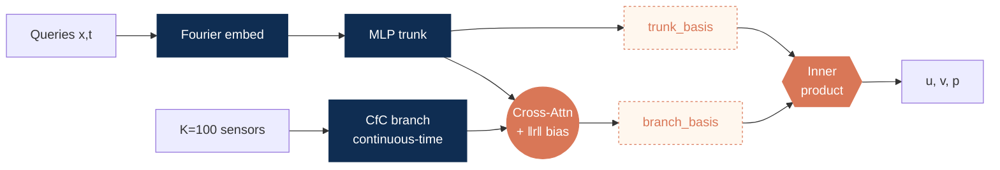

---

<!-- ====================================================================
     SLIDE 01 · COVER  (pptx Cover layout: 無 chevron NavBar，只有 logos)
     ==================================================================== -->

  <SectionTag>Thesis Defense · Junyi Li</SectionTag>

<h1 style="font-size: 2.4rem; line-height: 1.15; font-weight: 700; color: #7F1084; letter-spacing: -0.01em;">
Physics-Constrained Continuous-Time Reconstruction of Turbulent Flows from  Sparse Sensors
</h1>

  2-D Kolmogorov flow at <b style="color:#7F1084;">Re = 10⁴</b>,
  reconstructed from <b style="color:#7F1084;">100 velocity sensors</b>,
  with NS residual as the only physics signal — no DNS supervision in training.

  <TagChip>Sparse-Sensor</TagChip>
  <TagChip>DeepONet + CfC</TagChip>
  <TagChip>PINO</TagChip>
  <TagChip>2-D Kolmogorov</TagChip>

<FooterLogos />

<!--
[Cover · 30s] PI-CON 論文 defense。重點 anchor 在標題那行：K=100 sensors only · NS residual as the only physics signal · no DNS supervision in training。大綱 → 問題 / 架構 / 訓練 / 結果（能力→數量→位置→噪音三軸）/ 限制 / 下一步。
-->

---

<NavBar active="background" />

<SectionTag>§ Background · why classical inverse methods struggle</SectionTag>

# Sparse-sensor flow reconstruction — engineering deployment regime

<BulletRow><b style="color:#7F1084;">Setting</b>&nbsp;·&nbsp; K point sensors return (u, v) values · full field unobserved · DNS not available in the field</BulletRow>

<BulletRow><b style="color:#7F1084;">Challenge</b>&nbsp;·&nbsp; Many candidate flow fields fit the same sensor values → an external prior is required</BulletRow>

<BulletRow><b style="color:#7F1084;">Classical fix</b>&nbsp;·&nbsp; POD-ROM [Sirovich 1987; Manohar 2018] · 4D-Var [Asch 2016] · (En)KF [Evensen 2003] — each leans on an offline reference</BulletRow>

<Card>
<LabelTiny>FOUR PRACTICAL OBSTACLES</LabelTiny>

<b style="color:#7F1084;">① Basis grows with Re</b>&nbsp;·&nbsp; truncation discards small scales

<b style="color:#7F1084;">② Needs an offline reference</b>&nbsp;·&nbsp; POD basis or Data Assimilation (DA) background must come from somewhere

<b style="color:#7F1084;">③ Solver in the loop</b>&nbsp;·&nbsp; DA recomputes the NS solver per window — not real-time at high Re

<b style="color:#7F1084;">④ Gaussian assumptions</b>&nbsp;·&nbsp; break in chaotic, non-Gaussian turbulence

</Card>

Take-away&nbsp;·&nbsp;
All four classical pillars break under no-DNS, real-time, sparse-sensor conditions. What remains is a model-based prior learned from <b>sensors + PDE residual alone</b>.

<FooterLogos />

<!--
[Background A1 · 2min] 工程動機開場：sparse sensors + PDE only。三個 bullet（setting / challenge / classical fix）+ 4 obstacles card 保持簡單，不展開 inverse problem 的數學細節（line equation 已移除，避免被問 sensor sampling / sensor noise / rank 等問題）。Take-away 收斂為一句「四 pillar 都壞 → NN 是唯一剩下的工程方案」。下一張 (slide 3) NN vs classical 對照表，再下一張 (slide 4) PINN vs PINO 比較。
-->

---

<NavBar active="background" />

<SectionTag>§ Background · classical methods vs. neural networks</SectionTag>

# Why neural networks for sparse-flow reconstruction

<table class="w-full" style="border-collapse: collapse;">
  <thead>
    <tr style="border-bottom: 2px solid #7F1084;">
      <th class="text-left py-1 px-2" style="color:#7F1084;">Requirement at deployment</th>
      <th class="text-left py-1 px-2" style="color:#7F1084;">Classical &nbsp;(POD-ROM · 4D-Var · KF)</th>
      <th class="text-left py-1 px-2" style="color:#7F1084;">Neural network &nbsp;(operator + physics)</th>
    </tr>
  </thead>
  <tbody style="font-size: 0.78rem;">
    <tr style="border-bottom: 1px solid #E5E0EC;">
      <td class="py-1 px-2">Offline DNS / basis pre-compute</td>
      <td class="py-1 px-2" style="color:#E97132;">Required (POD basis · adjoint background)</td>
      <td class="py-1 px-2" style="color:#0F2D52;">Not required — train from sensor + PDE residual</td>
    </tr>
    <tr style="border-bottom: 1px solid #E5E0EC;">
      <td class="py-1 px-2">Forward solver in the loop</td>
      <td class="py-1 px-2" style="color:#E97132;">Required (4D-Var · EnKF propagation)</td>
      <td class="py-1 px-2" style="color:#0F2D52;">Replaced by amortised inference (one forward pass)</td>
    </tr>
    <tr style="border-bottom: 1px solid #E5E0EC;">
      <td class="py-1 px-2">Non-linear / non-Gaussian dynamics</td>
      <td class="py-1 px-2" style="color:#E97132;">Approximated (linearised tangent · Gaussian innovations)</td>
      <td class="py-1 px-2" style="color:#0F2D52;">Native via deep non-linear feature maps</td>
    </tr>
    <tr style="border-bottom: 1px solid #E5E0EC;">
      <td class="py-1 px-2">Function-valued sensor input</td>
      <td class="py-1 px-2" style="color:#E97132;">Snapshot-by-snapshot · ad-hoc temporal handling</td>
      <td class="py-1 px-2" style="color:#0F2D52;">Operator-learning branch ingests {y(tk)} as input</td>
    </tr>
    <tr style="border-bottom: 1px solid #E5E0EC;">
      <td class="py-1 px-2">Inference latency / snapshot</td>
      <td class="py-1 px-2" style="color:#E97132;">DA window solve: minutes – hours</td>
      <td class="py-1 px-2" style="color:#0F2D52;">&lt; 5 min on a single GPU</td>
    </tr>
    <tr style="background: rgba(127, 16, 132, 0.10);">
      <td class="py-1 px-2"><b>PDE consistency</b></td>
      <td class="py-1 px-2">Enforced inside the solver</td>
      <td class="py-1 px-2"><b style="color:#7F1084;">Differentiable residual loss (PINN / PINO)</b></td>
    </tr>
  </tbody>
</table>

<FooterLogos />

<!--
[Background A2 · 2min] 對照表 5 + 1 個 deployment requirement：DNS basis 依賴 / forward solver 成本 / 非線性 / function-valued input / inference latency / PDE consistency。Take-away：NN 解掉 classical 的 blocker 並保留 PDE consistency；下一張比較 PINN vs PINO 決定要用哪種 NN。
-->

---

<NavBar active="background" />

<SectionTag>§ Background · physics-informed networks vs. neural operators</SectionTag>

# Why neural operator — PINNs vs. PINOs

<table class="w-full" style="border-collapse: collapse;">
  <thead>
    <tr style="border-bottom: 2px solid #7F1084;">
      <th class="text-left py-1 px-2" style="color:#7F1084;">Aspect</th>
      <th class="text-left py-1 px-2" style="color:#7F1084;">PINN &nbsp;[Raissi 2019]</th>
      <th class="text-left py-1 px-2" style="color:#7F1084;">PINO &nbsp;(operator + physics) [Lu 2021; Wang 2024]</th>
    </tr>
  </thead>
  <tbody style="font-size: 0.78rem;">
    <tr style="border-bottom: 1px solid #E5E0EC;">
      <td class="py-1 px-2">Learned object</td>
      <td class="py-1 px-2" style="color:#E97132;">One solution u(x, t) for one fixed problem</td>
      <td class="py-1 px-2" style="color:#0F2D52;">Operator G : input function → solution map</td>
    </tr>
    <tr style="border-bottom: 1px solid #E5E0EC;">
      <td class="py-1 px-2">Sensor input</td>
      <td class="py-1 px-2" style="color:#E97132;">Ldata points only — cannot ingest trajectory</td>
      <td class="py-1 px-2" style="color:#0F2D52;"><b style="color:#7F1084;">①</b>&nbsp; Branch ingests full y(tk) as function-valued input</td>
    </tr>
    <tr style="border-bottom: 1px solid #E5E0EC;">
      <td class="py-1 px-2">Query at new (x, t)</td>
      <td class="py-1 px-2" style="color:#E97132;">Native, but bound to the trained problem</td>
      <td class="py-1 px-2" style="color:#0F2D52;"><b style="color:#7F1084;">②</b>&nbsp; Trunk evaluates basis at arbitrary (x, t), problem-agnostic</td>
    </tr>
    <tr style="border-bottom: 1px solid #E5E0EC;">
      <td class="py-1 px-2">Generalisation across IC / sensors</td>
      <td class="py-1 px-2" style="color:#E97132;">Retrain per problem instance</td>
      <td class="py-1 px-2" style="color:#0F2D52;"><b style="color:#7F1084;">③</b>&nbsp; Single network across instances — amortised inverse map</td>
    </tr>
    <tr style="border-bottom: 1px solid #E5E0EC;">
      <td class="py-1 px-2">Architecture family</td>
      <td class="py-1 px-2" style="color:#E97132;">MLP / SIREN per (x, t) query</td>
      <td class="py-1 px-2" style="color:#0F2D52;">Branch–trunk (DeepONet) · FNO ·  transformer hybrid (GeoTransolver)</td>
    </tr>
    <tr style="background: rgba(127, 16, 132, 0.10);">
      <td class="py-1 px-2"><b>PDE residual loss</b></td>
      <td class="py-1 px-2">Required — central component</td>
      <td class="py-1 px-2"><b style="color:#7F1084;">④</b>&nbsp; <b style="color:#7F1084;">Differentiable residual on operator output (PINO)</b></td>
    </tr>
  </tbody>
</table>

<FooterLogos />

<!--
[Why neural operator · 2min] 從第三頁延伸：上一張說明為何用 NN 而非 POD/4D-Var/KF，這張說明為何用 operator 而非 vanilla PINN。對照表 5+1 row，PINO column 用 ① ② ③ ④ 標號四個對 sparse-sensor 的關鍵 advantage：
① Sensor input 從點變函數（branch ingests trajectory）
② Query 任意 (x, t)，不綁特定問題
③ Generalisation amortised across instances
④ PDE residual 直接在 operator output 上（highlight row）
下一張 K=100 CS bound 量化結構難度。
-->

---

<NavBar active="background" />

<SectionTag>§ Literature review · direct comparison</SectionTag>

# How PI-CON compares within the deployable regime

<table class="w-full" style="border-collapse: collapse;">
  <thead>
    <tr style="border-bottom: 2px solid #7F1084;">
      <th class="text-left py-2 px-2" style="color:#7F1084;">Method</th>
      <th class="text-left py-2 px-2" style="color:#7F1084;">Backbone</th>
      <th class="text-left py-2 px-2" style="color:#7F1084;">Training supervision</th>
      <th class="text-left py-2 px-2" style="color:#7F1084;">Kolmogorov KE MAPE</th>
      <th class="text-left py-2 px-2" style="color:#7F1084;">Deployable?</th>
    </tr>
  </thead>
  <tbody style="font-size: 0.85rem;">
    <tr style="border-bottom: 1px solid #E5E0EC;">
      <td class="py-2 px-2">Mons et al. 2025 &nbsp;[Mons 2025]</td>
      <td class="py-2 px-2">Physics-constrained CNN</td>
      <td class="py-2 px-2"><b style="color:#7F1084;">Sensor + NS</b></td>
      <td class="py-2 px-2">~ 23 %</td>
      <td class="py-2 px-2"><b style="color:#7F1084;">Yes</b></td>
    </tr>
    <tr style="border-bottom: 1px solid #E5E0EC; background: rgba(127, 16, 132, 0.08);">
      <td class="py-2 px-2"><b>PI-CON&nbsp;(ours)</b></td>
      <td class="py-2 px-2">DeepONet&nbsp;+&nbsp;CfC&nbsp;+&nbsp;cross-attn</td>
      <td class="py-2 px-2"><b style="color:#7F1084;">Sensor + NS</b></td>
      <td class="py-2 px-2"><b style="color:#7F1084;">5.71&nbsp;±&nbsp;0.11 %</b>&nbsp;(n=5)</td>
      <td class="py-2 px-2"><b style="color:#7F1084;">Yes</b></td>
    </tr>
    <tr style="border-bottom: 1px solid #E5E0EC;">
      <td class="py-2 px-2">Classical interpolation&nbsp;(EXP-295)</td>
      <td class="py-2 px-2">RBF / IDW / div-free trig LSQ</td>
      <td class="py-2 px-2">Sensor only</td>
      <td class="py-2 px-2">KE can be low, but u L₂ <b>28–54 %</b></td>
      <td class="py-2 px-2"><b>Partly</b></td>
    </tr>
    <tr style="border-bottom: 1px solid #E5E0EC;">
      <td class="py-2 px-2">FLRNet 2024 / Senseiver 2023 / SHRED 2024</td>
      <td class="py-2 px-2">CNN-PerceptualLoss / Perceiver / LSTM</td>
      <td class="py-2 px-2" style="color:#E97132;">Sensor + DNS full field</td>
      <td class="py-2 px-2">few %</td>
      <td class="py-2 px-2" style="color:#E97132;">No</td>
    </tr>
  </tbody>
</table>

Take-aways&nbsp;·&nbsp;
<b>① Architecture</b>, not supervision, gives the gain: under the same sensor-only + NS regime as Mons 2025, PI-CON reduces KE error from ~23 % to 5.71 %.&nbsp;
<b>② Classical interpolation</b> can look KE-competitive but is pointwise poor.&nbsp;
<b>③ DNS-supervised methods</b> reach few-% error <i>because they train on DNS</i> — those numbers are not reproducible at deployment.

<FooterLogos />

<!--
[Literature review · direct comparison · 1.5min] 重點：同 regime 比 — Mons 2025 (~23%) → ours (5.71 ± 0.11%)。Classical interpolation 用 EXP-295：trig/RBF 可有低 KE，但 u/v/ω pointwise 很差，所以不能只看 KE。底部 DNS-supervised methods 數字漂亮但不能比，因為 deployment 沒 DNS。
-->

---

<NavBar active="background" />

<SectionTag>§ Sensor budget · null space & spectral bandwidth</SectionTag>

# K = 100 — null-space dimension and sensor bandwidth limit

<Card>
<LabelTiny>UNDERDETERMINED LINEAR SYSTEM</LabelTiny>

$$\mathbf{y}_t \;=\; \mathbf{C}\,\mathbf{u}_t, \qquad \text{rank-deficient}$$

Sensing operator <b>C</b> ∈ {0,1}K×N selects K entries of <b>u</b>t ∈ ℝN.

Per snapshot: 2K = <b>200</b> sensor obs vs 2N ≈ <b>1.31×10⁵</b> velocity dofs
&nbsp;⇒&nbsp; <b style="color:#7F1084;">~650× underdetermined</b>

</Card>

<Card>
<LabelTiny>COMPRESSED SENSING BOUND &nbsp;[Donoho 2006, Candès 2006]</LabelTiny>

$$M \;\geq\; C_0 \, s \, \log_2(N/s) \qquad \text{for exact recovery}$$

db4 wavelet sparsity s ≈ 328 (99.5 % energy).&nbsp; Required M ≳ C0 · 328 · log₂(65,536/328) ≈ <b>2,500–5,000</b>&nbsp;(C0 ∈ [1, 2]).

&nbsp;⇒&nbsp; <b style="color:#7F1084;">K = 100 is 25–50× short</b>

</Card>

Implication

· <b>Full-field exact</b> recovery requires K ≫ 100

· Productive scope: <b>low-band sub-recovery + physics-prior regularisation over the null space</b>

· Scope set by sensor Nyquist kmaxsensor ≈ √(K/π) ≈ 5.64

<FooterLogos />

<!--
[Sensor budget · 2min] 兩個視角量化 K=100 觀測能力：①linear system — y = Cu rank-deficient, 650× underdetermined ②CS bound — M ≥ O(s log(N/s)), s≈328 (db4 wavelet), full recovery 需 ~5000 sensors, K=100 差 50×。Implication 精準化：full-field recovery 結構上不可能；productive scope 是 low-band sub-recovery (Nyquist k_max ≈ 5.64) + physics prior 在 null-space 上 regularise。後續 Results 用 sensor Nyquist 與 K-scaling 量化此 scope。
-->

---

<NavBar active="objective" />

<SectionTag>§ Objective</SectionTag>

# Research objective

Reconstruct 2-D turbulent flow from sparse (u, v) sensors + Navier–Stokes residual, <b style="color:#7F1084;">no DNS field</b> in training · then map how <b style="color:#7F1084;">count, placement, noise</b> govern quality.

<Card>
<LabelTiny style="color:#7F1084;">(O1)&nbsp; ACCURATE &amp; FAST RECONSTRUCTOR</LabelTiny>

Engineering-grade from <b>sensor + PDE</b> only · query any (x, t) in one pass.

Criterion ·

· KE rel-err <b>&lt; 10 %</b> (n = 5)

· dominant lever <b>≥ 2 pp @ p &lt; 0.01</b>

· single pass <b>≥ 5×</b> faster than solving

</Card>

<Card>
<LabelTiny style="color:#7F1084;">(O2)&nbsp; COUNT SETS THE RESOLUTION</LabelTiny>

Recoverable band set by <b>sensor count</b>, not architecture.

Criterion ·

· kmaxsensor = √(K/π) ≈ <b>5.64</b> at K = 100

· cutoff tracks √(K/π) over K ∈ {100, 200, 400}

</Card>

<Card>
<LabelTiny style="color:#7F1084;">(O3)&nbsp; PLACEMENT &amp; NOISE SET RELIABILITY</LabelTiny>

Placement and noise change reliability, <b>not feasibility</b>.

Criterion ·

· DNS / LES / random all engineering-grade

· σplacement ≥ <b>3×</b> σtraining

· noise to <b>10 %</b> stays usable

</Card>

Contribution

<b>PI-CON</b> · CfC branch + distance-biased cross-attention + AL-continuity. The first surveyed operator to pair <b>query-anywhere continuous-time</b> with <b>sensor-only-with-physics</b> training at Re = 10⁴.

<FooterLogos />

<!--
[Objective · 1.5min] 對齊論文三軸 arc：工具(PI-CON) + sensing-configuration 系統研究（數量/位置/噪音）。
上方一句話：用 PI-CON 從稀疏 sensor + NS residual 重建流場（無 DNS 全場），並系統研究 sensing config 如何決定品質。
三個 Objective（先 qualitative goal、後 falsifiable criterion）：
  O1 重建器（準＋快）：sensor+PDE only 達 engineering grade，任意點單次前傳。criterion KE<10% n=5 / dominant lever ≥2pp @p<0.01 / 單次前傳 ≥5× 快於 forward-solving。
  O2 數量軸：可重建波數由 sensor 數量決定，非架構。criterion k_max^sensor=√(K/π)≈5.64 @K=100；K=100/200/400 cutoff 隨 √(K/π) 移動。
  O3 位置&噪音軸：placement/noise 影響 reliability 不影響 feasibility。criterion 三 placement 皆 engineering-grade、σ_placement≥3×σ_training；noise 到 10% 仍 engineering-grade。
底部 Contribution：PI-CON = CfC branch + distance-biased cross-attn + AL-continuity，surveyed operator 中首個結合 query-anywhere continuous-time 與 sensor-only-with-physics @Re=10⁴。具體數值留 §Results / §Conclusion。
-->

---

<NavBar active="method" />

<SectionTag>§ Application case · 2-D Kolmogorov · Re = 10⁴ · K = 100 sensors</SectionTag>

# 2-D Kolmogorov benchmark — setup at a glance

<Card>
<LabelTiny>2-D INCOMPRESSIBLE NS + KOLMOGOROV FORCING</LabelTiny>

$$\nabla\!\cdot\!\mathbf{u} = 0, \quad \partial_t \mathbf{u} + (\mathbf{u}\!\cdot\!\nabla)\mathbf{u} = -\nabla p + \nu\,\nabla^2 \mathbf{u} + \mathbf{f}, \quad \mathbf{f} = \bigl(A\sin(2\pi k_f y),\,0\bigr)$$

<b>Domain</b>&nbsp; doubly-periodic Ω = [0,1]²

<b>Re</b>&nbsp; UL/ν = 10⁴ · ν = 10⁻⁴ · A = 0.1 · kf = 2

</Card>

<Card>
<LabelTiny>DNS SOLVER &amp; SPARSE-SENSOR PROBLEM</LabelTiny>

<b>Solver</b>&nbsp; pseudo-spectral + 2/3 dealiasing; ETDRK4 fp64

<b>Grid</b>&nbsp; run <b style="color:#7F1084;">1024²</b> · stored <b>256²</b> · Δts = 0.025 · Nt = 201

<b style="color:#7F1084;">K = 100</b> (u, v) QR-pivot probes → query (u, v, p) at any (x, t)

<b style="color:#7F1084;">Training</b>&nbsp; sensor MSE + NS residual only

</Card>

<Card>
<LabelTiny>DNS VERIFICATION&nbsp;(see backup for full table)</LabelTiny>

<b>Resolution</b>&nbsp; kmax·η = <b style="color:#0F2D52;">7.61</b> run · <b style="color:#0F2D52;">1.91</b> stored ✓

<b>Statistics</b>&nbsp; KE plateau &lt; 3 % · energy budget &lt; 5 % ✓

<b>Grid margin</b>&nbsp; <b style="color:#0F2D52;">5.07×</b> over Pope threshold ✓

<b>Window</b>&nbsp; T / teddy = 2.51&nbsp;⚠

</Card>

Fig. 1.&nbsp; QR-pivot K = 100 placement on ω(<b>x</b>, t = 5).

<FooterLogos />

<!--
[Setup · 2min] 教授要求補 CFD 必要參數：
- Governing equations + BC（雙週期）+ 特徵 L, U, Re 定義（UL/ν）
- DNS algorithm：pseudo-spectral with 2/3 dealiasing [Orszag 1971; Boyd 2001] + ETDRK4 fp64 [Cox–Matthews 2002; Kassam–Trefethen 2005]
- Grid 256²、Δt = 2.5e-4、snapshot Δt_s = 0.025、N_t = 201、T = 5
- DNS verification 3 條件：k_max·η = 1.91 ≥ 1.5 (Pope 2000) ✓、KE plateau + CFL ≈ 0.18 < 0.5 ✓、T/t_eddy = 2.51 turnovers ⚠（誠實揭露 statistical window 有限，靠 multi-seed 彌補）
- Sparse-sensor card：K = 100, QR-pivot POD [Manohar 2018], operator target G_θ, loss 只用 sensor + NS（不偷 DNS / ω / E(k)）
右 col 維持 sensor placement 圖。把 engineering target（KE/div/k_f amp 數字）移到 §Results，§Setup 不背具體閾值。
-->

---

<NavBar active="method" />

<SectionTag>§ Architecture · how (O1)–(O3) get answered</SectionTag>

# Three additions that turn DeepONet into a sparse-sensor operator

DeepONet needs three changes to become a sparse inverse-flow operator.

<Card>
<LabelTiny>CfC branch</LabelTiny>

Consumes sensor time signals instead of fixed-grid snapshots; keeps (O1) sensor-only training feasible.

</Card>
<Card>
<LabelTiny>Relpos cross-attention</LabelTiny>

Links each query (x, t) to nearby sensor tokens; enables sparse-to-dense streaming readout.

</Card>
<Card>
<LabelTiny>AL-continuity</LabelTiny>

Makes incompressibility an active constraint instead of a soft residual side effect.

</Card>

Fourier trunk + GradNorm balancing · total ≈ 3.14 M parameters.

<FooterLogos />

<!--
[Architecture · 2min] 教授九點 (7) (9) 落實：把 Architecture 寫成「接 Objective、補 vanilla DeepONet 缺口」三件套 narrative，不在這頁堆 AI mathematical 細節。
Gap → Addition → Why-it-hits-(Ox) 三欄表：
  Gap (a) DeepONet branch 吃固定 grid snapshot → CfC continuous-time branch → 對齊 (O1) sensor-only feasibility
  Gap (b) inner product 沒 spatial prior → cross-attention with ‖r‖ bias → 對齊 (O2) streaming inference
  Gap (c) PDE residual soft penalty → Augmented Lagrangian on continuity → 對齊 (O3) physical consistency
底部一行交代 trunk Fourier embed [Tancik 2020] + GradNorm [Chen 2018] + 3.14M params。
CfC 內部公式、cross-attn 內部公式留 backup slides，這張只講 narrative。
-->

---

<NavBar active="method" />

<SectionTag>§ Method backup · CfC branch detail</SectionTag>

# CfC — closing the "time-signal" gap in vanilla DeepONet

Vanilla DeepONet's branch ingests a fixed-grid snapshot.&nbsp; Our sensors deliver an unevenly clocked <b>time series</b>; we replace the branch with a closed-form continuous-time RNN.

<Card>
<LabelTiny>① LIQUID NEURAL NETWORK (LNN) [Hasani 2021]</LabelTiny>

Hidden state h(t) ∈ ℝd evolves by an ODE — natural fit for an irregular sensor clock, but an ODE solver inside the autograd graph is expensive:

$$\frac{d h}{dt} = -\Bigl[\tfrac{1}{\tau} + f(h, x, t;\theta)\Bigr] \odot h + f(h, x, t;\theta) \odot A$$

τ, A learnable per-dim · f(·) is a small MLP.

</Card>

<Card>
<LabelTiny>② CfC — closed-form solution of the LNN ODE [Hasani 2022]</LabelTiny>

Analytical update over (t, t + Δt) — no ODE solver, O(1) per step, autograd survives through PDE Jacobians:

$$h(t + \Delta t) = \sigma\!\left(-f \Delta t\right) \odot g(h, x;\theta_g) + \left[1 - \sigma(-f \Delta t)\right] \odot h$$

σ(·) gating · g(·) update target. The gap closed: branch now consumes a true time signal at any Δt.

</Card>

<FooterLogos />

<!--
[CfC introduction · backup 1min] 教授九點 (9) — CFD lab 不重 AI 細節：把 CfC 介紹改成「補 vanilla DeepONet 的 time-signal 缺口」narrative。
頂部一句話：vanilla DeepONet branch 吃固定 grid snapshot，我們的 sensor 是 irregular time series，所以換成 closed-form continuous-time RNN。
卡 1：LNN ODE 形式 + 為何 vanilla ODE solver 在 autograd 內貴。
卡 2：CfC analytical closed-form + O(1) per step + autograd 安全。
底部「為何要 CfC」三條 chip 移除（已在頂部 narrative + 卡 2 末尾標明）。
-->

---

<NavBar active="method" />

<SectionTag>§ Method backup · cross-attention readout detail</SectionTag>

# Cross-attention — closing the "sparse-to-dense" gap

Vanilla DeepONet's inner product has no spatial prior linking a query to the nearest sensors.&nbsp; We add a distance-aware attention readout — a learnable analogue of an RBF interpolant.

<Card>
<LabelTiny>① ATTENTION WITH PHYSICAL DISTANCE BIAS [Vaswani 2017]</LabelTiny>

$$\text{Attn}(Q, K, V) = \text{softmax}\!\left(\frac{Q K^{\top} - \lambda\,|r|}{\sqrt{d_k}}\right) V$$

· Q = Fourier embedding of query (x, t)

· K, V = CfC-encoded sensor tokens

· |r|ij = √(‖xq,i − xs,j‖² + ε)&nbsp;smooth norm, ε = 10⁻⁸

· λ learnable — distant sensors get down-weighted (built-in proximity prior)

</Card>

<Card>
<LabelTiny>② CFD ANALOGUE — LEARNABLE RBF INTERPOLANT</LabelTiny>

An RBF interpolant $\hat{u}(\mathbf{x}) = \sum_j w_j(\mathbf{x};\sigma)\,u_j$&nbsp; uses a fixed kernel $w_j \propto \exp(-\|r_j\|^2/\sigma^2)$.

<b>Cross-attention with |r| bias</b> learns both the kernel shape (via softmax(QK⊤)) <i>and</i> the bandwidth (λ), instead of hand-picking σ.

<b>Causal masking</b>&nbsp;·&nbsp; future sensor times invisible → streaming-deployable.

</Card>

<FooterLogos />

<!--
[Cross-attention introduction · backup 1min] 教授九點 (9) — 用 CFD 熟悉的 RBF interpolant analogy 介紹 cross-attention，少談 Transformer 內部細節。
頂部一句話：vanilla DeepONet inner product 沒 spatial prior，所以加 distance-aware attention readout — 等價於 learnable RBF interpolant。
卡 1：attention with |r| bias 公式 + ε=10⁻⁸ smooth norm（避免 query 落在 sensor 上時 second-order autograd NaN）+ λ learnable
卡 2：CFD analogue — 固定 RBF 用 hand-picked σ，cross-attention 自己學 kernel + bandwidth；causal masking 讓 streaming OK。
移除原本「Self-attention vs cross-attention」對比（純 AI 細節，CFD lab 不感興趣）。
-->

---

<NavBar active="method" />

<SectionTag>§ Method · LES proxy for sensor placement (DNS-free pipeline)</SectionTag>

# LES proxy — DNS-free sensor placement

<Card>
<LabelTiny>FILTERED NAVIER–STOKES</LabelTiny>

$$\partial_t \bar{u}_i + \bar{u}_j\,\partial_j \bar{u}_i = -\partial_i \bar{p} + \nu\,\nabla^2 \bar{u}_i \;-\; \partial_j \tau_{ij}^{\mathrm{SGS}} + f_i$$

<b>Domain</b>&nbsp; same Ω, BC, forcing as DNS

<b>Closure</b>&nbsp; Bardina scale-similarity + spectral hyperviscosity

<b>Solver</b>&nbsp; pseudo-spectral + 2/3 dealiasing, ETDRK4 fp64

<b>Setup</b>&nbsp;·&nbsp; N = 256, Tend = 50, cost ≈ <b style="color:#7F1084;">1/16 DNS</b>

</Card>

<Card>
<LabelTiny>LES VERIFICATION &nbsp;(EXP-221, the trajectory used for placement)</LabelTiny>

<b>‖∇·ū‖max</b>

<b style="color:#0F2D52;">&lt; 10⁻¹⁰</b> ✓

<b>KE plateau</b>

<b style="color:#0F2D52;">&lt; 5 %</b> ✓

<b>Tend / teddy</b>

<b style="color:#0F2D52;">26.5</b> ✓

<b>Independent samples</b>

<b style="color:#0F2D52;">≈ 17</b> ✓

<b>Spectral overlap</b>

<b style="color:#0F2D52;">within 2×</b> on k ∈ [2, N/3]

<b>Role</b>

<b style="color:#0F2D52;">placement only</b>, not training truth

QR-pivot depends on leading POD mode geometry; exact LES pointwise match to DNS is not required.

</Card>

<Pill>LES → QR-pivot&nbsp;[Manohar 2018]&nbsp;→ K = 100 placement&nbsp;·&nbsp; EXP-245: 5.71 ± 0.11 % KE</Pill>

Fig. 2.&nbsp; LES vorticity with K = 100 QR-pivot sensors. DNS is not used in this branch.

<FooterLogos />

<!--
[LES generation · 2min] 教授九點 (4) (5) 落實：LES 也要把 CFD 重要參數寫清楚 + 解析度/穩定度判斷標準。
左卡 1 — filtered NS + Domain/BC（雙週期，與 DNS 一致）+ SGS closure（Bardina scale-similarity [Bardina 1980; Sagaut 2006] + spectral hyperviscosity）+ Solver（pseudo-spectral + 2/3 dealiasing, ETDRK4 fp64 [Kassam-Trefethen 2005]）+ N=256, T_end=50, cost ≈ 1/16 DNS
左卡 2 — convergence/穩定度四條件，標題改成「When is the LES good enough for placement?」更貼近 CFD 實驗室問法：incompressibility、KE plateau、T/t_eddy ≥ 5 (EXP-221 達 26.5)、spectral overlap within 2× DNS on k ∈ [2, N/3]。結尾交代「placement 只需 leading POD modes align」說明為何不要求 pointwise match。
底部 Pill 用 final fair-comparison 口徑：LES placement 是 EXP-245 main pipeline，KE 5.71 ± 0.11%；不要再用舊 placement-ablation 的 12.36% / 9.40% 作主張。
-->

---

<NavBar active="method" />

<SectionTag>§ Training · closing the physics-consistency gap</SectionTag>

# Augmented Lagrangian on ∇·u — Lagrangian analog of pressure projection

<Card>
<LabelTiny>AUGMENTED LAGRANGIAN ON CONTINUITY</LabelTiny>

$$\mathcal{L}_{\text{AL}} \;=\; \mathcal{L} + \lambda\,C \;+\; \tfrac{\rho}{2}\,C^2,$$

$$C \,=\, \mathbb{E}_{\text{collocation}}\big[(\partial_x u + \partial_y v)^2\big],$$

$$\lambda \,\leftarrow\, \lambda + \rho\,C \quad\text{(dual ascent).}$$

ρ = 0.1 (penalty), λ_clip = 10 (max dual variable). λ grows when continuity is violated, decays once C is small.

</Card>

<Card>
<LabelTiny>CFD ANALOGUE &amp; OBSERVED EFFECT</LabelTiny>

<b>SIMPLE / PISO algorithms</b> in classical CFD enforce incompressibility by solving an <b>elliptic Poisson equation</b> for pressure correction p' — non-local, pointwise, exact on the discrete grid.

Our λ is the <b>Lagrange-multiplier analog</b> — not algorithmically equivalent: λ is a scalar updated by gradient ascent on the mean residual; constraint is enforced <b>in expectation</b> over sampled collocation points, not pointwise on a grid.

<MetricHero value="0.39%" label="divergence ratio · EXP-245 main baseline (LES_T50, 20 k, n = 5)" size="sm" />

</Card>

<FooterLogos />

<!--
[Continuity AL · 1.5min] 左卡 AL formulation 完整：penalty C 是 continuity 平方期望、dual ascent λ ← λ + ρC、ρ=0.1 λ_clip=10。右卡 CFD analogue — SIMPLE/PISO 的 pressure correction p' 是 Lagrange multiplier，我們的 λ 用 gradient ascent 取代 Poisson 解；enforce in expectation 而非 exactly on grid。觀測 effect 用 final protocol 說法：EXP-245 divergence ratio 0.39 ± 0.006%，接近 resolved-bandwidth finite-difference floor。
-->

---

<NavBar active="method" />

<SectionTag>§ Training · optimisation &amp; multi-task balancing</SectionTag>

# SOAP + Schedule-Free + GradNorm — why second-order matters

<Card>
<LabelTiny>SOAP + SCHEDULE-FREE &nbsp;[Wang 2025, Defazio 2024]</LabelTiny>

<b>SOAP.</b> Shampoo-style 2nd-order preconditioner that approximates the Hessian via Kronecker-factorisation, then applies Adam <i>in the eigenbasis</i> of the preconditioner. Recomputed every 2 steps.

<b>Schedule-Free.</b> Polyak–Ruppert averaging trajectory without explicit lr decay. Outputs the running average rather than the last iterate.

<b>Why both</b>&nbsp;·&nbsp; Re = 10⁴ anisotropic valleys · Adam zigzags · SOAP overshoots · SF averaging stabilises second-order trajectory

<MetricHero value="−20 %" label="KE MAPE drop · Schedule-Free AdamW → SOAP + SF" size="sm" />

</Card>

<Card>
<LabelTiny>GRADNORM &nbsp;— auto-weighting 4 loss tasks &nbsp;[Chen 2018]</LabelTiny>

$$\|w_i\,\nabla\!_{\theta_r}\,\mathcal{L}_i\| \;\propto\; (\mathcal{L}_i / \mathcal{L}_i^{(0)})^{\alpha},$$

recomputed every 1 000 steps with respect to the trunk output layer θ_r. Weights normalised by w_d^target to avoid absolute scale drift; EMA(0.9) on top.

<b>Why.</b> Hand-tuned w are brittle: too small ⇒ data overfit; too large ⇒ near-zero collapse. GradNorm equalises <b>gradient-norm magnitude</b> across {data, NS-u, NS-v, cont} automatically.

</Card>

<FooterLogos />

<!--
[Optimisation · 2min] 左卡 SOAP+SF — Shampoo 2nd-order + Polyak averaging。chaotic NS valleys 需要 2nd-order；EXP-030 確認 SF AdamW → SOAP+SF 帶 -20% KE。右卡 GradNorm — 4-task gradient-norm equalisation，每 1000 步調權重，避免 hand-tuned brittle。Init 物理 0.01 (1% of data weight)，會自己 ramp up。下一張講 AL 怎麼補 continuity。
-->

---

<NavBar active="method" />

<SectionTag>§ Hyperparameters · physical setup &amp; model</SectionTag>

# Configuration parameters (1 of 2)

| Group · Parameter | Value |
|---|---|
| **Flow** | |
| Domain &amp; BC | Ω = \[0, 1\]² (dimensionless), doubly-periodic |
| Characteristic scales | L★ = 1, U★ = 1 (nondimensionalisation); measured Urms = 0.503 |
| Reynolds number | Re = U★L★/ν★ = 10⁴ ⇒ ν = 10⁻⁴ |
| Forcing &amp; window | A = 0.1, kf = 2, T = 5 (≈ 2.51 teddy) |
| DNS | **Run 1024²**, ↓×4 → **Stored 256²** · pseudo-spectral + 2/3 dealiasing · ETDRK4 fp64 · Δt = 2.5×10⁻⁴ · Δts = 0.025 (Nt = 201) |
| **Sensors** | |
| Number &amp; channels | **K = 100**,&nbsp; (u, v) only |
| Placement | QR-pivot POD basis [Manohar 2018] |

| Group · Parameter | Value |
|---|---|
| **Network architecture** | |
| dmodel · dtime | 256 · 16 |
| demb (Fourier) | 128, harmonics = 16, σ = 2.0 learnable |
| Branch (sensor encoder) | spatial CfC × 1 + temporal CfC × 1 [Hasani 2022] |
| Token self-attn | 2 layers × 1 heads, dim = 256 |
| Trunk (query MLP) | 1 layer × 256 hidden, operator rank = 256 |
| Readout (decoder) | Cross-attn, 1 head, \|r\| bias [Vaswani 2017] |
| **Evaluation grid** | 128² (DNS 256²/4, avoid Nyquist) |

<FooterLogos />

<!--
[Hyperparams 1/2 · 1min] §Method 最後的 reproducibility summary (1/2)。物理 + sensors + network 全部集中一頁。Flow: domain, Re, forcing, DNS solver。Sensors: K=100 QR-pivot (u,v only)。Network: d_model=256, d_emb=128, branch CfC, trunk 1-MLP, cross-attn 1 head, 3.14M params。下一張 (12) 講 optimisation + GradNorm + AL + reproducibility (seeds, hardware)。
-->

---

<NavBar active="method" />

<SectionTag>§ Hyperparameters · training &amp; reproducibility</SectionTag>

# Configuration parameters (2 of 2)

| Group · Parameter | Value |
|---|---|
| **SOAP optimiser** [Wang 2025] | |
| Learning rate · warm-up | 10⁻³ · 2 000 steps |
| β₁, β₂ · precond. freq. | 0.9, 0.999 · every 2 steps |
| **Schedule-Free** [Defazio 2024] | Polyak averaging, no lr decay |
| **GradNorm** [Chen 2018] | |
| Update freq. · EMA | 1 000 steps · momentum 0.9 |
| Init weights | (wd, wNS,u, wNS,v, wc) = (1, 0.01, 0.01, 0.01) |

| Group · Parameter | Value |
|---|---|
| **Augmented Lagrangian** | (continuity only) |
| Penalty ρ · λ clip | **0.1** · 10 |
| Constraint | C = 𝔼[(∂xu + ∂yv)²] |
| **Training & reproducibility** | |
| Iterations · seeds | 10 000 · **n = 5** (42, 1, 2, 3, 4) |
| Hardware · wall-time | NVIDIA RTX 3090 · <b>~1 h 20m </b> per seed (10k steps, 1024 collocation) |

<FooterLogos />

<!--
[Hyperparams 2/2 · 1min] §Method 最後的 reproducibility summary (2/2)。Training 設定全部集中。SOAP+SF: lr=1e-3, β=(0.9,0.999), precond_freq=2, warmup=2000, Polyak averaging。GradNorm: 1000 步更新, EMA 0.9, init [1, 0.01, 0.01, 0.01] (物理項從 1% 數據權重 ramp up)。AL: ρ=0.1, λ_clip=10, C continuity constraint。Training: 10k steps × 5 seeds, RTX 3090 ~1h20m/seed。教授要 reproducibility 細節時都翻這兩頁。
-->

---

<NavBar active="method" />

<SectionTag>§ Evaluation metrics &amp; training loss</SectionTag>

# How error and physics consistency are computed

<Card>
<LabelTiny>FIELD ERROR METRICS &nbsp;(offline DNS benchmark only)</LabelTiny>

<b>Global rel-L₂</b> over t ∈ [0, T]:

$$\mathrm{rel}\,L_2(\phi) \,=\, \frac{\|\phi_{\text{pred}} - \phi_{\text{DNS}}\|_2}{\|\phi_{\text{DNS}}\|_2}, \quad \phi \in \{u, v, \omega\}$$

<b>rel-L∞</b> pointwise max error / DNS max.

<b>t★ = 5 rel-L₂</b> final-snapshot error.

<b>KE(t)</b> 1/2∫Ω(u²+v²)dx.

<b>div L₂(t)</b> ‖∂x u + ∂y v‖₂.

Derivatives: 4th-order central differences on 128² eval grid; div L₂ uses the DNS FD floor as reference.

</Card>

<Card>
<LabelTiny>TRAINING LOSS &nbsp;(GradNorm-balanced [Chen 2018])</LabelTiny>

$$\mathcal{L}(\theta) = w_d\,\mathcal{L}_{\text{data}} + w_{\text{NS},u}\,\mathcal{L}_{\text{NS},u} + w_{\text{NS},v}\,\mathcal{L}_{\text{NS},v} + w_c\,\mathcal{L}_{\text{cont}}$$

<b>Data term</b> MSE on the K = 100 measured sensor channels.

<b>Momentum</b> Ru, Rv from incompressible NS at collocation points.

<b>Continuity</b> ∇·u at collocation points, promoted by AL update.

<b>Balancing</b> GradNorm keeps data and physics terms comparable.

<b style="color:#7F1084;">Invariant</b>&nbsp;·&nbsp; DNS field never enters $\mathcal{L}$.

</Card>

<FooterLogos />

<!--
[Evaluation metrics · 1.5min] 教授要求「交代清楚誤差怎麼算」+「maximum error 或指定時間點 error 比較好」：
左卡 4 個誤差層級：
  (1) 全域時間平均 rel-L₂
  (2) 最壞點 rel-L_∞（pointwise max / DNS pointwise max）— 教授指定
  (3) 指定時間點 t* = 5 的 snapshot rel-L₂（rollout 結尾最難）— 教授指定
  (4) bulk: KE(t)、div_L₂(t)
最後標明：4 階中央差分、128² eval grid、div 對照 DNS FD floor。
右卡 Loss formulation 精簡保留：4-task weighted sum + 個別公式（data MSE / R_u momentum / L_NS,u / L_cont）。底部紅線：「DNS field 從不入 L」標明工程不可遷移性。
注意：avoid 「approximately / matches」這類 hardness/marketing 語。
-->

---

<NavBar active="results" />

<SectionTag>§ Main result · multi-seed comparison against fair baselines</SectionTag>

# 2×2 architecture ablation at the deployment setup

Setup&nbsp;·&nbsp; Re = 10⁴ · K = 100 · <b>LES-derived QR-pivot placement (DNS-free)</b> · 1024 collocation · 20 k iterations · <b>all rows n = 5 seeds</b>

<table class="w-full" style="border-collapse: collapse;">
  <thead>
    <tr style="border-bottom: 2px solid #7F1084;">
      <th class="text-left py-1 px-2" style="color:#7F1084;">Variant (rank by KE)</th>
      <th class="text-left py-1 px-2" style="color:#7F1084;">KE MAPE (%)</th>
      <th class="text-left py-1 px-2" style="color:#7F1084;">u rel-L₂ (%)</th>
      <th class="text-left py-1 px-2" style="color:#7F1084;">ω rel-L₂ (%)</th>
      <th class="text-left py-1 px-2" style="color:#7F1084;">Params</th>
    </tr>
  </thead>
  <tbody>
    <tr style="border-bottom: 1px solid #E5E0EC; background: rgba(127, 16, 132, 0.10);">
      <td class="py-1 px-2"><b>B3&nbsp; PI-CON (CfC + cross-attn)</b></td>
      <td class="py-1 px-2"><b>5.71 ± 0.11</b></td>
      <td class="py-1 px-2"><b>13.65</b></td>
      <td class="py-1 px-2"><b>41.79</b></td>
      <td class="py-1 px-2">3.14M</td>
    </tr>
    <tr style="border-bottom: 1px solid #E5E0EC;">
      <td class="py-1 px-2">B2&nbsp; Cross-attn only (no CfC)</td>
      <td class="py-1 px-2">7.03 ± 0.14</td>
      <td class="py-1 px-2">14.64</td>
      <td class="py-1 px-2">44.32</td>
      <td class="py-1 px-2">2.74M</td>
    </tr>
    <tr style="border-bottom: 1px solid #E5E0EC;">
      <td class="py-1 px-2">B0&nbsp; Vanilla DeepONet</td>
      <td class="py-1 px-2">8.23 ± 0.22</td>
      <td class="py-1 px-2">15.42</td>
      <td class="py-1 px-2">45.44</td>
      <td class="py-1 px-2">1.28M</td>
    </tr>
    <tr style="border-bottom: 1px solid #E5E0EC;">
      <td class="py-1 px-2">B1&nbsp; CfC only (no cross-attn)</td>
      <td class="py-1 px-2">9.23 ± 0.51</td>
      <td class="py-1 px-2">18.05</td>
      <td class="py-1 px-2">51.14</td>
      <td class="py-1 px-2">3.14M</td>
    </tr>
  </tbody>
</table>

All n = 5 seeds, ranked by KE. PI-CON (B3) vs Vanilla DeepONet (B0): <b>−2.53 percentage points</b> (t = 22.9, p = 3.0×10⁻⁷). CfC alone (B1) is worse than B0 — cross-attention is the dominant standalone lever; CfC contributes through interaction. ω rel-L₂ is a derivative diagnostic (curl amplifies high-k null-space error); the engineering metric is KE.

<FooterLogos />

<!--
[Main result table · 2min] 論文 2×2 ablation，全 n=5 一致 setup (LES_T50 + 1024 collo + 20k)，按 KE 排序：
🥇 B3 PI-CON (CfC + cross-attn): 5.71 ± 0.11 % — main baseline
B2 cross-attn only: 7.03 ± 0.14 %
B0 Vanilla DeepONet: 8.23 ± 0.22 %
B1 CfC only: 9.23 ± 0.51 % ← 比 B0 還差
Paper-grade findings：
- B1 (CfC only) 比 B0 差 → CfC 單獨無益，只透過 interaction 生效；cross-attention 才是 dominant standalone lever
- B3 vs B0：−2.53 percentage points, t=22.9, p=3.0×10⁻⁷, Cohen d=14.5
- KE decomposition about B0=8.23：cross-attn main −1.21、CfC main +0.99、interaction −2.31、sum −2.53
- PINN single-seed sweep 已移出主表（論文不採此口徑）；如委員問可走 backup
-->

---

<NavBar active="results" />

<SectionTag>§ Architectural value · 2×2 ablation + baselines</SectionTag>

# Cross-attention is the dominant lever — 2×2 ablation at n = 5 seeds

<Card>
<LabelTiny>Architectural ablation · 5-seed mean of KE MAPE</LabelTiny>
<ChartCanvas type="bar" :data="archData" :options="archOpts" height="190px" />

B3 = CfC + cross-attention · CfC alone (B1) trails B0 → cross-attention is the dominant standalone lever.

</Card>

<Card>
<LabelTiny>KE decomposition · main effects (about B0)</LabelTiny>

Cross-attention&nbsp; <b style="color:#7F1084;">−1.21 pp</b> (main lever) 
CfC&nbsp; <b style="color:#E97132;">+0.99 pp</b> (worse alone) 
Interaction&nbsp; <b style="color:#7F1084;">−2.31 pp</b>

About B0 = 8.23 %; sum = −2.53 pp → B3 = 5.71 %. ANOVA additivity holds on the absolute scale.

</Card>

<Card>
<LabelTiny>Multi-seed t-test (n = 5)</LabelTiny>

B3 KE&nbsp; <b>5.71 ± 0.11%</b> 
B0 KE&nbsp; 8.23 ± 0.22% 
Gap&nbsp; <b style="color:#7F1084;">−2.53 pp (−30.6 % relative)</b>,&nbsp; p = <b>3.0×10⁻⁷</b>

</Card>

<FooterLogos />

<!--
[Architectural ablation · 2min] 長條圖：4 個架構變體 B0/B1/B2/B3 的 KE MAPE 比較（按 KE 排序）。右上 KE decomposition (about B0=8.23)：cross-attn −1.21pp（dominant lever）、CfC +0.99pp（worse alone）、interaction −2.31pp、sum −2.53pp。右下 multi-seed n=5 t-test：B3 vs B0 −2.53pp（−30.6% relative）、p=3.0×10⁻⁷。v-clicks：①兩個 component 都 essential、cross-attn 強 lever ②operator framework > raw capacity (PINN 3.24M < DeepONet 1.28M)。
-->

---

<NavBar active="results" />

<SectionTag>§ Results · field reconstruction at t = 5</SectionTag>

# Field reconstruction ω · u · v at t = 5

<b style="color:#7F1084;">Colorbar policy</b>&nbsp;·&nbsp; DNS &amp; PI-CON share ±max; Error scaled independently

<b style="color:#7F1084;">Key observations</b>

· main vortex structure recovered

· Small-scale (k &gt; 5) smoothed — Nyquist sensor bound

· Error on <b>high-shear edges</b>, not random

· |u, v error| ≪ |ω error| (ω amplifies derivatives)

Source · EXP-245 baseline 
B3 1-head + LES_T50 + 1024 collo 
seed = 42 (field viz) · metrics at n = 5

Velocity field at t = 5. Rows: u (m/s), v (m/s); columns: DNS, PI-CON, signed error. Axes: x, y on Ω = [0, 1]² m².

Vorticity ω (1/s) at t = 5. Left: DNS, middle: PI-CON, right: signed error.

<FooterLogos />

<!--
[Field reconstruction · 2.5min] 合併版：左 title + key observations bullet (k_f mode recovered, mid/high k smoothed, error on high-shear edges, u/v < ω error)，右上 velocity 6-panel (u/v × DNS/PI-CON/Error) + 右下 vorticity 3-col。Speaker：「展示主結果視覺面 — 先看 velocity 場（u/v）DNS 與 PI-CON 視覺幾乎一致，error magnitude 小；再看 vorticity 場是 derivative quantity，amplifies error 但仍 capture 主結構。Error 集中 high-shear edges 是 sensor Nyquist 上限造成。Velocity 圖高度 = vorticity 兩倍（2 row vs 1 row），讓單 panel 視覺等大。」
-->

---

<NavBar active="results" />

<SectionTag>§ Results · vorticity error interpretation</SectionTag>

# Where the error sits and why — K = 100 information bound

<Card>
<LabelTiny>KEY METRICS</LabelTiny>

<b>EXP-245 main</b> (LES_T50, 20 k, n=5) 
KE MAPE&nbsp; <b style="color:#7F1084;">5.71 ± 0.11 %</b> 
ω rel-L₂&nbsp; 41.79 ± 0.12 % 
div ratio&nbsp; <b style="color:#7F1084;">0.39 ± 0.006 %</b> 
Low-band error remains single-digit.

</Card>

<Card>
<LabelTiny>① REFERENCE → PREDICTION</LabelTiny>

DNS has kf = 2 forcing and ω range ≈ ±30. PI-CON recovers dominant vortex pairs and kf phase; small scales are smoothed.

</Card>

<Card>
<LabelTiny>② ERROR FIELD — structural, not stochastic</LabelTiny>

Error concentrates along <b>high-shear edges</b>, not as random noise. ω rel-L₂ is dominated by mid/high-k modes.

</Card>

<Card>
<LabelTiny>③ INTERPRETATION</LabelTiny>

The ceiling is sensor-information-bound at K = 100: kmaxsensor ≈ 5.64. Architecture tweaks cannot recover unseen bandwidth.

</Card>

<FooterLogos />

<!--
[Vorticity error interpretation · 2min] 左 metrics 用 EXP-245 main (LES_T50, 20k, n=5)：KE 5.71 ± 0.11%, ω rel-L₂ 41.79%, div ratio 0.39%。右三個 Card 解讀：①DNS reference 有什麼 (k_f forcing + cascade) ②PI-CON 抓到什麼 (主 vortex + k_f mode 對的振幅相位，小尺度 smoothed) ③Error 結構性 (集中在 high-shear edges, 不是 random noise)。後面 spectral analysis 量化這個 information bound。
-->

---

<NavBar active="results" />

<SectionTag>§ Results · velocity error analysis</SectionTag>

# Channel-wise interpretation — u, v anisotropy and structural error

<Card>
<LabelTiny>① u CHANNEL — streamwise</LabelTiny>

DNS dynamic range ±1.0.&nbsp; Error band ±0.10 ⇒ <b style="color:#7F1084;">~10 % peak local error</b>.

Large-scale shear sheets fully recovered; remaining error localised at sheet edges where |∂u/∂y| is large.

u rel-L₂ — B3 5-seed mean&nbsp;<b>13.65 ± 0.06 %</b>

</Card>

<Card>
<LabelTiny>② v CHANNEL — cross-stream</LabelTiny>

· DNS range ±0.7 (smaller than u) · error band ±0.15 (higher relative error)

· Forcing acts only on u (sin(kf y))

· v = derived response via ∇p + nonlinear coupling

· No direct forcing template → harder to recover from sparse v samples

v rel-L₂ — B3 5-seed mean&nbsp;<b>17.52 ± 0.10 %</b>

</Card>

<Card>
<LabelTiny>③ ERROR STRUCTURE</LabelTiny>

· <b>Not random noise</b> — error concentrates on <b>high-shear edges</b>

· Same pattern as ω error field → coherent representational deficit

· Low-gradient bulk regions reconstruct accurately

· Mid/high-k structural error, sensor-bound at Nyquist kmax ≈ 5.64

</Card>

<FooterLogos />

<!--
[Velocity error analysis · 2min] 3 Card 拆 u / v / Error structure。u (range ±1, error ±0.15, ~15% peak) — 主 shear sheets recovered. v (range ±0.7, error ±0.20, 相對 error 略高) — forcing 在 v 方向。Error structure — 集中 high-shear edges 跟 ω error 同 pattern，coherent representational deficit 非 noise。底部 explainer：velocity error < vorticity error 因為 energy 在低 k (k≤8 占 94%) ω = curl 放大高 k。
-->

---

<NavBar active="results" />

<SectionTag>§ Results · EXP-245 baseline (B3 + LES_T50, 1024 collo)</SectionTag>

# Temporal & spectral diagnostics

<Card>
<LabelTiny>Kinetic energy KE(t) — units: m²/s²</LabelTiny>

KE MAPE <b style="color:#7F1084;">5.71 ± 0.11 %</b> (n = 5, mean ± 1σ)·&nbsp; PI-CON follows the DNS chaotic decay 0.161 → 0.122 m²/s²; IC warm-up for t &lt; 2 s, within ~7 % of DNS for t ≥ 2.5 s.

</Card>

<Card>
<LabelTiny>Velocity rel-L₂ error u, v — dimensionless</LabelTiny>

rel-L₂ ~30% (IC) → single-digit; time-avg u <b>13.65%</b>, v <b>17.52%</b> (n = 5, ±1σ).&nbsp; v &gt; u — forcing on u; v is a derived response.

</Card>

<Card>
<LabelTiny>Energy spectrum E(k) at t = 5 — units: m³/s²</LabelTiny>

Axis: wavenumber k (1/m) · low band (k ≤ 5) recovered · mid/high drop at k ≈ <b>5.64</b> = K = 100 sensor-Nyquist ceiling.

</Card>

  <BulletRow>k ≤ 5 (within √(K/π)) carries <b>~99%</b> of E → rel-err <b style="color:#7F1084;">~4%</b></BulletRow>
  <BulletRow>k ∈ (5, 16] and k &gt; 16 → rel-err <b style="color:#E97132;">saturates near 100%</b></BulletRow>
  <BulletRow>Divergence ratio <b style="color:#7F1084;">0.39%</b> — resolved-bandwidth FD floor (active AL)</BulletRow>

<FooterLogos />

<!--
[Temporal & Spectral · 2min] 三張圖：KE(t)（MAPE 5.71 ± 0.11%, n=5, 追 DNS chaotic decay 0.161→0.122 m²/s²）、velocity rel-L₂ u/v(t)（~30%→single-digit, v>u, ±1σ band n=5）、E(k) at t=5（low band k≤5 recovered, mid/high 在 k≈5.64 = K=100 sensor-Nyquist 掉落）。div ratio 0.39% 接近 resolved-bandwidth FD floor。
-->

---

<NavBar active="results" />

<SectionTag>§ DNS-free engineering pipeline · LES-derived sensor placement</SectionTag>

# DNS-free placement is competitive, not oracle-equivalent

Same B3, 1024 collocation, 20 k iterations, n = 5 seeds. DNS oracle wins KE; LES placement wins pointwise L₂.

<table class="w-full mt-2 text-xs" style="border-collapse: collapse;">
  <thead>
    <tr style="border-bottom: 2px solid #7F1084;">
      <th class="text-left py-1 px-2" style="color:#7F1084;">Placement strategy</th>
      <th class="text-left py-1 px-2" style="color:#7F1084;">Pre-deployment cost</th>
      <th class="text-left py-1 px-2" style="color:#7F1084;">KE MAPE (%)</th>
      <th class="text-left py-1 px-2" style="color:#7F1084;">u / v / ω L₂ (%)</th>
      <th class="text-left py-1 px-2" style="color:#7F1084;">Engineering deployable?</th>
    </tr>
  </thead>
  <tbody>
    <tr style="border-bottom: 1px solid #E5E0EC; background: rgba(127, 16, 132, 0.10);">
      <td class="py-1 px-2"><b>LES_N=256 T=50</b> (n = 5, main pipeline)</td>
      <td class="py-1 px-2">LES, no DNS</td>
      <td class="py-1 px-2"><b style="color:#7F1084;">5.71 ± 0.11</b></td>
      <td class="py-1 px-2"><b style="color:#7F1084;">13.65 / 17.52 / 41.79</b></td>
      <td class="py-1 px-2"><b style="color:#7F1084;">✓ (paper main)</b></td>
    </tr>
    <tr style="border-bottom: 1px solid #E5E0EC;">
      <td class="py-1 px-2">DNS QR-pivot oracle (n = 5)</td>
      <td class="py-1 px-2">Full DNS field</td>
      <td class="py-1 px-2"><b>4.68 ± 0.06</b></td>
      <td class="py-1 px-2">15.34 / 18.10 / 42.41</td>
      <td class="py-1 px-2">✗ (requires DNS)</td>
    </tr>
    <tr>
      <td class="py-1 px-2">Random uniform K = 100 (LES-free fallback)</td>
      <td class="py-1 px-2">None</td>
      <td class="py-1 px-2">7.95 ± 0.68 (5 placements)</td>
      <td class="py-1 px-2">higher variance</td>
      <td class="py-1 px-2">✓ (no pre-deployment input)</td>
    </tr>
  </tbody>
</table>

<b style="color:#7F1084;">Real-world pipeline (fully DNS-free)</b>&nbsp;·&nbsp;
LES (random IC) → QR-pivot on LES POD modes → measure at K = 100 physical locations → reconstruct. DNS is used only for offline benchmark.

Fig.&nbsp; LES T = 50 vs DNS E(k) at t = 5. Leading POD modes overlap within 2× on k ∈ [2, N/3]; the LES tail steepens from SGS dissipation.

<FooterLogos />

<!--
[Sensor placement transferability · 2min] 這張改為 EXP-245 vs EXP-271 fair comparison。重點是 trade-off：DNS oracle KE 4.68 ± 0.06 比 LES 5.71 ± 0.11 好；但 LES 的 pointwise u/v/ω L2 較好。Random placement 5 seeds = 7.95 ± 0.68，證明沒有 placement effort 仍 engineering-grade，但 variance 比 training seed 大 6.2×。論文 main story：完整 LES → QR-pivot → 量測 → 重建 pipeline 不需 DNS；DNS 只作 offline benchmark。
-->

---

<NavBar active="results" />

<SectionTag>§ Results · vs forward-CFD from sensor-IC</SectionTag>

# Why a solver-from-sensor-IC is not enough — KE matches, phase doesn't

<table class="w-full" style="border-collapse: collapse;">
  <thead>
    <tr style="border-bottom: 2px solid #7F1084;">
      <th class="text-left py-2 px-2" style="color:#7F1084;">Method</th>
      <th class="text-left py-2 px-2" style="color:#7F1084;">KE MAPE (%)</th>
      <th class="text-left py-2 px-2" style="color:#7F1084;">u rel-L₂ (%)</th>
      <th class="text-left py-2 px-2" style="color:#7F1084;">v rel-L₂ (%)</th>
      <th class="text-left py-2 px-2" style="color:#7F1084;">Phase preserved?</th>
    </tr>
  </thead>
  <tbody style="font-size: 0.85rem;">
    <tr style="border-bottom: 1px solid #E5E0EC; background: rgba(127, 16, 132, 0.10);">
      <td class="py-2 px-2"><b>PI-CON (ours)</b></td>
      <td class="py-2 px-2"><b>5.71 ± 0.11</b></td>
      <td class="py-2 px-2"><b style="color:#7F1084;">13.65</b></td>
      <td class="py-2 px-2"><b style="color:#7F1084;">17.52</b></td>
      <td class="py-2 px-2"><b style="color:#7F1084;">Yes</b></td>
    </tr>
    <tr style="border-bottom: 1px solid #E5E0EC;">
      <td class="py-2 px-2">Forward-CFD from sensor IC POD-rank-40 IC → ETDRK4 to t = 5</td>
      <td class="py-2 px-2" style="color:#0F2D52;">3.85</td>
      <td class="py-2 px-2" style="color:#E97132;">152.8</td>
      <td class="py-2 px-2" style="color:#E97132;">203.9</td>
      <td class="py-2 px-2" style="color:#E97132;">No (chaos decorrelation)</td>
    </tr>
  </tbody>
</table>

Take-away&nbsp;·&nbsp;
A standard solver started from a sensor-projected IC gets a <b>better bulk KE (3.85 %)</b> but its pointwise rel-L₂ is <b style="color:#E97132;">≥ 11× worse</b> — bounded statistics survive, phase information is lost to chaotic decorrelation. This is exactly why <b>KE alone mis-ranks chaotic reconstruction</b>; pointwise fidelity is the discriminating metric.

<FooterLogos />

<!--
[forward-CFD 對照 · 1.5min] 委員第一個反射問題「為何不直接 forward CFD」的正面回答。forward-CFD KE 3.85% 看似贏 PI-CON 5.71%，但 u/v rel-L₂ 152.8%/203.9% vs 13.65%/17.52%（≥11×）證明它只保住 bulk statistics、相位全丟（chaos）。呼應 §Conclusion ④ KE-as-misleading。
-->

---

<NavBar active="results" />

<SectionTag>§ Results · sensor count axis (O2) · K-scaling</SectionTag>

# Sensor count sets the recoverable resolution — K-scaling

<Card>
<LabelTiny>KE vs sensor count K (single-seed, 20 k)</LabelTiny>
<ChartCanvas type="bar" :data="ksData" :options="ksOpts" height="210px" />

KE drops ~70 % from K = 100 to K = 400; ratios (0.42, 0.30) follow the 1/K prediction within 20 %.

</Card>

<Card>
<LabelTiny>Sensor Nyquist kmax = √(K/π)</LabelTiny>

· K = 100 → kmax ≈ <b>5.64</b>

· K = 200 → kmax ≈ <b>7.98</b>

· K = 400 → kmax ≈ <b>11.28</b>

</Card>
<Card>
<LabelTiny>Take-away</LabelTiny>

Effective cutoff tracks √(K/π): <b>sensor budget, not architecture</b>, is the lever for higher fidelity. 
Preliminary trend — single-seed, retuned config; K = 100 here = 5.90 % (seed 42) vs n = 5 baseline 5.71 %.

</Card>

<FooterLogos />

<!--
[K-scaling · 1.5min] O2 數量軸的實證圖。K=100/200/400 → KE 5.90/2.47/1.76%，cutoff 隨 √(K/π) 右移。也是 spectral-bias 反駁：若是模型 spectral bias，加 sensor 不會改善高頻；K-scaling 改善證明 ceiling 是 sensor 資訊量。誠實標 single-seed preliminary、K=100 5.90 (seed42) vs 5.71 (n=5)。
-->

---

<NavBar active="results" />

<SectionTag>§ Results · sensor noise axis (O3) · robustness</SectionTag>

# Robust to sensor noise up to 10 % — noise series (n = 5)

<Card>
<LabelTiny>KE vs additive Gaussian noise level (n = 5, per-channel std)</LabelTiny>
<ChartCanvas type="bar" :data="nzData" :options="nzOpts" height="210px" />

KE 5.71 → 6.08 % across 0–10 % noise (+0.37 percentage points); stays well under the 10 % engineering threshold.

</Card>

<Card>
<LabelTiny>Reliability, not feasibility</LabelTiny>

· 10 % sensor-std noise → KE <b>6.08 ± 0.21 %</b>

· degradation only +0.37 percentage points

· low-band recovery unaffected (high band already sensor-bound)

</Card>
<Card>
<LabelTiny>Take-away</LabelTiny>

PI-CON is <b>highly robust</b> to realistic additive sensor noise; engineering-grade across the tested range.

</Card>

<FooterLogos />

<!--
[noise robustness · 1.5min] O3 噪音軸實證。clean/1/3/5/10% → KE 5.71/5.75/5.81/5.92/6.08% (n=5)。到 10% 僅 +0.37pp，仍 < 10% engineering threshold。noise 影響的是 low-band，high-band 已被 K=100 Nyquist 限制。
-->

---

<NavBar active="results" />

<SectionTag>§ Results · engineering applicability (within the validated scope)</SectionTag>

# What this method can and cannot deliver

Scope: 2-D periodic Ω = [0,1]², stationary Kolmogorov forcing, DNS-extracted sparse sensors; additive Gaussian noise tested separately up to 10 % sensor std.

<Card>
<LabelTiny style="color:#16A34A;">✓ SUPPORTED AT K = 100</LabelTiny>

  

    <b style="color:#7F1084;">KE & mean-flow monitoring</b> 
    KE MAPE <b>5.71 ± 0.11 %</b> · low band single-digit error
  

  

    <b style="color:#7F1084;">Phase-locked control at kf</b> 
    amplitude ratio ≈ 0.99 · phase error ≲ 0.09 rad
  

  

    <b style="color:#7F1084;">Incompressibility check</b> 
    div ratio <b>0.39 %</b> · resolved-bandwidth FD floor
  

  

    <b style="color:#7F1084;">Streaming deployment</b> 
    causal · arbitrary query frequency
  

</Card>

<Card>
<LabelTiny style="color:#DC2626;">✗ OUT OF SCOPE AT K = 100</LabelTiny>

  

    <b style="color:#E97132;">Small-scale turbulence statistics</b> 
    high-order moments beyond kmaxsensor = 5.64
  

  

    <b style="color:#E97132;">Fine vorticity filaments</b> 
    ω is diagnostic, not observable
  

  

    <b style="color:#E97132;">Acoustic / shock localisation</b> 
    needs denser or multi-modal sensors
  

</Card>

<Pill>70.7 ms encoder · 31k sparse queries/s · full-field query not real-time on CPU/MPS</Pill>

<FooterLogos />

<!--
[Engineering applicability · 2min] 左卡：K=100 可支援的 use case — KE & mean-flow monitoring (5.71 ± 0.11%)、phase-locked control (forcing mode amplitude/phase recovered)、incompressibility check (resolved-bandwidth FD floor)、streaming deployment (filtering mode)。右卡：不適用 case — small-scale turbulence stats、fine vorticity filaments、acoustic/shock localisation 需多模態。底部 inference cost 必須精準：encoder 70.7ms 一次/trajectory；sparse query throughput 31k grid-pt/s；full 128² query 527.8ms，不宣稱 full-field 100ms。
-->

---

<NavBar active="results" />

<SectionTag>§ Backup · multi-constraint AL diagnostic · EXP-292</SectionTag>

# NS-momentum AL is mixed, not a promoted main recipe

<table class="w-full" style="border-collapse: collapse;">
  <thead>
    <tr style="border-bottom: 2px solid #7F1084;">
      <th class="text-left py-1 px-2" style="color:#7F1084;">Config</th>
      <th class="text-left py-1 px-2" style="color:#7F1084;">GradNorm tasks</th>
      <th class="text-left py-1 px-2" style="color:#7F1084;">AL terms</th>
      <th class="text-left py-1 px-2" style="color:#7F1084;">KE MAPE (%)</th>
      <th class="text-left py-1 px-2" style="color:#7F1084;">u L₂ (%)</th>
      <th class="text-left py-1 px-2" style="color:#7F1084;">div ratio (%)</th>
      <th class="text-left py-1 px-2" style="color:#7F1084;">Verdict</th>
    </tr>
  </thead>
  <tbody>
    <tr style="border-bottom: 1px solid #E5E0EC; background: rgba(127, 16, 132, 0.10);">
      <td class="py-1 px-2"><b>EXP-292 cont-only AL</b></td>
      <td class="py-1 px-2">[data, ns_u, ns_v]</td>
      <td class="py-1 px-2">[cont]</td>
      <td class="py-1 px-2"><b style="color:#7F1084;">5.75</b></td>
      <td class="py-1 px-2">13.38</td>
      <td class="py-1 px-2">0.57</td>
      <td class="py-1 px-2">stable diagnostic</td>
    </tr>
    <tr style="border-bottom: 1px solid #E5E0EC;">
      <td class="py-1 px-2">EXP-292 full physics AL, no GN</td>
      <td class="py-1 px-2">[data]</td>
      <td class="py-1 px-2">[ns_u, ns_v, cont]</td>
      <td class="py-1 px-2">5.54</td>
      <td class="py-1 px-2"><b>13.31</b></td>
      <td class="py-1 px-2">0.56</td>
      <td class="py-1 px-2">no collapse</td>
    </tr>
    <tr style="border-bottom: 1px solid #E5E0EC;">
      <td class="py-1 px-2">EXP-292 NS-AL + cont double</td>
      <td class="py-1 px-2">[data, cont]</td>
      <td class="py-1 px-2">[ns_u, ns_v, cont]</td>
      <td class="py-1 px-2"><b>5.47</b></td>
      <td class="py-1 px-2">13.47</td>
      <td class="py-1 px-2"><b>0.39</b></td>
      <td class="py-1 px-2">best KE, single seed</td>
    </tr>
    <tr>
      <td class="py-1 px-2">EXP-292 full double</td>
      <td class="py-1 px-2">[data, ns_u, ns_v, cont]</td>
      <td class="py-1 px-2">[ns_u, ns_v, cont]</td>
      <td class="py-1 px-2">6.31</td>
      <td class="py-1 px-2">13.85</td>
      <td class="py-1 px-2">0.39</td>
      <td class="py-1 px-2">accuracy cost</td>
    </tr>
  </tbody>
</table>

<Card>
<LabelTiny>① FINAL-PROTOCOL RERUN CHANGES THE STORY</LabelTiny>

The older blanket rejection of NS-AL does not transfer cleanly to the final 20 k / 1024 / LES protocol.&nbsp;
Several variants are stable and KE-competitive.

</Card>

<Card>
<LabelTiny>② WHY CONTINUITY-ONLY STAYS MAIN</LabelTiny>

EXP-292 is single-seed and diagnostic. The thesis keeps continuity-only AL because the main EXP-245 recipe is validated at n = 5, while multi-constraint variants have not been multi-seed confirmed.

</Card>

<FooterLogos />

<!--
[Multi-constraint AL · 2min] 這張是 EXP-292 final-protocol rerun。不要再沿用舊的 multi-AL 負面結論。新的重點：NS-momentum AL 在 final protocol 下並未 collapse，甚至有 single-seed KE 較好的 row；但這不是 main claim，因為沒有 multi-seed。正式 thesis conclusion：continuity-only AL 保留為 conservative main recipe，因為 EXP-245 n=5 已驗證；multi-constraint AL 留在 appendix/backup 作 diagnostic。
-->

---

<NavBar active="results" />

<SectionTag>§ Results · filtering vs smoothing mode</SectionTag>

# Filtering stays default for deployment, not because smoothing fails

<Card>
<LabelTiny>FILTERING vs SMOOTHING</LabelTiny>

<table class="w-full mt-2 text-xs" style="border-collapse: collapse;">
  <thead>
    <tr style="border-bottom: 1.5px solid #7F1084;">
      <th class="text-left py-1 px-1" style="color:#7F1084;">Mode</th>
      <th class="text-left py-1 px-1" style="color:#7F1084;">KE mean</th>
      <th class="text-left py-1 px-1" style="color:#7F1084;">Role</th>
    </tr>
  </thead>
  <tbody>
    <tr style="border-bottom: 1px solid #E5E0EC; background: rgba(127,16,132,0.10);">
      <td class="py-1 px-1"><b>Filtering</b> (EXP-245)</td>
      <td><b style="color:#7F1084;">5.71 ± 0.11 %</b></td>
      <td>main n = 5 baseline</td>
    </tr>
    <tr>
      <td class="py-1 px-1">Smoothing (EXP-294)</td>
      <td>5.74 %</td>
      <td>single-seed diagnostic</td>
    </tr>
  </tbody>
</table>

Filtering = forward CfC scan only, query reads sensor up to tq. 
Smoothing = forward + backward CfC, query sees full sensor sequence.

</Card>

<Card>
<LabelTiny>FINAL-PROTOCOL RESULT</LabelTiny>

· Smoothing is <b>comparable</b> to filtering under the final protocol

· It is not promoted because the evidence is single-seed

· The main filtering recipe has n = 5 support

</Card>

<Card>
<LabelTiny>ENGINEERING IMPLICATIONS OF FILTERING</LabelTiny>

① <b>Streaming-deployable</b> — never reads future sensor data

② <b>½ compute</b> — no backward scan

③ <b>Validated recipe</b> — filtering is the n = 5 default mode

</Card>

<FooterLogos />

<!--
[Filtering vs smoothing · 1min] 兩個 CfC mode 對照：filtering forward-only (engineering deployable) vs smoothing forward+backward (offline batch)。EXP-294 final-protocol smoothing 不再支持舊的 failure story；它與 filtering 接近。但 filtering 仍是預設，因為 streaming-deployable、半 compute，而且 EXP-245 n=5 是主 baseline。
-->

---

<NavBar active="summary" />

<SectionTag>§ Conclusion · contributions</SectionTag>

# Three core contributions + one secondary finding

<Card>

①
<LabelTiny>PI-CON ARCHITECTURE</LabelTiny>

CfC branch · distance-biased cross-attention · AL-continuity → DeepONet as a sparse-sensor inverse operator.

KE <b style="color:#7F1084;">5.71 ± 0.11 %</b> (n=5, K=100, Re=10⁴) · cross-attention the dominant lever · query any (x, t) in one pass.

</Card>

<Card>

②
<LabelTiny>SYSTEMATIC SENSING-CONFIGURATION STUDY</LabelTiny>

How sensor <b>count · placement · noise</b> govern reconstruction quality.

Count: K=100→400 KE <b>5.90→1.76 %</b> · placement DNS/LES/random all &lt; 10 %, σplacement/σtraining = <b>6.2×</b> · noise to 10 % stays usable.

</Card>

<Card>

③
<LabelTiny>CROSS-REYNOLDS FEASIBILITY</LabelTiny>

Same architecture across two decades of Reynolds number.

Re=10⁶, K=200: KE <b style="color:#7F1084;">6.10 %</b> ≈ Re=10⁴ baseline 5.71 % (single-seed, retuned config).

</Card>

<Card style="background: rgba(127,16,132,0.04);">

④
<LabelTiny>SECONDARY · KE ALONE IS MISLEADING</LabelTiny>

vs classical interpolation (RBF / IDW / div-free trig-LSQ), same sensors.

PI-CON cuts pointwise u rel-L₂ by <b style="color:#7F1084;">47–74 % relative</b>, despite their lower KE (over-smoothing).

</Card>

<Pill>Engineering-grade sparse reconstruction without DNS-field supervision.</Pill>

<FooterLogos />

<!--
[Contributions · 1.5min] 對齊論文 Conclusion 三條 core + 一條 secondary：
① PI-CON 架構：CfC + cross-attn + AL-continuity，sensor-only-with-physics，KE 5.71±0.11%，cross-attn 為 dominant lever。
② Sensing-configuration 系統研究（數量/位置/噪音）：K-scaling 100→400 KE 5.90→1.76%；placement DNS/LES/random 皆 <10%，σ_placement/σ_training=6.2×；noise 到 10% 仍 engineering-grade。
③ Cross-Reynolds feasibility：Re=10⁶ K=200 KE 6.10%（single-seed、retuned config）。
④ secondary：KE 單看會誤導 — vs RBF/IDW/trig-LSQ pointwise u rel-L₂ 好 47–74% relative。
注意：divergence 已降級為 §Results diagnostic，不再列為 contribution。
-->

---

<NavBar active="summary" />

<SectionTag>§ Conclusion · summary</SectionTag>

# Three objectives — three answers

<Card>

OBJECTIVE 1

Accurate &amp; fast reconstructor

✓

Main baseline (LES_T50, 20 k, n=5): KE <b style="color:#7F1084;">5.71 ± 0.11 %</b>, low band ~4 %

Cross-attention the dominant lever: <b>−2.53 pp</b> vs B0 (p = 3.0×10⁻⁷)

Single forward pass · full trajectory <b>≈20×</b> faster than DNS solve (9.7 min vs 3.27 h) · one-time setup 2.2× cheaper

</Card>

<Card>

OBJECTIVE 2

Count sets the resolution

✓

Sensor Nyquist kmaxsensor = √(K/π) ≈ <b>5.64</b> at K = 100

K = 100 / 200 / 400 → KE <b style="color:#7F1084;">5.90 / 2.47 / 1.76 %</b>

Cutoff tracks √(K/π) — budget, not architecture

</Card>

<Card>

OBJECTIVE 3

Placement &amp; noise set reliability

✓

DNS / LES / random: KE <b style="color:#7F1084;">4.68 / 5.71 / 7.95 %</b> — all &lt; 10 %

σplacement / σtraining = <b>6.2×</b>

Noise to 10 % → KE <b>6.08 %</b> (reliability, not feasibility)

</Card>

<Pill>Tool (PI-CON) + sensing study · count sets resolution · placement &amp; noise set reliability</Pill>

<FooterLogos />

<!--
[Conclusion summary · 2min] 對應三個 objectives 一一作答：
O1 feasibility — main baseline EXP-245 (LES_T50 + 1024 collo + 20k, n=5) KE 5.71 ± 0.11% 達工程目標；EXP-271 DNS oracle fair comparison KE 4.68 ± 0.06% 但 pointwise L2 較差；EXP-290 noise n=5 證明 10% additive noise 仍 engineering-grade；inference 說法限定 sparse monitoring。
O2 數量軸 — sensor Nyquist k_max=√(K/π)≈5.64 @K=100；K=100/200/400 → KE 5.90/2.47/1.76%，cutoff 隨 √(K/π)，budget 而非架構。
O3 位置&噪音軸 — DNS/LES/random KE 4.68/5.71/7.95% 皆 <10%，σ_placement/σ_training=6.2×；noise 到 10% 仍 engineering-grade。
-->

---

<NavBar active="summary" />

<SectionTag>§ Conclusion · limitations</SectionTag>

# Four limitations bound the scope of these results

<Card>
<LabelTiny>① REALISTIC SENSOR ERRORS REMAIN OPEN</LabelTiny>

Additive Gaussian noise is tested up to 10 % and remains engineering-grade. Bias, drift, dropout, correlated noise, and calibration errors remain open.

</Card>

<Card>
<LabelTiny>② PERIODIC-DOMAIN VALIDATION</LabelTiny>

Cylinder wake has preliminary support, but airfoils, internal flows, and mixing layers are not yet validated.

</Card>

<Card>
<LabelTiny>③ SINGLE FORCING FORM</LabelTiny>

The validated case uses Kolmogorov body forcing. Wall-driven and inflow-driven flows need case-specific re-training and checks.

</Card>

<Card>
<LabelTiny>④ GENERALITY AND CFD-RIGOUR GAPS</LabelTiny>

Training is single-trajectory at fixed Re. Mean profiles, Reynolds stresses, TKE budget closure, and classical sensor-projection CFD baselines remain future validation.

</Card>

<Pill>K = 100 is an engineering success regime, not a universal operator-generalisation claim.</Pill>

<FooterLogos />

<!--
[Limitations · 1.5min] 五點限制：①Gaussian noise 已做 n=5，但真實 sensor bias/drift/dropout/correlated noise 未做 ②periodic domain only — cylinder wake KE 3.5% 已驗但 airfoil/channel/mixing layer 未驗 ③single forcing form — Kolmogorov body force, wall/inflow flows 需 case by case 重訓 ④K=100 hard ceiling — info-theoretic, 需更多 sensor 或 prior 才能突破 ⑤single trajectory / Re=10^6 single-seed — 跨 IC 或跨 Re 的 operator generalisation 還沒驗證。
-->

---

<NavBar active="summary" />

<SectionTag>§ Conclusion · future work</SectionTag>

# Four research directions directly from the limitations

<Card style="background: rgba(127,16,132,0.06);">
<LabelTiny>① CROSS-RE MULTI-SEED EXTENSION&nbsp;(highest priority)</LabelTiny>

Upgrade Re = 10⁶ from single seed to n ≥ 3, then test Re ≥ 10⁷.

</Card>

<Card style="background: rgba(127,16,132,0.06);">
<LabelTiny>② SENSOR-BUDGET SCALING&nbsp;(K = 200 / 400 preliminary ✓)</LabelTiny>

Complete K = 50 / 100 / 200 / 400 with matched budgets; test whether bandwidth follows kmax ≈ √(K/π).

</Card>

<Card>
<LabelTiny>③ REALISTIC SENSOR-ERROR MODEL</LabelTiny>

Move beyond additive Gaussian noise to bias, drift, dropout, correlated channel noise, and calibration uncertainty.

</Card>

<Card style="background: rgba(127,16,132,0.06);">
<LabelTiny>④ WALL-BOUNDED GEOMETRIES + CLASSICAL-CFD BASELINE&nbsp;(CFD-rigour anchor)</LabelTiny>

Cylinder → airfoil → channel. Add a classical forward-CFD baseline from divergence-projected sensor ICs.

</Card>

<FooterLogos />

<!--
[Future work · 1.5min] 5 個 future direction：
① 最高 — Re=10^6 從 single-seed 升到 n≥3，確認跨 Re seed variance
② Sensor-budget scaling — K=50 補低端、K=400 補 matched training budget；K=100/200/400 目前只作 trend，不作強統計 claim
③ Realistic sensor-error model — EXP-290 已完成 additive Gaussian n=5；下一步 bias/drift/dropout/correlated/calibration
④ Wall-bounded geometries — cylinder → airfoil/channel
⑤ Forward-CFD / 4D-Var baseline audit — 若要放強 baseline，需要重新 audit 或 rerun

[Q&A] 常見問題提示：
- 主 baseline 是哪個？→ EXP-245 (LES_T50 + 1024 physics points + B3 1-head, 20k, n=5, KE 5.71 ± 0.11%) — 工程可遷移配置
- EXP-241_b 5.97% 是不是 over-fit？→ historical DNS-oracle single-seed protocol evidence；主線不靠這個數據
- DNS oracle vs LES proxy gap？→ EXP-271 vs EXP-245 是 trade-off：DNS oracle KE 4.68 ± 0.06 較好，LES pointwise u/v/ω 較好
- K=100 怎麼選？→ QR-pivot on DNS climatology (oracle) / LES-derived POD modes (engineering)
- Sensor noise model? → EXP-290 已完成 additive Gaussian 1/3/5/10% n=5；真實 bias/drift/dropout/correlated noise 未做
- AL hyperparams? → ρ=0.1 continuity-only 是 EXP-245 n=5 主 recipe；EXP-292 multi-constraint AL 是 final-protocol single-seed diagnostic，不能升主結論
- Why CfC not LSTM? → 連續時間 + ODE-aligned hidden state，autograd 對 t 平滑
- Cylinder transferable? → 是，CEXP-002 KE 3.5% (CEXP-001 51% with BC loss fix)
- 為什麼 forcing-mode amp 是好指標？→ k_f=2 是能量注入點，沒抓對就沒下游 cascade
-->

---
disabled: true
---

<NavBar active="results" />

<SectionTag>§ Backup · historical physics-sampling diagnostic</SectionTag>

# Historical sampling-budget sweep motivated the final protocol

<table class="w-full" style="border-collapse: collapse;">
  <thead>
    <tr style="border-bottom: 2px solid #7F1084;">
      <th class="text-left py-1 px-2" style="color:#7F1084;">Config</th>
      <th class="text-left py-1 px-2" style="color:#7F1084;">num_physics_pts</th>
      <th class="text-left py-1 px-2" style="color:#7F1084;">KE MAPE (%)</th>
      <th class="text-left py-1 px-2" style="color:#7F1084;">u rel-L₂ (%)</th>
      <th class="text-left py-1 px-2" style="color:#7F1084;">ω rel-L₂ (%)</th>
      <th class="text-left py-1 px-2" style="color:#7F1084;">div L₂</th>
      <th class="text-left py-1 px-2" style="color:#7F1084;">ek-ratiokf</th>
      <th class="text-left py-1 px-2" style="color:#7F1084;">GPU util (%)</th>
      <th class="text-left py-1 px-2" style="color:#7F1084;">Train wall</th>
    </tr>
  </thead>
  <tbody>
    <tr style="border-bottom: 1px solid #E5E0EC;">
      <td class="py-1 px-2">EXP-200 baseline (n=5 mean)</td>
      <td class="py-1 px-2">64</td>
      <td class="py-1 px-2">10.77 ± 0.52</td>
      <td class="py-1 px-2">20.69</td>
      <td class="py-1 px-2">52.65</td>
      <td class="py-1 px-2">6.6e-2</td>
      <td class="py-1 px-2">0.920</td>
      <td class="py-1 px-2">13–34 (latency-bound)</td>
      <td class="py-1 px-2">~2 h 24 m (M3)</td>
    </tr>
    <tr style="border-bottom: 1px solid #E5E0EC;">
      <td class="py-1 px-2">EXP-241_a</td>
      <td class="py-1 px-2">256 (4×)</td>
      <td class="py-1 px-2">6.88</td>
      <td class="py-1 px-2">17.13</td>
      <td class="py-1 px-2">46.71</td>
      <td class="py-1 px-2">0.0551</td>
      <td class="py-1 px-2">0.953</td>
      <td class="py-1 px-2">40</td>
      <td class="py-1 px-2">1 h 04 m</td>
    </tr>
    <tr style="border-bottom: 1px solid #E5E0EC; background: rgba(127, 16, 132, 0.10);">
      <td class="py-1 px-2"><b>EXP-241_b · DNS oracle best</b></td>
      <td class="py-1 px-2"><b>1024 (16×)</b></td>
      <td class="py-1 px-2"><b style="color:#7F1084;">5.97</b></td>
      <td class="py-1 px-2"><b style="color:#7F1084;">16.38</b></td>
      <td class="py-1 px-2"><b style="color:#7F1084;">45.14</b></td>
      <td class="py-1 px-2"><b style="color:#7F1084;">0.0460</b></td>
      <td class="py-1 px-2"><b style="color:#7F1084;">0.957</b></td>
      <td class="py-1 px-2"><b>75 (throughput-bound)</b></td>
      <td class="py-1 px-2">1 h 19 m</td>
    </tr>
  </tbody>
</table>

All rows use <b>DNS QR-pivot sensor</b> (omniscient oracle), so this slide is kept as historical protocol evidence only. The deployable main baseline is EXP-245 with LES_T50 sensors, 20 k iterations, and n = 5 seeds: KE <b>5.71 ± 0.11 %</b>.

<Card>
<LabelTiny>① BAND DECOMPOSITION — where the gain lives</LabelTiny>

Low band (k ≤ 8, 94.4 % of E):&nbsp; rel-err 3.62 % → <b style="color:#7F1084;">2.41 %</b> (−34 %).&nbsp;
Mid/high band (k &gt; 8):&nbsp; 99.97 % → <b>99.99 %</b> (no change — Nyquist kmaxsensor ≈ 5.64 still binds).

</Card>

<Card>
<LabelTiny>② TWO INDEPENDENT CONSTRAINTS</LabelTiny>

Low band — physics-sampling budget affects PDE-residual estimator coverage.&nbsp;
Mid/high band — sensor count binds (information-theoretic).&nbsp;
Total KE = 94.4 % · low + 5.6 % · mid/high → collocation dominates total KE improvement.

</Card>

<FooterLogos />

<!--
[Historical sampling budget · 2.5min] 這張現在只放 backup，說明為什麼 final protocol 升到 1024 physics points。三點 sweep：64 / 256 / 1024，KE 10.77 → 6.88 → 5.97。注意：這些是 DNS-oracle sensor、single seed 的 historical protocol evidence，不再作 Chapter 4 主線。正式主線是 EXP-245 final protocol n=5 + sensor Nyquist / K-scaling / placement variance。
-->

---
disabled: true
---

<NavBar active="results" />

<SectionTag>§ Backup · historical Architecture × Placement 2D ablation · EXP-240</SectionTag>

# Historical 2D ablation is not the current placement comparison

This disabled slide is retained only to explain the development history. The current placement claim is EXP-245 vs EXP-271: DNS oracle wins KE, LES placement wins pointwise L₂.

<table class="w-full" style="border-collapse: collapse;">
  <thead>
    <tr style="border-bottom: 2px solid #7F1084;">
      <th class="text-left py-1 px-2" style="color:#7F1084;">Historical KE MAPE (%)</th>
      <th class="text-left py-1 px-2" style="color:#7F1084;">DNS oracle</th>
      <th class="text-left py-1 px-2" style="color:#7F1084;">LES_T=50</th>
      <th class="text-left py-1 px-2" style="color:#7F1084;">Random</th>
      <th class="text-left py-1 px-2" style="color:#7F1084;">Best → worst (within row)</th>
    </tr>
  </thead>
  <tbody>
    <tr style="border-bottom: 1px solid #E5E0EC;">
      <td class="py-1 px-2"><b>B0 · Vanilla DeepONet</b> (n=5 / n=1)</td>
      <td class="py-1 px-2">18.52 ± 0.66</td>
      <td class="py-1 px-2">19.58 (EXP-240_a)</td>
      <td class="py-1 px-2">21.82 (EXP-240_b)</td>
      <td class="py-1 px-2">+18 % rel.&nbsp;(Random worse than DNS)</td>
    </tr>
    <tr style="border-bottom: 1px solid #E5E0EC; background: rgba(127, 16, 132, 0.10);">
      <td class="py-1 px-2"><b>B3 · PI-CON historical</b> (pre-final protocol)</td>
      <td class="py-1 px-2"><b style="color:#7F1084;">9.40 / 10.77 ± 0.52</b></td>
      <td class="py-1 px-2"><b style="color:#7F1084;">12.36</b></td>
      <td class="py-1 px-2"><b style="color:#7F1084;">13.25</b></td>
      <td class="py-1 px-2">+41 % rel.&nbsp;(Random worse than DNS)</td>
    </tr>
    <tr style="border-bottom: 2px solid #7F1084;">
      <td class="py-1 px-2"><b>PI-CON reduces KE vs B0</b></td>
      <td class="py-1 px-2"><b style="color:#7F1084;">−49 %</b></td>
      <td class="py-1 px-2"><b style="color:#7F1084;">−37 %</b></td>
      <td class="py-1 px-2"><b style="color:#7F1084;">−39 %</b></td>
      <td class="py-1 px-2">—</td>
    </tr>
  </tbody>
</table>

<Card>
<LabelTiny>① ARCHITECTURE EFFECT DOMINANT</LabelTiny>

Historical takeaway: architecture mattered in this early grid, but the final thesis uses EXP-245/271 for placement and EXP-245/246/247/248/249/250 for architecture.

</Card>

<Card>
<LabelTiny>② B0 LESS SENSITIVE TO PLACEMENT</LabelTiny>

Do not quote these rows as final placement evidence; they used older protocols and mixed seed/statistical status.

</Card>

<Card>
<LabelTiny>③ LES &gt; RANDOM TRANSFERS ACROSS ARCH</LabelTiny>

Final deployment statement: LES-derived placement is competitive and DNS-free, while random placement remains a higher-variance fallback.

</Card>

<FooterLogos />

<!--
[Arch × Placement 2D · 2min] 封閉的 2×3 ablation：B0 vs B3 跨 3 個 placement (DNS / LES_T50 / Random)。主要 finding: architecture gap ~8pp 跨所有 placement 穩定，且比 placement gap (~3pp) 大 2-3×。Sub-finding 1: B0 placement gap (3.30) ≈ B3 (3.85)，B0 capacity saturated，placement marginal benefit 已 cap。Sub-finding 2: 反直覺 — B0 從 LES placement 受益更多 (Random→LES +2.24pp vs B3 +0.89pp)，因為架構不夠時 placement 變 binding constraint。Decision gate: hypothesis 部分支持，LES placement 對 B0 也有改善 (19.58%) 但仍受架構 capacity 限制，未達 16% "transferable" 門檻。
-->

---
disabled: true
---

<NavBar active="summary" />

<SectionTag>§ Backup material</SectionTag>

# Backup slides — Q&A reference

The following slides cover deeper details on methodology, ablations, and CFD-rigour questions. 
Skipped during 30-min defense; available for follow-up questions.

<FooterLogos />

---
disabled: true
---

<NavBar active="background" />

<SectionTag>§ Literature review · landscape of sparse-flow reconstruction</SectionTag>

# Methodology landscape & research gap

Deployable backbone must integrate:&nbsp;
<b style="color:#7F1084;">(a)</b> function-valued sensor input&nbsp;·&nbsp;
<b style="color:#7F1084;">(b)</b> continuous-time recurrence&nbsp;·&nbsp;
<b style="color:#7F1084;">(c)</b> PDE consistency under sensor-only training

<table class="w-full" style="border-collapse: collapse;">
  <thead>
    <tr style="border-bottom: 2px solid #7F1084;">
      <th class="text-left py-1 px-2" style="color:#7F1084;">Method family</th>
      <th class="text-left py-1 px-2" style="color:#7F1084;">Representative work</th>
      <th class="text-left py-1 px-2" style="color:#7F1084;">Training supervision</th>
      <th class="text-left py-1 px-2" style="color:#7F1084;">Missing ingredient(s)</th>
      <th class="text-left py-1 px-2" style="color:#7F1084;">Deployable?</th>
    </tr>
  </thead>
  <tbody style="font-size: 0.74rem;">
    <tr style="border-bottom: 1px solid #E5E0EC;">
      <td class="py-1 px-2">Classical ROM + DA</td>
      <td class="py-1 px-2">POD [Sirovich 1987], QR-pivot [Manohar 2018], 4D-Var [Asch 2016]</td>
      <td class="py-1 px-2">Sensor + low-rank basis / solver</td>
      <td class="py-1 px-2" style="color:#E97132;"><b>(a) (b) (c)</b>&nbsp;— basis explodes at high Re; needs offline DNS</td>
      <td class="py-1 px-2" style="color:#E97132;">Partial</td>
    </tr>
    <tr style="border-bottom: 1px solid #E5E0EC;">
      <td class="py-1 px-2">Operator learning + CT-RNN backbones</td>
      <td class="py-1 px-2">DeepONet [Lu 2021], FNO [Li 2021], CfC [Hasani 2022], Neural ODE</td>
      <td class="py-1 px-2">DNS forward / sequence data</td>
      <td class="py-1 px-2" style="color:#E97132;"><b>(c)</b>&nbsp;— no PDE residual under sensor-only loss</td>
      <td class="py-1 px-2" style="color:#6B7280;">–</td>
    </tr>
    <tr style="border-bottom: 1px solid #E5E0EC;">
      <td class="py-1 px-2">PINN + stabilization</td>
      <td class="py-1 px-2">PINN [Raissi 2019], PirateNets [Wang 2024]</td>
      <td class="py-1 px-2">Coord query + PDE residual</td>
      <td class="py-1 px-2" style="color:#E97132;"><b>(a) (b)</b>&nbsp;— MLP cannot ingest sensor trajectory</td>
      <td class="py-1 px-2" style="color:#E97132;">Partial</td>
    </tr>
    <tr style="border-bottom: 1px solid #E5E0EC;">
      <td class="py-1 px-2">Sparse-sensor + physics (SOTA)</td>
      <td class="py-1 px-2">Mons et al. 2025 — physics-constrained CNN</td>
      <td class="py-1 px-2">Sensor + NS only</td>
      <td class="py-1 px-2" style="color:#E97132;"><b>(a) partial · (b)</b>&nbsp;— sensor as image; discrete time</td>
      <td class="py-1 px-2" style="color:#E97132;">Partial</td>
    </tr>
  </tbody>
</table>

<FooterLogos />

<!--
[Literature review landscape · 2min] 5 row 表格 — 上方 legend 標 (a)(b)(c) 三個 deployable backbone 缺口。每行 Missing ingredient column 標該方法缺哪些：Classical ROM 缺 (a)(b)(c)、Operator learning 缺 (c)、PINN 缺 (a)(b)、Mons SOTA 缺 (a) partial + (b)。Highlight row = PI-CON (ours) 標「provides (a)(b)(c)」直接填上 gap，不用底部再寫 take-away。
-->

---
disabled: true
---

<NavBar active="background" />

<SectionTag>§ Motivation</SectionTag>

# Why combine operator learning, CfC, and physics

<Card>
<LabelTiny>4 GAPS LEFT BY EXISTING WORK</LabelTiny>

<b>(G1) Supervision regime</b>&nbsp;·&nbsp; No PINO validated under <b>sensor + NS-only</b> deployment.

Closest comparator (Mons 2025) is a plain CNN, not an operator.

<b>(G2) Function-valued sensor input</b>&nbsp;·&nbsp; PINN MLP cannot ingest a sensor <b>trajectory</b>.

DeepONet was designed for dense forward, not sparse inverse with continuous-time queries.

<b>(G3) CT-RNN ↔ PDE autograd</b>&nbsp;·&nbsp; Latent-ODE needs per-step integration <b>inside autograd</b>.

Prohibitive when also computing PDE Jacobians; CfC closed-form has the right cost profile but no fluids deployment yet.

<b>(G4) Error attribution</b>&nbsp;·&nbsp; Existing studies report <b>aggregated error</b>, no split.

Info-limit (Nyquist) vs architecture vs collocation never separated by band.

</Card>

<Card>
<LabelTiny>OUR INGREDIENTS — EACH FILLS A GAP</LabelTiny>

<b>DeepONet branch–trunk</b> [Lu 2021]&nbsp;→ G2

Operator-universal-approximation; branch ingests function-valued sensor input.

<b>CfC closed-form RNN</b> [Hasani 2022]&nbsp;→ G3

Continuous-time, O(1) per step, autograd-stable through PDE Jacobians.

<b>Causal cross-attention</b> [Vaswani 2017]&nbsp;→ G1

Sparse-to-dense fusion: query at any (x, t); + AL-continuity → sensor-only + NS regime.

<b>Band decomposition</b> (Nyquist kmax)&nbsp;→ G4

Low (k≤8) vs mid/high (k&gt;8) split → info-limit isolated from architecture choices.

</Card>

<FooterLogos />

<!--
[Motivation · 2min] 左卡 4 gaps 完整版（每條一行 + 補充 context）：
G1 supervision regime — PINO 在 sensor + NS-only regime 未驗證 (Mons 2025 用 plain CNN)
G2 function-valued sensor input — PINN MLP 無法 ingest trajectory; DeepONet 不適 sparse inverse
G3 CT-RNN autograd — Latent-ODE 需 per-step integration; CfC closed-form 適但無 PDE deployment
G4 error attribution — 沒人對 sensor info bound 拆 error
右卡 4 ingredients (each → Gx)：DeepONet→G2 / CfC→G3 / Cross-attn→G1 / Band decomposition→G4，每條補 1 line "what it provides"。底部 Hypothesis chip：四件套合一補 G1-G4，gain 應 statistically significant + 殘餘 error 對齊 sensor info bound (Nyquist k_max ≈ 5.64) 而非 optimisation。
-->

---
disabled: true
---

<NavBar active="results" />

<SectionTag>§ Results · falsifiability tests at fixed collocation budget (O3 support)</SectionTag>

# 8 levers at fixed collocation = 64 — all falsified

<table class="w-full" style="border-collapse: collapse;">
  <thead>
    <tr style="border-bottom: 2px solid #7F1084;">
      <th class="text-left py-0.5 px-2" style="color:#7F1084;">Lever target</th>
      <th class="text-left py-0.5 px-2" style="color:#7F1084;">Experiment</th>
      <th class="text-left py-0.5 px-2" style="color:#7F1084;">Recipe</th>
      <th class="text-left py-0.5 px-2" style="color:#7F1084;">KE MAPE</th>
      <th class="text-left py-0.5 px-2" style="color:#7F1084;">Δ vs EXP-064</th>
      <th class="text-left py-0.5 px-2" style="color:#7F1084;">Outcome</th>
    </tr>
  </thead>
  <tbody>
    <tr style="border-bottom: 1px solid #E5E0EC; background: rgba(127,16,132,0.10);">
      <td class="py-0 px-2"><b>(baseline)</b></td><td><b>EXP-064</b></td><td>4-task GradNorm, no AL</td><td><b style="color:#7F1084;">7.80 %</b></td><td>—</td><td><b style="color:#7F1084;">reference</b></td>
    </tr>
    <tr style="border-bottom: 1px solid #E5E0EC;">
      <td class="py-0 px-2">① Trunk capacity</td><td>EXP-065</td><td>num_query_mlp_layers 1→2</td><td>7.74 %</td><td>−0.06 percentage points</td><td style="color:#E97132;">noise floor</td>
    </tr>
    <tr style="border-bottom: 1px solid #E5E0EC;">
      <td class="py-0 px-2">② Multi-scale time const + freq stratification</td><td>EXP-067</td><td>CfC log τ ∈ (−3, 1), 3-band σ</td><td>11.20 %</td><td>+3.40 percentage points</td><td style="color:#E97132;">regression</td>
    </tr>
    <tr style="border-bottom: 1px solid #E5E0EC;">
      <td class="py-0 px-2">③ PINN causal weighting</td><td>EXP-068</td><td>ε = 1, 16 bins</td><td>9.73 %</td><td>+1.93 percentage points</td><td style="color:#E97132;">regression (div +269 %)</td>
    </tr>
    <tr style="border-bottom: 1px solid #E5E0EC;">
      <td class="py-0 px-2">④ Multi-head cross-attn</td><td>EXP-083</td><td>num_heads 1→2 (same params)</td><td>10.36 %</td><td>+2.56 percentage points</td><td style="color:#E97132;">ek_ratio −4.2 %</td>
    </tr>
    <tr style="border-bottom: 1px solid #E5E0EC;">
      <td class="py-0 px-2">⑤ Fourier bandwidth ↑</td><td>EXP-084</td><td>fourier_harmonics 8→16</td><td>10.81 %</td><td>+3.01 percentage points</td><td style="color:#E97132;">spectral over-fit</td>
    </tr>
    <tr style="border-bottom: 1px solid #E5E0EC;">
      <td class="py-0 px-2">⑥ K-scaling</td><td>EXP-085</td><td>K = 100 → 200, same recipe</td><td>~ 30 %</td><td>+22 percentage points</td><td style="color:#E97132;">recipe mismatch</td>
    </tr>
    <tr style="border-bottom: 1px solid #E5E0EC;">
      <td class="py-0 px-2">⑦ Trunk depth ↑</td><td>EXP-086</td><td>num_query_mlp_layers 1→3</td><td>11.77 %</td><td>+3.97 percentage points</td><td style="color:#E97132;">over-smoothing</td>
    </tr>
    <tr>
      <td class="py-0 px-2">⑧ Modified MLP gating</td><td>EXP-087</td><td>U/V gating (Wang 2024) [Wang 2024]</td><td>10.71 %</td><td>+2.91 percentage points</td><td style="color:#E97132;">noise floor</td>
    </tr>
  </tbody>
</table>

<b>At collocation = 64, no architectural lever closes the gap.</b>&nbsp;
Productive levers identified by stable phase:&nbsp;
<b>physics-sampling budget</b> (historical EXP-241)&nbsp;·&nbsp;
<b>continuity-only AL</b> (main EXP-245 n = 5 recipe).

<FooterLogos />

<!--
[Falsifiability tests · 2min] 8 個 legacy lever 對 EXP-064 baseline 做 ablation，全部在早期固定 physics budget 下；此頁現在是 backup，不作主線。正式結論應回到 final protocol：EXP-245 n=5 main baseline、K-scaling 趨勢、EXP-290 noise、EXP-292 diagnostic。
-->

---
disabled: true
---

<NavBar active="summary" />

<SectionTag>§ Backup · anticipated Q&A</SectionTag>

# Defense preparation — CFD-rigour questions

<Card>
<LabelTiny>Q1.&nbsp; DNS resolution adequacy? &nbsp;<b style="color:#7F1084;">✓ verified</b></LabelTiny>

ε = <b>6.27·10⁻³</b>,&nbsp; η = <b>3.55·10⁻³</b>,&nbsp; kmax = 85.3 mode (2/3 dealiased) ⇒ kmax,phys = 536.&nbsp;
<b style="color:#7F1084;">kmax·η = 1.91 ≥ 1.5 (Pope 2000)</b> ⇒ adequate.

</Card>

<Card>
<LabelTiny>Q2.&nbsp; Energy spectrum slope? &nbsp;<b style="color:#E97132;">dissipation-dominated</b></LabelTiny>

Fitted slope k &gt; kf: <b>−4.61</b> (R² = 0.99) — <b>steeper than theoretical k⁻³</b>.&nbsp; Re = 10⁴ on a [0,1]² box has no clear inertial enstrophy range; dissipation dominates above kf.&nbsp; Inverse cascade absent (only k = 1 below kf).

</Card>

<Card>
<LabelTiny>Q3.&nbsp; T = 5 vs Lyapunov time?</LabelTiny>

Urms = 0.50, teddy = L / Urms = <b>1.99</b>.&nbsp;
T = 5 ≈ <b>2.51 turnovers</b>; λL proxy ≈ 1/teddy = 0.50 ⇒ ~2.5 e-foldings.&nbsp;
<b style="color:#E97132;">Limited statistical window</b>; multi-seed n = 5 partially compensates.

</Card>

<Card>
<LabelTiny>Q4.&nbsp; AL ≡ SIMPLE/PISO?</LabelTiny>

<b>Lagrangian analog, not algorithmically equivalent</b>.&nbsp; SIMPLE: elliptic Poisson, non-local, pointwise on grid.&nbsp; AL: scalar λ, gradient ascent on mean residual, enforced in expectation over sampled collocation. Same constraint, different enforcement mechanism.

</Card>

<Card>
<LabelTiny>Q5.&nbsp; Is divergence really controlled? &nbsp;<b style="color:#7F1084;">✓ matched-bandwidth check</b></LabelTiny>

EXP-245 divergence ratio is <b style="color:#7F1084;">0.39 ± 0.006 %</b>.&nbsp;
The full DNS finite-difference ratio is higher because it contains unresolved high-k content; after band-limiting DNS to the reconstructed bandwidth, the floor is ≈ <b>0.38 %</b>.&nbsp;
Claim: AL-continuity reaches the resolved-bandwidth FD floor, not "more incompressible than DNS."

</Card>

<Card>
<LabelTiny>Q6.&nbsp; Standard PINN baseline straw-man?</LabelTiny>

Acknowledged limitation: PINN has no set-encoder for sensor cloud.&nbsp; <b>Vanilla DeepONet (B0)</b> is the fair architectural baseline (same set-encoded input), and B3 vs B0 KE gap −2.53 percentage points at p = 3.0×10⁻⁷ isolates "operator branch + CfC + cross-attn" gain.&nbsp; PINN row is informational, not the headline claim.

</Card>

<Card>
<LabelTiny>Q7.&nbsp; Pressure rel-L₂ (mod gauge)?</LabelTiny>

DNS reference prms (gauge-removed) = <b>0.231</b> (denominator established).&nbsp;
Numerator ‖ppred − pDNS + C‖₂ needs evaluator extension (1 h work); without it the momentum residuals could be satisfied by an arbitrary p gauge — CFD-rigour gap acknowledged.

</Card>

<Card>
<LabelTiny>Q8.&nbsp; Forward CFD from sensor IC&nbsp; (2026-05-15 actually run)</LabelTiny>

POD-projection IC (rank 40 from K = 100 sensors, div-free by construction) → ETDRK4 forward to t = 5, fp64.&nbsp;
KE MAPE <b>3.85 %</b>, enstrophy 14.65 vs 14.16 (±3.5 %) ⇒ <b>same invariant measure</b>, not a different solution branch.&nbsp;
But pointwise <b>u rel-L₂ 152.8 %&nbsp;·&nbsp;v rel-L₂ 203.9 %</b> (vs PI-CON final baseline 13.65 % / 17.52 %, <b>≥ 11×</b> worse), and forcing-induced anisotropy <b>u_std/v_std</b> drifts from 2.32 (DNS) to 0.90 (forward).&nbsp;
Reading: <i>another typical sample on the same chaotic attractor, with phase totally decorrelated after 2.5 teddy</i> — KE alone mis-ranks; operator framework is what tracks the realization.

</Card>

<FooterLogos />

<!--
[Anticipated Q&A · backup only] 8 個 CFD-rigour 級別問題的預備答案。Q1-Q3 DNS validation 數據 (ε/η/k_max·η, E(k) slope, Lyapunov);  Q4 AL vs SIMPLE 描述軟化;  Q5 div in physical units;  Q6 PINN straw-man defense (用 B0 vanilla DeepONet 作為 fair baseline);  Q7 pressure rel-L₂ pending;  Q8 forward CFD baseline 已實際跑出（2026-05-15, 遠端 home-gpu, ETDRK4 20000 steps, 27.5min）：KE MAPE 3.85% < PI-CON 5.71% **but** u rel-L₂ 152.8% / v rel-L₂ 203.9% vs PI-CON 13.65% / 17.52% — chaos signature 教科書範例，bounded statistics 留下、phase info 丟失。回應策略：當委員攻擊「為何不用 forward CFD」，回擊 "KE MAPE alone mis-ranks chaotic systems; pointwise rel-L₂ ≥ 11× worse confirms operator framework value"。
-->
